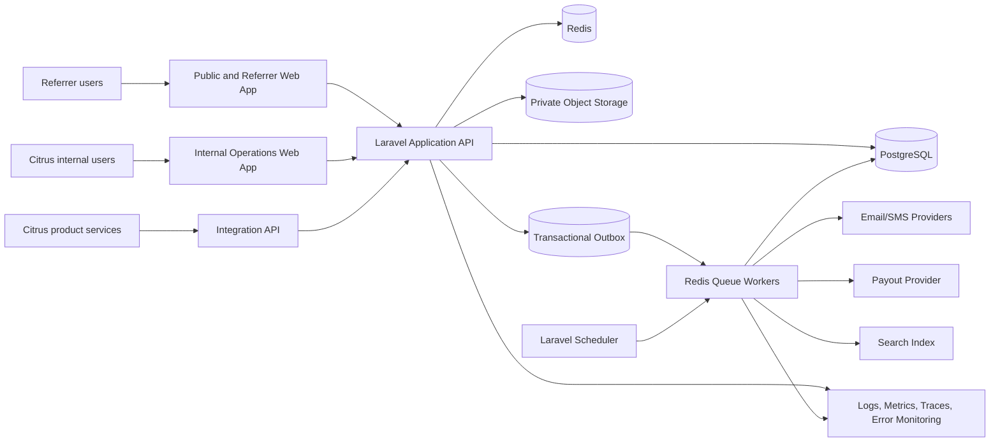

# Citrus Refer & Earn — Production Software Development Plan

**Document type:** Implementation-ready software architecture and delivery plan  
**Platform owner:** Citrus Labs Limited  
**Formal product name:** Citrus Refer & Earn  
**Customer-facing name:** Refer & Earn  
**Target implementation:** Production-grade centralized, multi-product referral, qualification, reward, payout, risk, support, and reporting SaaS platform  
**Primary implementation stack:** Laravel, PHP 8.2+, Vue 3, TypeScript, Tailwind CSS, PostgreSQL, Redis, S3-compatible storage, Docker, CI/CD  
**Launch currency:** KES only  
**Launch qualification frequency:** Monthly only  
**Launch payout frequency:** Monthly only  
**Minimum retention milestone:** Four consecutive qualifying service months  
**Architecture style:** Modular monolith with explicit bounded contexts and an extraction path for high-scale services  
**Document status:** Governing development plan  

---

## How the implementation agent must use this document

This plan is executable engineering guidance, not a conceptual overview. Before making any change, the implementation agent must identify the governing requirement, inspect the current repository, prove the implementation gap, make the smallest correct change, add tests, run the tests, and provide evidence of the result.

The following source-of-truth precedence applies:

1. The complete rewritten Citrus Refer & Earn feature specification governs product behavior, financial rules, state machines, roles, integration authority, error handling, and edge cases.
2. The Refer & Earn brand identity and product technical details govern naming, visual design, voice, accessibility, responsive behavior, and the baseline technology requirements.
3. This development plan converts those requirements into architecture, schemas, code organization, delivery phases, tests, and operational controls.
4. A later formally approved architecture decision record may refine an implementation mechanism, but it may not weaken a governing business, financial, privacy, security, or audit invariant.

No implementation task is complete merely because code compiles. Completion requires tests, observable proof, authorization-denial proof, tenant-isolation proof where relevant, and rollback or correction instructions.

---

# 1. Executive Architecture Summary

## 1.1 Product architecture decision

Build **one centralized Citrus Refer & Earn platform** that integrates independently with every eligible Citrus Labs product. Do not create a full referral subsystem inside each product. Each source product retains only the product-native referral capture, merchant registration, attribution notice, integration event production, reconciliation endpoint, and product-specific activity-decision logic required to integrate with the central platform.

The central platform is authoritative for:

- Referrer legal entities and Referrer users.
- Referrer memberships, roles, contact verification, terms, identity review, and payout readiness.
- Product and campaign configuration.
- Immutable campaign versions.
- Referral links, codes, QR codes, clicks, claims, attribution, conflicts, and corrections.
- Qualification periods and evidence snapshots.
- Reward calculations, reward liabilities, ledger entries, holds, adjustments, and reversals.
- Payout-method records and controlled replacement workflows.
- Approval workflows and separation of duties.
- Payout runs, payout items, product allocations, provider attempts, reconciliation, returns, and finality.
- Statements, notifications, support cases, fraud cases, appeals, audit cases, and audit logs.
- Referrer-facing status and reporting.

Each Citrus source product remains authoritative for:

- Merchant legal and operational identity.
- Merchant Administrator account creation and status.
- Merchant product-tenant identifiers.
- Merchant setup completion.
- Subscription plans, invoices, payments, refunds, chargebacks, discounts, and suspensions.
- Product-specific merchant activity and the final active-use qualification decision.
- Product operating status.

The central platform must never infer authoritative product facts by directly querying a product's operational database. Products send signed, idempotent events or respond through authenticated reconciliation APIs.

## 1.2 Chosen implementation style

Use a **modular Laravel monolith** for the initial production release. The application must contain strict bounded contexts, module-owned services, explicit public interfaces, asynchronous domain events, an outbox, and separate queue workloads. This produces transactional integrity for financial and attribution workflows without incurring premature distributed-system complexity.

Required bounded contexts:

1. Identity and Access.
2. Referrer Organization Management.
3. Products and Integrations.
4. Campaigns and Enrollment.
5. Referral Assets and Attribution.
6. Qualification and Retention.
7. Rewards and Ledger.
8. Payout Methods.
9. Approvals and Separation of Duties.
10. Payouts, Reconciliation, and Statements.
11. Risk, Fraud, Holds, and Appeals.
12. Support.
13. Notifications.
14. Reporting and Search.
15. Audit, Privacy, Tax, and Compliance.
16. Platform Operations and Configuration.

The architecture must permit later extraction of Integration Ingestion, Notifications, Search, Reporting, and Payout Provider Adapters without changing domain rules or public contracts.

## 1.3 Runtime planes

The deployment contains four logically distinct planes:

| Plane | Users or callers | Primary responsibilities | Security boundary |
|---|---|---|---|
| Public and Referrer plane | Prospective Referrers and authenticated Referrer users | Registration, verification, campaign discovery, referral assets, referral tracking, earnings, payouts, statements, support, profile and security | Referrer-entity tenant isolation; no cross-entity access |
| Internal operator plane | Citrus staff | Product configuration, campaign approval, attribution review, finance, risk, support, audit, legal, tax, integration operations | Enterprise SSO, MFA, explicit permissions, product/campaign scopes, maker/checker |
| Product integration plane | Product service accounts | Signed event submission, code validation, central confirmation, reconciliation | Product/environment-bound service identities; schema and signature validation |
| Worker and scheduler plane | Queue workers and scheduled commands | Event processing, qualification, reward calculation, payouts, email, exports, reconciliation, cleanup | Explicit serialized context; least-privilege credentials; idempotent jobs |

The planes may initially run from the same codebase and container image, but routes, middleware stacks, database roles, credentials, queue names, monitoring, and deployment scaling must remain separate.

## 1.4 Tenant model

The external SaaS tenant is the **Referrer legal entity**. A Referrer user may belong to one or more Referrer entities through memberships. The active entity is resolved from the authenticated user's valid membership and a public-safe entity identifier.

Internal Citrus users are not Referrer tenants. They operate in a separately authorized operator plane using product scopes, campaign scopes, role permissions, data masking, and separation-of-duties rules.

A `merchant_product_tenant` is an external source-product reference used for attribution and qualification. It is not a tenant that signs into the central platform.

## 1.5 Launch invariants

The code, database, and tests must enforce all of the following:

- Launch currency is KES only, while every money record stores `currency_code`.
- Qualification and payout cycles are monthly only.
- A recurring reward campaign requires a product-specific active-use rule version.
- The minimum retention milestone is at least four consecutive qualifying service months.
- Reward duration and retention counters are independent.
- The default payout policy is `monthly_pay_as_earned`.
- Ordinary merchant churn does not claw back legitimately earned earlier rewards.
- One merchant-product tenant has only one effective earning attribution at a time, regardless of campaign count.
- Campaign versions are immutable once activated.
- Verified payout destinations are never edited in place.
- Every production payout has preparation, independent approval, provider-status verification, reconciliation, product allocation, and a final statement.
- Every financial correction is append-only through adjustment or reversal entries.
- No human or service principal has an unrestricted bypass role.
- Frontend permission checks are user-experience controls only; the server remains authoritative.

## 1.6 Technology decisions

| Layer | Decision |
|---|---|
| Backend | Laravel on PHP 8.2 or newer; use the current supported stable framework release pinned by `composer.lock` |
| API authentication | Laravel Sanctum for browser SPA session authentication and approved first-party API tokens |
| Referrer authentication | Passwordless magic-link flow with hashed single-use tokens; optional or policy-mandated MFA; step-up verification for high-risk actions |
| Internal authentication | Enterprise OIDC or SAML SSO with mandatory MFA and no weak local-password fallback |
| Frontend | Vue 3, TypeScript, Vite, Vue Router, Pinia for durable client state, TanStack Query for server state |
| Styling | Tailwind CSS with a tokenized design system; no jQuery |
| Database | PostgreSQL with constraints, partial unique indexes, transactional locking, and row-level security for critical Referrer-owned data |
| Cache and queue | Redis; separate cache, rate-limit, session, and queue namespaces or logical databases |
| Object storage | Private S3-compatible storage with encryption, malware scanning, and signed downloads |
| Search | PostgreSQL search for early exact operational queries; Meilisearch for indexed user-facing and internal search once enabled; database remains source of truth |
| Money | Integer minor units plus ISO currency code; immutable calculation snapshots; use a tested money value object library or equivalent internal value object |
| Observability | Structured JSON logs, metrics, distributed traces, error aggregation, audit logs, synthetic health checks |
| Deployment | Docker images, managed PostgreSQL/Redis/object storage, repeatable CI/CD, rolling or blue/green deployment |

## 1.7 Architecture confidence

The modular-monolith approach has an estimated **94% probability** of being the correct launch architecture because the platform contains highly transactional cross-domain workflows, a single operating organization, KES-only monthly payout processing, and strong audit requirements. Premature microservices would materially increase consistency and operations risk. The main extraction candidates are event ingestion, notification delivery, search indexing, reporting, and payout-provider adapters after measured throughput or team-boundary evidence exists.

---

# 2. Assumptions and Constraints

## 2.1 Governing business constraints

1. Citrus Labs Limited is the sole platform operator.
2. Referrers may be individuals or organizations.
3. One Referrer legal entity can have multiple human users.
4. One user may hold memberships in more than one Referrer entity.
5. A Referrer may participate in several product campaigns.
6. A merchant may be referred separately to different Citrus products because each product tenant is a separate acquisition relationship.
7. One merchant-product tenant cannot have two simultaneous earning Referrers.
8. Campaign terms are snapshotted through immutable versions.
9. Launch money movement is KES only.
10. Launch payout method priority is M-Pesa, with bank and other approved methods enabled only after provider and compliance readiness.
11. Merchant subscriptions are billed by source products, not by the central platform.
12. Referrers are not charged a subscription by Citrus Refer & Earn at launch.
13. Statements are required in the first production release.
14. Reconciliation and maker/checker are required in the first production release.
15. Tax-dependent campaigns remain disabled until either minimum tax support exists or a formally approved no-withholding mode is lawful and configured.

## 2.2 Technical assumptions

The plan uses these initial capacity assumptions for sizing and test design. They are not claims about current volume:

| Metric | Initial planning assumption | Scale test target |
|---|---:|---:|
| Referrer legal entities | 100,000 | 500,000 |
| Referrer users | 250,000 | 1,000,000 |
| Merchant-product tenant references | 1,000,000 | 5,000,000 |
| Product events per month | 5,000,000 | 20,000,000 |
| Active campaign versions | 1,000 | 10,000 |
| Qualification periods per month | 1,000,000 | 5,000,000 |
| Reward ledger entries per month | 2,000,000 | 10,000,000 |
| Payout items per monthly run | 250,000 | 1,000,000 |
| Peak authenticated API requests | 500 requests/second | 2,000 requests/second |
| Peak integration ingestion | 1,000 events/second in bursts | 5,000 events/second |

The agent must replace these assumptions with measured capacity data before production sizing is finalized.

## 2.3 Explicit implementation constraints

- Use UTC for persisted timestamps and `Africa/Nairobi` as the default business display and monthly-boundary timezone at launch.
- Use public-safe UUIDv7 or ULID identifiers. Sequential numeric IDs must not appear in public APIs.
- Use integer minor units for money. Floating-point money is prohibited.
- Use immutable snapshots for campaign terms, product subscription evidence, reward calculations, payout destinations, and statement versions.
- No direct database connection from the central platform to product operational databases.
- No plaintext payment identifiers, identity numbers, tokens, or provider secrets in logs, analytics, search indexes, or emails.
- No JavaScript device detection for responsive behavior.
- No disabled browser zoom.
- No green success color in the product design system; use the approved Trust Blue semantic state.

## 2.4 Decisions that must be closed before production activation

The implementation can proceed behind interfaces, but production activation must be blocked until the following decision records are approved:

| Decision | Required evidence | Default implementation posture |
|---|---|---|
| Payout provider and M-Pesa rail | Contract, API documentation, sandbox proof, callback security, settlement files, fee model | Build a provider adapter interface and a deterministic fake provider; do not hardcode a vendor |
| Enterprise identity provider | OIDC/SAML metadata, MFA policy, deprovisioning flow, group/claim mapping | Implement OIDC-first adapter with deny-on-assurance-failure |
| Tax launch mode | Legal and finance approval | Disable tax-dependent campaigns until approved |
| Identity/KYC provider | Data-processing agreement, supported fields, outage behavior | Build manual-review-capable adapter; minimize retained identity data |
| Email provider | Domain verification, suppression handling, webhooks, data residency | Implement provider abstraction and local mail capture |
| SMS/OTP provider | Delivery proof, sender identity, cost, retry and fraud controls | Keep phone verification feature-flagged until approved |
| Object-storage and malware-scanning provider | Encryption, lifecycle, regional policy, scanner integration | S3-compatible private bucket plus quarantine workflow |
| Search engine | Load test and tenancy-filter proof | Start with database search; enable Meilisearch only after security tests pass |
| Backup region and disaster-recovery objectives | Infrastructure and legal approval | Same-region high availability plus encrypted cross-region backups where permitted |

## 2.5 Non-applicable generic SaaS features

A central subscription-billing module for Referrers is **not applicable at launch**. Do not create generic SaaS plans merely to satisfy a template. Product subscription records are external evidence used for merchant qualification. Platform feature access is governed by Referrer state, campaign enrollment, internal permissions, product scopes, feature flags, and approved capability rules.

## 2.6 Prove-the-problem requirement

For each implementation task, the agent must record:

- Requirement identifier or section.
- Current repository evidence.
- Missing or incorrect behavior.
- Failure mode if omitted.
- Proposed minimal implementation.
- Verification method.

For each defect, the agent must separate the observed symptom from the actual root cause and identify affected routes, actions, models, migrations, jobs, policies, UI components, and records.

---

# 3. Non-Negotiable Security Rules

## 3.1 Identity and access

1. Authenticate every protected route.
2. Authorize every resource action on the server.
3. Resolve Referrer-entity membership before tenant-owned access.
4. Deny by default when tenant, product, campaign, role, permission, or approval context is missing.
5. Require step-up authentication for payout-method changes, legal-profile changes, ownership transfer, sensitive exports, account closure, payout execution, role assignment, data unmasking, and break-glass activation.
6. Internal users authenticate only through the approved enterprise identity provider. No fallback local password is permitted for privileged actions.
7. Service accounts are non-human, product-bound, environment-bound, and scope-bound.
8. Revoke sessions and authorization caches immediately after suspension, role change, membership removal, employment termination, or suspicious-session detection.

## 3.2 Tenant and scope isolation

1. Every Referrer-owned table contains `referrer_entity_id` unless ownership is inherited through a constrained immutable parent and the exception is documented.
2. Every Referrer query is tenant-scoped before filtering by public identifier.
3. PostgreSQL row-level security must protect critical Referrer-owned tables used by the Referrer plane.
4. Internal access must still pass application policies, product/campaign scopes, and masking rules even when using an internal database role.
5. Queue jobs serialize and verify tenant, product, and campaign context.
6. Exports, search documents, notifications, signed downloads, and websocket channels preserve the same scope.
7. Valid identifiers from another tenant must return a non-enumerating `404` or equivalent denied response.

## 3.3 Financial integrity

1. Money uses integer minor units and explicit currency.
2. Reward calculations are versioned and immutable.
3. Reward ledger entries are append-only.
4. Adjustments and reversals never mutate original entries.
5. Payout allocations must sum exactly to the payout-item total.
6. A payout cannot become `reconciled_paid` without provider evidence and successful reconciliation.
7. A preparer cannot approve the same production payout or material correction.
8. Any material change invalidates previous approvals.
9. Verified payout methods are replaced, never patched.
10. Provider requests use idempotency keys and immutable request snapshots.
11. Closed accounting periods cannot be changed without an approved reopening workflow.

## 3.4 Integration security

1. Validate service-account identity before payload parsing beyond safe limits.
2. Verify canonical HMAC or asymmetric signatures, timestamp tolerance, nonce/replay state, product, environment, event type, schema version, and payload hash.
3. Reject the same event ID with a different payload hash as a critical integrity incident.
4. Process duplicates idempotently.
5. Preserve raw encrypted payload evidence for the approved retention period, with strict access controls.
6. Never accept an activity decision for a different product, rule version, merchant product tenant, or qualification period.
7. Never trust a callback solely because it reaches a callback URL; authenticate it and reconcile it.

## 3.5 Application security

- Use Form Request validation for every mutating request.
- Explicitly define mass-assignable fields; do not pass request payloads directly to models.
- Escape user-generated content by default.
- Sanitize only where controlled rich text is explicitly supported.
- Protect browser flows with CSRF tokens and secure same-site cookies.
- Restrict CORS to approved first-party origins.
- Validate redirect destinations against an allowlist.
- Rate-limit registration, magic links, verification, invitation acceptance, code validation, step-up, exports, support submissions, and integration endpoints.
- Use Content Security Policy, HSTS, `X-Content-Type-Options`, `Referrer-Policy`, and appropriate framing restrictions.
- Do not expose stack traces, SQL, secrets, provider responses, or internal exception details to clients.
- Do not log passwords, tokens, full payout destinations, identity numbers, session cookies, signed URLs, or raw sensitive documents.

## 3.6 File security

- Store uploads in private object storage.
- Quarantine before malware scan and content validation.
- Verify MIME type by content, not extension.
- Generate random object keys; never trust user filenames as paths.
- Strip unsafe metadata where applicable.
- Use short-lived, authorization-checked signed downloads.
- Block executable and unsupported archive formats.
- Audit every sensitive document download.

## 3.7 Infrastructure and supply chain

- Secrets live in an approved secret manager, never in source control or container images.
- CI runs dependency, secret, static-analysis, container, and infrastructure scans.
- Production images use pinned dependencies, non-root users, read-only filesystems where feasible, and minimal base images.
- Databases, Redis, and object storage are not publicly reachable.
- Backups are encrypted and restoration-tested.
- Production changes use CI/CD and auditable approvals; no routine manual server edits.

---

# 4. System Architecture

## 4.1 Context diagram



## 4.2 Container architecture

| Container or process | Responsibility | Scaling model |
|---|---|---|
| `web-referrer` | Serves Referrer SPA assets and Referrer/public API | Horizontal based on request latency and CPU |
| `web-internal` | Serves internal console and internal API | Separate autoscaling and network policy |
| `web-integration` | Receives product events and validation requests | Burst-scaled; stricter payload and rate limits |
| `worker-critical` | Ledger, approval, payout, reconciliation jobs | Small controlled concurrency; no job overlap |
| `worker-integration` | Product event processing and reconciliation | High concurrency with partition-aware ordering |
| `worker-notification` | Email, SMS, in-app notifications | Independent retries and provider throttles |
| `worker-exports` | Statements, reports, exports, scanning | Resource-limited and isolated |
| `scheduler` | Runs one active scheduler instance with distributed locks | Singleton with failover |
| `migration` | Runs database migrations as a deployment job | One-shot, approval-controlled |

The same image may run these process types with different commands and credentials.

## 4.3 Bounded-context module layout

```text
app/
├── Domain/
│   ├── Identity/
│   ├── Referrers/
│   ├── Products/
│   ├── Campaigns/
│   ├── Referrals/
│   ├── Qualification/
│   ├── Rewards/
│   ├── PayoutMethods/
│   ├── Approvals/
│   ├── Payouts/
│   ├── Risk/
│   ├── Support/
│   ├── Notifications/
│   ├── Audit/
│   └── Reporting/
├── Application/
│   ├── Commands/
│   ├── Queries/
│   ├── DTOs/
│   └── Contracts/
├── Infrastructure/
│   ├── Persistence/
│   ├── Integrations/
│   ├── Payments/
│   ├── IdentityProviders/
│   ├── Search/
│   ├── Storage/
│   └── Observability/
├── Http/
│   ├── Controllers/Api/V1/
│   ├── Middleware/
│   ├── Requests/
│   └── Resources/
├── Jobs/
├── Policies/
├── Providers/
└── Console/Commands/
```

Each domain module owns its model behavior, enums, transition services, policies, events, and tests. Cross-module access occurs through application commands, query services, read models, or domain events. Direct mutation of another module's aggregate is prohibited.

## 4.4 Transaction and consistency boundaries

Use database transactions for:

- Referrer registration plus entity/user/membership creation.
- Campaign activation plus immutable version and approval consumption.
- Attribution lock and competing-claim resolution.
- Qualification finalization plus reward calculation creation.
- Reward ledger posting.
- Payout-run item creation and allocation.
- Approval decisions and approval invalidation.
- Payment-method activation and previous-method replacement.
- Payout reconciliation and liability transition.

Use the transactional outbox pattern whenever a successful commit must trigger an external or asynchronous action. The application inserts an outbox record in the same transaction as the business change. A worker publishes or executes it after commit and records idempotent delivery state.

Do not use a distributed transaction with product systems or payout providers. Use state machines, idempotency, reconciliation, and append-only corrections.

## 4.5 Domain event model

Internal domain events must include:

```text
event_id
occurred_at
aggregate_type
aggregate_id
aggregate_version
referrer_entity_id nullable
product_id nullable
campaign_id nullable
actor_type
actor_id nullable
correlation_id
causation_id
payload_schema_version
payload
```

Events are immutable. Consumers maintain an inbox/idempotency record before applying side effects.

## 4.6 Environment model

Required environments:

1. Local development.
2. Automated test.
3. Shared development.
4. Integration/sandbox.
5. Staging.
6. Production.

Product service accounts and keys are environment-bound. Test and staging data must not contain copied unredacted production identity or payout information. Production provider callbacks must not be accepted by non-production environments.

## 4.7 Failure-domain behavior

- Database unavailable: reject writes; never acknowledge product events as accepted; health check fails.
- Redis unavailable: preserve synchronous database writes only when safe; return `503` for workflows requiring queues or rate-limit integrity; do not execute payouts synchronously as a fallback.
- Search unavailable: fall back to bounded database search where safe; do not expose unscoped results.
- Object storage unavailable: reject new uploads and preserve metadata transaction consistency.
- Email provider unavailable: queue retries and surface delivery status; do not roll back completed financial actions.
- Payout provider unavailable: keep payout attempt pending or failed according to evidence; never mark paid.
- Identity provider unavailable: deny privileged internal writes; do not fall back to local passwords.
- Product unavailable: preserve pending qualification and run reconciliation later; do not infer qualified status.

## 4.8 Architecture decision records

Create ADRs under `docs/architecture/adr/` for at least:

- ADR-001 Modular monolith and bounded contexts.
- ADR-002 Referrer entity as external tenant.
- ADR-003 PostgreSQL row-level security boundary.
- ADR-004 UUIDv7/ULID identifier strategy.
- ADR-005 Money representation and rounding.
- ADR-006 Passwordless Referrer authentication.
- ADR-007 Enterprise internal SSO.
- ADR-008 Transactional outbox and idempotency.
- ADR-009 Immutable ledger and correction model.
- ADR-010 Payout provider adapter and reconciliation finality.
- ADR-011 Search source-of-truth boundary.
- ADR-012 File quarantine and scanning.

Each ADR states context, evidence, options, decision, consequences, failure modes, and review triggers.

---

# 5. Backend Architecture

## 5.1 Laravel application organization

Use thin HTTP controllers. Controllers perform request mapping, invoke an application command/query, and return an API resource. Domain behavior belongs in explicit action or service classes, not controllers, models, listeners, or jobs with mixed concerns.

Example flow:

```text
POST /api/v1/referrer/entities/{entity}/payment-method-change-requests
→ StartPaymentMethodChangeRequest
→ Authorization policy
→ Step-up assurance validator
→ PayoutMethodChangeService
→ Transaction
→ change request + candidate method + hold + audit + outbox
→ API resource
```

## 5.2 Required backend patterns

- **Enums:** PHP backed enums for stable states and reason codes.
- **Value objects:** Money, Currency, ServiceMonth, EmailAddress, PhoneNumber, PublicIdentifier, PercentageRate, ProviderReference.
- **Commands:** Mutating use cases with one public `handle()` method.
- **Queries:** Read-only optimized services that always accept scope context.
- **Policies:** Resource and action authorization.
- **Form Requests:** Validation, normalization, and safe authorization preconditions.
- **API Resources:** Stable response mapping and field masking.
- **State-transition services:** Validate permitted transitions and write history.
- **Provider adapters:** Interfaces for payout, identity, email, SMS, storage scan, SSO, and search.
- **Outbox/inbox:** Durable asynchronous side effects and idempotent consumers.
- **Query specifications:** Explicit reusable scopes; avoid ad hoc unscoped Eloquent calls.

Do not create a generic repository layer around all Eloquent models. Use repositories only where an aggregate requires a specialized persistence interface or provider-independent boundary.

## 5.3 Aggregate boundaries

| Aggregate | Root | Protected invariants |
|---|---|---|
| Referrer entity | `ReferrerEntity` | legal-entity identity, state dimensions, at least one verified owner |
| Membership | `ReferrerMembership` | active entity/user relationship and allowed role |
| Campaign version | `CampaignVersion` | immutable product, KES, monthly frequency, reward rule, duration, retention, activity rule |
| Attribution | `ReferralAttribution` | one effective earning attribution per merchant-product tenant |
| Qualification period | `QualificationPeriod` | one final decision per attribution/service month/version |
| Reward calculation | `RewardCalculation` | deterministic snapshot and one active calculation version |
| Ledger | `RewardLedgerEntry` | balanced liability transitions and append-only history |
| Payout method change | `PaymentMethodChangeRequest` | candidate verification, hold, cooling-off, immutable prior method |
| Approval request | `ApprovalRequest` | policy version, actor separation, invalidation after mutation |
| Payout run | `PayoutRun` | cutoff snapshot, eligibility, allocations, approvals, execution and reconciliation |
| Fraud case | `FraudCase` | evidence, holds, decisions, appeal linkage |
| Support case | `SupportCase` | tenant ownership, visibility, masked context, immutable message history |

## 5.4 State machines

Every state transition must pass through a named transition service that:

1. Locks the current aggregate row where concurrent mutation is possible.
2. Validates current state and transition preconditions.
3. Rechecks authorization at execution time.
4. Writes the new state.
5. Writes append-only state history with actor, reason, source, and correlation ID.
6. Emits a domain event through the outbox.
7. Returns a typed result.

Direct updates to state columns outside transition services must fail code review and static architecture tests.

## 5.5 Money and rounding

- Persist amounts as `BIGINT` minor units.
- Persist `currency_code CHAR(3)` with a launch check constraint of `KES` on launch-only financial tables or campaign versions.
- Persist percentage rates as integer basis points or high-precision decimal, with the chosen representation documented. Recommended: `rate_basis_points INTEGER` for standard percentage rewards.
- Use half-up or legally approved rounding once per qualification-period calculation, not repeatedly across intermediate values.
- Persist input amount, discount treatment, rate, cap, rounding mode, unrounded result where needed, final amount, and calculation algorithm version.
- Never recalculate historical rewards from mutable current campaign or subscription data.

## 5.6 Concurrency controls

Use:

- PostgreSQL partial unique indexes for one effective attribution.
- `SELECT ... FOR UPDATE` for attribution resolution, payout-run preparation, payment-method activation, and ledger posting.
- Optimistic version columns for editable drafts and account profiles.
- Advisory locks or distributed Redis locks for monthly run generation, reconciliation batches, scheduler singleton tasks, and period closure.
- Idempotency records for all externally retried mutations.
- Unique database constraints as the final concurrency authority.

A caught unique violation must be translated into a deterministic conflict outcome, not a generic `500`.

## 5.7 Error handling

Create a domain exception hierarchy:

```text
DomainException
├── ValidationDomainException
├── StateTransitionDenied
├── AuthorizationContextMissing
├── TenantContextMissing
├── ScopeViolation
├── ConcurrencyConflict
├── IdempotencyConflict
├── FinancialInvariantViolation
├── IntegrationIntegrityException
├── ProviderUnavailable
└── RecordNotFoundWithinScope
```

Map exceptions centrally to the API error contract. Log full internal context only after redaction. Client messages must be safe, specific, and actionable without exposing another tenant or internal fraud evidence.

## 5.8 Configuration

Use typed configuration objects for:

- Business timezone.
- Monthly cutoff and payout calendar.
- Provider timeout and retry rules.
- Signature timestamp tolerance.
- Magic-link expiry.
- Session idle and absolute timeout.
- Step-up assurance duration.
- Payment-method cooling-off period.
- Minimum payout threshold.
- File size and type limits.
- Retention schedules.
- Rate limits.

Configuration changes with financial or security impact require versioned database configuration, approval, activation dates, and audit records. Environment variables are for deployment configuration and secrets, not mutable business rules.

## 5.9 Scheduled command safety

Every scheduled command must:

- Be idempotent.
- Acquire an overlap-prevention lock.
- Accept a bounded date or cursor.
- Log correlation and run identifiers.
- Emit metrics.
- Handle partial failure without losing completed work.
- Support safe rerun.
- Avoid loading unbounded result sets.

## 5.10 Backend coding standards

- PHP strict types in domain and application code.
- Static analysis at a high enforceable level.
- Formatter and linting in CI.
- No dynamic property use.
- Explicit return types.
- Domain state and reason codes use enums, not free-form strings.
- Transactions are opened in application services, not hidden in model observers.
- Model observers may not perform external network calls.
- Queue jobs contain identifiers and context, not serialized Eloquent models with stale state.

---

# 6. Frontend Architecture

## 6.1 Chosen frontend

Use **Vue 3 with TypeScript**. Build separate route shells for the Referrer portal and internal console while sharing a design-system package, typed API client, accessibility primitives, and utility libraries.

Recommended structure:

```text
resources/js/
├── apps/
│   ├── public-site/
│   ├── referrer-portal/
│   └── internal-console/
├── components/
│   ├── ui/
│   ├── forms/
│   ├── data-display/
│   ├── feedback/
│   └── domain/
├── composables/
├── layouts/
├── pages/
├── router/
├── services/
│   ├── api/
│   ├── auth/
│   └── telemetry/
├── stores/
├── types/
├── validation/
├── styles/
└── tests/
```

Use route-level code splitting. Internal finance, risk, audit, and integration pages must load only after authentication and permission-aware routing, while the backend remains the authority.

## 6.2 State boundaries

- **Server state:** TanStack Query for API data, caching, invalidation, retry, and mutation state.
- **Durable client state:** Pinia for active Referrer entity, theme preference, locale, and UI preferences.
- **Form state:** A typed form library or composables with schema validation; server errors remain authoritative.
- **URL state:** Filters, sort, page, and selected tabs belong in query parameters for shareable operational views.
- **Sensitive state:** Never persist tokens, full payout details, identity data, or provider responses in local storage.

Sanctum browser authentication uses secure HTTP-only cookies. Do not store bearer tokens in local storage.

## 6.3 Route structure

Referrer portal:

```text
/
/register
/verify-email
/verify-phone
/sign-in
/select-entity
/app/:entityId/overview
/app/:entityId/campaigns
/app/:entityId/referrals/new
/app/:entityId/referrals
/app/:entityId/referrals/:referralId
/app/:entityId/qualification
/app/:entityId/earnings
/app/:entityId/payments
/app/:entityId/statements
/app/:entityId/payout-method
/app/:entityId/support
/app/:entityId/notifications
/app/:entityId/settings/profile
/app/:entityId/settings/members
/app/:entityId/settings/security
/app/:entityId/legal
/app/:entityId/restricted-access
```

Internal console:

```text
/internal/overview
/internal/products
/internal/integrations
/internal/campaigns
/internal/referrers
/internal/merchant-referrals
/internal/attribution-reviews
/internal/qualification-reviews
/internal/reward-ledger
/internal/payout-runs
/internal/reconciliation
/internal/risk
/internal/adjustments
/internal/support
/internal/reports
/internal/audit
/internal/configuration
/internal/access
```

## 6.4 Component architecture

Required shared primitives:

- `AppButton`, `AppLink`, `IconButton`.
- `TextField`, `SelectField`, `CheckboxField`, `RadioGroup`, `DateField`, `MoneyField`, `PhoneField`.
- `FormErrorSummary`, `InlineFieldError`, `RequiredIndicator`.
- `StatusChip`, `MoneyAmount`, `MaskedValue`, `ServiceMonthLabel`.
- `DataTable`, `ResponsiveRecordList`, `Pagination`, `FilterBar`, `SortButton`.
- `ModalDialog`, `ConfirmationDialog`, `Drawer`, `Popover`, `Menu`.
- `AlertBanner`, `ToastRegion`, `EmptyState`, `ErrorState`, `Skeleton`.
- `PageHeader`, `SidebarNavigation`, `MobileNavigation`, `ProfileMenu`.
- `Timeline`, `AuditTrail`, `EvidenceSummary`, `ApprovalSteps`.
- `PermissionBoundary` for UX only.

Domain components must not embed authorization rules. They consume capabilities returned by the API and still handle `403` responses.

## 6.5 Central API client

The API client must:

- Send CSRF credentials.
- Attach correlation IDs.
- Parse the standard error envelope.
- Distinguish validation, authentication, authorization, conflict, rate-limit, maintenance, and provider-pending responses.
- Support idempotency keys for high-risk submissions.
- Support ETags or version headers for optimistic updates.
- Never retry non-idempotent mutations unless an idempotency key exists.
- Trigger session refresh or sign-in only for authenticated-session failures.
- Avoid exposing another entity's existence in error UI.

## 6.6 Frontend error states

Every page and mutation must implement:

- Initial loading.
- Empty state.
- Partial data state.
- Validation failure.
- Authorization denial.
- Tenant membership lost.
- Conflict due to concurrent update.
- Rate limit with retry guidance.
- Offline or network failure.
- Provider pending or delayed state.
- Generic safe failure with support correlation ID.

Do not show success before the server confirms the committed state.

## 6.7 Security rules

- Escape all dynamic text.
- Use controlled HTML sanitization only for approved rich content.
- Do not render raw provider or event payloads to ordinary users.
- Mask payout destinations and identity fields.
- Re-fetch capabilities after membership or role changes.
- Clear sensitive query caches on logout, entity switch, and session revocation.
- Do not use route guards as authorization controls.
- Do not embed secrets or privileged rules in the bundle.

## 6.8 Frontend testing

Use:

- Vitest for logic and component tests.
- Vue Testing Library for behavior-focused component tests.
- Mock Service Worker or equivalent for API contract fixtures.
- Playwright for critical browser workflows.
- Automated accessibility checks plus manual keyboard and screen-reader testing.
- Visual regression for light/dark and responsive layouts.

---

# 7. Database Architecture

## 7.1 Database conventions

Use PostgreSQL. Store timestamps as `timestamptz` in UTC. Use UUIDv7 or ULID identifiers generated application-side; examples below use `uuid`. Public APIs expose `public_id` only where an internal primary key must remain private. Prefer a single UUID primary key when it is already public-safe.

Common columns:

```text
id UUID PRIMARY KEY
created_at TIMESTAMPTZ NOT NULL
updated_at TIMESTAMPTZ NOT NULL
created_by_type VARCHAR(40) NULL
created_by_id UUID NULL
correlation_id UUID NULL
lock_version INTEGER NOT NULL DEFAULT 1
```

Tenant-owned rows use:

```text
referrer_entity_id UUID NOT NULL REFERENCES referrer_entities(id)
```

Money fields use:

```text
amount_minor BIGINT NOT NULL
currency_code CHAR(3) NOT NULL
```

Immutable tables omit `updated_at` when no correction is permitted, or permit only controlled metadata updates while immutable business fields are protected by database triggers and application architecture tests.

## 7.2 Soft-delete and retention policy

- Do not soft-delete financial, attribution, campaign-version, approval, integration-evidence, reconciliation, statement-version, or audit records.
- Use lifecycle states for Referrer entities, users, memberships, campaigns, support cases, and payout methods.
- Soft delete only recoverable drafts or non-authoritative attachments where legal policy permits.
- Pseudonymize or redact personal data through a controlled privacy workflow while retaining finance, fraud, tax, contract, and audit evidence.
- Retention periods are versioned policy configuration, not hardcoded constants.

## 7.3 Core identity and tenancy tables

### `referrer_entities`

**Purpose:** External SaaS tenant and legal owner of referral rights, rewards, payout instructions, statements, and contracts.

| Column | Type | Rules |
|---|---|---|
| `id` | UUID | Primary key |
| `public_id` | UUID | Unique, client-facing |
| `entity_type` | VARCHAR(32) | Enum: individual, sole_proprietor, company, agency, association, consultancy, other_approved |
| `legal_name` | VARCHAR(200) | Required |
| `display_name` | VARCHAR(160) | Required |
| `country_code` | CHAR(2) | ISO country |
| `account_status` | VARCHAR(32) | Independent account lifecycle state |
| `onboarding_status` | VARCHAR(32) | Independent onboarding state |
| `identity_status` | VARCHAR(32) | Independent identity state |
| `terms_status` | VARCHAR(32) | Independent terms state |
| `payout_readiness_status` | VARCHAR(32) | Independent payout readiness |
| `risk_status` | VARCHAR(32) | Independent risk state |
| `preferred_currency` | CHAR(3) | Launch check `KES` |
| `preferred_language` | VARCHAR(10) | Default `en-KE` |
| `activated_at`, `closed_at` | TIMESTAMPTZ | Nullable lifecycle timestamps |
| `lock_version` | INTEGER | Optimistic concurrency |

**Indexes and constraints:** unique `public_id`; indexes on account, risk, payout readiness, country, created date; check constraints for states and KES launch preference.  
**Tenant ownership:** This is the tenant root.  
**Deletion:** No hard delete once referenced.  
**Security:** RLS permits only users with active membership; internal role uses scoped access.  
**Migration note:** Create before every tenant-owned table.

### `users`

**Purpose:** Natural-person Referrer user identities.

| Column | Type | Rules |
|---|---|---|
| `id` | UUID | Primary key |
| `public_id` | UUID | Unique |
| `legal_first_name`, `legal_last_name` | VARCHAR(100) | Required after minimum profile |
| `display_name` | VARCHAR(160) | Required |
| `email_normalized` | CITEXT | Unique among active login identities |
| `email_verification_status` | VARCHAR(24) | Enum |
| `phone_e164_encrypted` | BYTEA/TEXT | Application-encrypted |
| `phone_hash` | CHAR(64) | Blind index for duplicate checks |
| `phone_last4` | CHAR(4) | Display only |
| `phone_verification_status` | VARCHAR(24) | Enum |
| `status` | VARCHAR(24) | active, restricted, suspended, closed |
| `last_authenticated_at` | TIMESTAMPTZ | Nullable |
| `locale`, `timezone` | VARCHAR | Preferences |

**Indexes:** unique active normalized email using partial index; phone blind-index lookup; status.  
**Deletion:** Pseudonymize where lawful; retain membership and audit references.  
**Security:** Encrypted contact fields; no password column for launch passwordless flow.

### `referrer_memberships` (`account_user` equivalent)

**Purpose:** Links users to Referrer entities and defines entity-level role.

| Column | Type | Rules |
|---|---|---|
| `id` | UUID | Primary key |
| `referrer_entity_id` | UUID | FK, tenant |
| `user_id` | UUID | FK users |
| `role_key` | VARCHAR(40) | organization_owner, organization_admin, finance_viewer, referral_operator, support_contact, read_only |
| `status` | VARCHAR(24) | invited, active, suspended, removed |
| `invited_by_membership_id` | UUID | Nullable self-FK |
| `accepted_at`, `removed_at` | TIMESTAMPTZ | Nullable |
| `permission_overrides` | JSONB | Strongly restricted; default empty |

**Constraints:** unique active membership per entity/user; trigger or service invariant preventing removal of the last verified active owner.  
**Indexes:** entity/status, user/status, role.  
**Deletion:** Lifecycle only.  
**Security:** RLS by entity; all role changes audited.

### `invitations`

**Purpose:** Invitation-based onboarding to Referrer entities.

Columns: `id`, `referrer_entity_id`, `email_normalized`, `role_key`, `token_hash`, `invited_by_membership_id`, `status`, `expires_at`, `accepted_by_user_id`, `accepted_at`, `revoked_at`, timestamps.  
Constraints: one active invitation per entity/email/role; token hash unique; expiry check in application.  
Indexes: tenant/email/status, expiry.  
Retention: retain accepted/revoked metadata; remove token material after terminal state.  
Security: enumeration-resistant responses and rate limits.

### `roles`, `permissions`, `role_permissions`

**Purpose:** Internal and optional external permission definitions.

- `roles`: `id`, `key`, `name`, `plane`, `risk_classification`, `is_system`, lifecycle timestamps.
- `permissions`: `id`, `key`, `resource`, `action`, `description`, `risk_level`.
- `role_permissions`: `role_id`, `permission_id`, optional constraints JSON, effective dates.

Unique keys on role and permission. System roles cannot be deleted. Permission changes require audit and, for privileged roles, approval.

### `internal_users`

**Purpose:** Local authorization projection of enterprise identities.

Columns: `id`, `subject_identifier`, `email_normalized`, `display_name`, `employment_status`, `assurance_level`, `last_sso_at`, `disabled_at`, timestamps.  
Unique: identity-provider subject; active email.  
Security: no local password; SSO claims do not automatically grant permissions without approved assignments.

### `user_roles`, `product_scopes`, `campaign_scopes`, `approval_assignments`

- `user_roles`: internal user, role, effective dates, assigner, reason, review date.
- `product_scopes`: assignment to one or more products or all-products scope under explicit approval.
- `campaign_scopes`: narrower campaign access.
- `approval_assignments`: approval category, threshold, currency, effective dates.

All assignments are append-only or lifecycle-controlled and audited. A role change invalidates active authorization caches.

## 7.4 Profile, contact, verification, and state-history tables

| Table | Purpose and essential columns | Critical constraints and retention |
|---|---|---|
| `referrer_entity_profiles` | Entity address, registration identifier encrypted/hash, industry, website, beneficial-owner status, profile version | One active version per entity; changes use requests for legal fields |
| `referrer_contacts` | Contact type, encrypted value, blind index, last4, primary flag, status | Unique verified contact according to policy; tenant-owned |
| `referrer_contact_verifications` | Contact, challenge hash, provider, attempts, status, expiry, verified_at | Single-use; purge challenge secrets after completion |
| `referrer_identity_checks` | Provider/manual case, subject, status, evidence references, expiry, decision reason | Restricted access; never expose raw provider result to ordinary support |
| `referrer_terms_acceptances` | Terms version, user, entity, accepted_at, IP/device evidence | Append-only legal evidence |
| `referrer_tax_profiles` | Tax mode, encrypted tax ID, blind index, status, effective dates | Restricted; versioned; no in-place overwrite of submitted evidence |
| `referrer_security_events` | Auth, step-up, session, device, ownership, export events | Append-only; security retention policy |
| `referrer_account_state_history` | prior/new account state, actor, reason, source | Append-only |
| `referrer_onboarding_state_history` | prior/new onboarding state | Append-only |
| `referrer_risk_state_history` | prior/new risk state, case link | Append-only; restricted |

## 7.5 Product, service identity, campaign, and enrollment tables

### `referral_products`

Columns: `id`, `public_id`, `code`, `name`, `status`, `source_system_identifier`, `default_timezone`, `integration_status`, `registered_at`, timestamps.  
Unique: product code and source identifier.  
No tenant owner; internal product scope applies.  
No hard delete after references.

### `service_accounts`, `service_account_scopes`, `service_account_keys`

- Service account: product, environment, name, status, allowed IP/network policy, last_used_at.
- Scope: event types, verification endpoints, methods, rate limits.
- Key: key identifier, encrypted secret or public key, activation, expiry, revoked_at, rotation predecessor/successor.

Keys are append-only and rotated. Plain secrets are shown only once at creation where symmetric HMAC is used.

### `referral_campaigns`

Columns: `id`, `public_id`, `product_id`, `code`, `name`, `status`, `owner_internal_user_id`, draft metadata, timestamps.  
Unique product/code. Campaign root is mutable only while draft-level metadata is editable.

### `referral_campaign_versions`

Essential columns:

```text
id UUID PK
campaign_id UUID FK
version_number INTEGER
status VARCHAR
currency_code CHAR(3) CHECK = 'KES'
qualification_frequency VARCHAR CHECK = 'monthly'
payout_frequency VARCHAR CHECK = 'monthly'
reward_model VARCHAR
fixed_amount_minor BIGINT NULL
percentage_basis VARCHAR NULL
rate_basis_points INTEGER NULL
monthly_cap_minor BIGINT NULL
lifetime_cap_minor BIGINT NULL
reward_duration_type VARCHAR CHECK = 'fixed_calendar_duration'
reward_duration_months INTEGER CHECK >= 4
minimum_retention_milestone_months INTEGER CHECK >= 4
retention_requires_consecutive_months BOOLEAN CHECK = TRUE
payout_policy VARCHAR
activity_rule_id UUID NOT NULL
attribution_policy_version VARCHAR
minimum_payout_threshold_minor BIGINT
clearing_period_days INTEGER
start_at TIMESTAMPTZ
end_at TIMESTAMPTZ NULL
terms_version_id UUID
budget_id UUID NULL
tax_mode VARCHAR
calculation_algorithm_version VARCHAR
approved_at TIMESTAMPTZ
activated_at TIMESTAMPTZ
immutable_hash CHAR(64)
```

Unique campaign/version number. After activation, a database trigger prevents updates to immutable fields. A new version is required for change.

### Supporting campaign tables

| Table | Essential fields | Rules |
|---|---|---|
| `campaign_eligible_plans` | version, source product plan ID, billing period, eligibility dates | Product-bound; unique per version/plan |
| `campaign_activity_rules` | product, rule key, rule version, description, schema, status, effective dates | Mandatory for recurring campaigns; immutable activated version |
| `campaign_budgets` | campaign version, amount minor, consumed/reserved, period, status | Atomic reservation; no negative balance |
| `campaign_terms_versions` | terms content hash, published document object, effective date | Append-only |
| `campaign_approval_requests` | target version, policy, material hash, status | Material mutation invalidates |
| `campaign_approval_decisions` | request, approver, decision, reason, assurance evidence | Creator cannot approve when separation applies |
| `referrer_campaign_enrollments` | entity, campaign version, status, accepted terms, eligibility snapshot | Unique active enrollment per entity/version |
| `campaign_enrollment_reviews` | enrollment, reviewer, decision, evidence | Append-only |
| `campaign_enrollment_status_history` | prior/new status, actor, reason | Append-only |

## 7.6 Merchant reference and attribution tables

### `merchant_legal_entity_references`

Purpose: minimized cross-product reference to a merchant legal entity.  
Columns: `id`, `public_id`, `country_code`, `legal_name_snapshot`, encrypted/hash identifiers where permitted, source confidence, created_at.  
No Referrer tenant ownership. Access is product-scoped and purpose-limited. No operational merchant data.

### `merchant_product_tenants`

Columns: `id`, `public_id`, `product_id`, `source_tenant_id`, `merchant_legal_entity_reference_id`, `display_name_snapshot`, `status_snapshot`, `first_seen_at`, `last_source_event_at`.  
Unique `(product_id, source_tenant_id)`.  
No hard delete. Source product remains authoritative.

### Referral asset tables

- `referral_codes`: entity, product, campaign/version, code, status, activation/expiry, creation source.
- `referral_links`: code, signed token/version, destination allowlist key, status.
- `referral_clicks`: product, campaign, code, timestamp, pseudonymous device/session identifiers, consent flags, landing context.

Codes are unguessable, normalized, and unique within the declared scope. Click data is rate-limited and retained according to analytics/privacy policy.

### `referral_attributions`

Essential columns:

```text
id UUID PK
public_id UUID UNIQUE
merchant_product_tenant_id UUID NOT NULL
product_id UUID NOT NULL
referrer_entity_id UUID NOT NULL
campaign_id UUID NOT NULL
campaign_version_id UUID NOT NULL
status VARCHAR NOT NULL
effective_from TIMESTAMPTZ NOT NULL
effective_to TIMESTAMPTZ NULL
is_earning_attribution BOOLEAN NOT NULL
supersedes_attribution_id UUID NULL
resolution_case_id UUID NULL
locked_at TIMESTAMPTZ NULL
attribution_policy_version VARCHAR NOT NULL
source_type VARCHAR NOT NULL
source_reference UUID NULL
created_at TIMESTAMPTZ NOT NULL
```

Critical partial unique index:

```sql
CREATE UNIQUE INDEX uq_effective_earning_attribution
ON referral_attributions (merchant_product_tenant_id, product_id)
WHERE is_earning_attribution = true
  AND effective_to IS NULL
  AND status IN ('confirmed', 'qualified', 'active');
```

All access from the Referrer portal is scoped by `referrer_entity_id`. Internal access requires product scope. Historical and invalidated claims are retained.

### Attribution evidence and resolution tables

| Table | Purpose | Essential controls |
|---|---|---|
| `referral_attribution_evidence` | Immutable click/code/registration/merchant-choice evidence | Content hashes, source, received time, restricted raw data |
| `referral_attribution_claims` | Competing or late claims | Never deleted; status and priority reason |
| `referral_attribution_conflicts` | Conflict case | Product, merchant tenant, involved claims, status |
| `referral_attribution_resolutions` | Decision, approver, evidence, superseded attribution | Maker/checker for financially material reassignment |
| `referral_attribution_status_history` | State transitions | Append-only |
| `merchant_identity_snapshots` | Minimized merchant identity at decision time | Immutable version; encrypted sensitive values |

## 7.7 Qualification, evidence, calculation, and ledger tables

### `referral_qualification_periods`

Columns include `id`, `attribution_id`, `referrer_entity_id`, `product_id`, `campaign_version_id`, `service_month_start`, `service_month_end`, `status`, `subscription_status`, `activity_status`, `attribution_valid`, `risk_clear`, `clearing_complete`, `failure_reason_code`, `rewarded_qualification_month_number`, `current_consecutive_qualifying_months`, `maximum_consecutive_qualifying_months`, `retention_milestone_reached_at`, `reward_duration_completed_at`, `decision_version`, timestamps.

Unique `(attribution_id, service_month_start, decision_version)` and one active final decision per period. Tenant-owned for Referrer access, product-scoped internally.

### Evidence and decision tables

- `referral_activity_evidence`: period, product event, rule version, encrypted/minimized evidence summary, hash.
- `referral_activity_decisions`: period, source decision version, qualified boolean, reason code, decided_at, supersedes decision.
- `referral_subscription_evidence`: invoice/payment/discount/refund/chargeback snapshots, eligible amount, currency, clearance state, source event references.
- `retention_sequence_results`: attribution, evaluated through month, current/maximum consecutive counts, milestone state, algorithm version.

Final activity authority belongs to the source product. The central platform validates authority and versioning but does not substitute operational evidence for a missing final decision.

### `referral_reward_calculations`

Columns: period, entity, product, campaign/version, calculation version, reward model, eligible amount minor, rate, cap, unrounded result, rounding mode, final amount minor, currency, algorithm version, status, supersedes ID, input snapshot hash, calculated_at.  
Unique active calculation per period/version. Immutable after posting.

### `referral_reward_ledger_entries`

Columns: `id`, entity, product, campaign, attribution, period, entry type, debit/credit account keys, amount minor, currency, liability state, related calculation, payout item, adjustment/reversal linkage, occurred_at, posted_at, immutable hash, correlation ID.  
Indexes: entity/date, product/date, payout item, period, entry type.  
No updates or deletes. Corrections use new entries. Consider monthly partitioning after measured volume.

### Holds, adjustments, and reversals

- `referral_reward_holds`: scope, reason, risk/support case, start/end, placed/released actor, status.
- `referral_adjustments`: proposed amount/direction, reason, evidence, period, approval request, posted ledger entry.
- `referral_reversals`: original entry, reason, invalidating event, amount, approval, recovery status.

All financially material records require a reason code, evidence, and applicable approval.

## 7.8 Payout-method, approval, payout, and statement tables

### `referrer_payment_methods`

Columns: entity, method type, provider token encrypted, encrypted destination, blind index, masked display, holder name encrypted, country, currency, status, verification record, activated_at, replaced_at, immutable snapshot hash.  
Verified rows cannot be updated in place. No soft delete. RLS by entity; internal access is masked unless privileged and audited.

### Payment-method workflow tables

- `payment_method_change_requests`: entity, requesting user, reason, step-up evidence, status, candidate method, requested_at.
- `payment_method_verifications`: candidate, provider/manual result, evidence hash, status, verified_at.
- `payment_method_activation_decisions`: candidate, eligibility, approver/policy, cooling-off completion, activated_at.
- `payment_method_change_holds`: entity, affected unsettled liabilities/items, status, release criteria.
- `payment_method_risk_reviews`: request, indicators, reviewer, decision, evidence.

### Generic approval tables

- `approval_policies`: action category, risk class, thresholds, required steps, separation rules, version/effective date.
- `approval_requests`: target type/ID, material hash, initiator, status, policy version.
- `approval_steps`: sequence, required permission, quorum, status.
- `approval_decisions`: step, actor, decision, reason, assurance level, timestamp.
- `approval_invalidations`: request, changed material, actor, reason.
- `separation_of_duties_rules`: prohibited actor combinations and thresholds.

### Payout tables

| Table | Purpose and key columns | Critical constraints |
|---|---|---|
| `referral_payout_runs` | Run month, cutoff, currency, status, prepared by, totals, approval, execution/reconciliation timestamps | Unique run key; KES; locked snapshot |
| `referral_payout_items` | Run, entity, method snapshot, gross, withholding, net, status | Unique run/entity/currency; net = gross - withholding |
| `referral_payout_item_allocations` | Item, product, campaign, ledger entries, amount | Sum equals payout item exactly |
| `referral_payout_attempts` | Item, attempt number, idempotency key, provider, status, request/response refs | Unique provider idempotency key |
| `payout_provider_requests` | Encrypted/redacted request snapshot, hash, sent_at | Append-only |
| `payout_provider_responses` | HTTP/provider code, safe summary, raw encrypted object ref | Append-only |
| `payout_callbacks` | Callback ID, signature result, payload hash, received_at | Unique provider callback ID |
| `payout_status_queries` | Poll request/result | Append-only |
| `payout_reconciliation_results` | Provider amount/currency/status match, settlement evidence, final result | Required before final paid state |
| `payout_reconciliation_exceptions` | Mismatch type, owner, status, resolution | Cannot be silently ignored |
| `payout_returns` | Returned item, reason, provider evidence, restored liability entry | Append-only |
| `withholding_decisions` | Tax rule version, basis, amount, evidence | Only when tax mode enabled |

### Statements

- `referral_statements`: entity, statement month, currency, status, current version, totals.
- `referral_statement_versions`: immutable rendered-data snapshot, PDF object key, hash, generated_at, supersedes version.
- `statement_download_audits`: entity/user/internal actor, statement version, timestamp, IP/device context.

A final statement must reconcile to ledger and payout allocation data. Reissued statements create a new version and retain the previous version.

## 7.9 Support, risk, audit, notification, and integration tables

| Table group | Tables and essential design |
|---|---|
| Support | `referral_support_cases`, `referral_support_messages`, `referral_support_attachments`; tenant-owned, case reference, category, priority, status, SLA, visibility, linked records; messages separate internal and Referrer-visible content |
| Fraud | `referral_fraud_flags`, `referral_fraud_cases`, `referral_fraud_case_links`; indicators are not final guilt; evidence, decision, holds, reviewer, reason and appeal eligibility |
| Appeals | `referral_appeals`, `referral_appeal_decisions`; entity-owned submission with restricted internal evidence and independent reviewer where required |
| Notifications | `notifications`, `referral_notifications`, `referral_email_deliveries`; channel, template version, recipient, status, provider ID, suppression, retry |
| Audit | `audit_logs`, `audit_cases`, `audit_case_notes`, `audit_case_links`, `audit_case_status_history`; business audit log append-only; audit users may change case metadata only |
| Integration | `product_integration_events`, `product_webhook_deliveries`, `product_event_validation_results`, `product_event_payload_hashes`, `product_dead_letter_events`, `product_reconciliation_exceptions`; product/environment/event uniqueness, raw encrypted payload object, validation stages, processing state |

## 7.10 Platform infrastructure tables

Required framework and platform tables:

- `personal_access_tokens` only for approved first-party/service use; prefer cookie sessions for browser users.
- `sessions` with encrypted session payload or secure server storage, principal type, user, entity context, assurance, expiry.
- `password_reset_tokens` only if a password fallback is ever approved; absent at launch passwordless mode.
- `magic_link_tokens`: hashed token, user/email, purpose, expiry, used_at, request context.
- `mfa_challenges`: challenge type, hashed secret/reference, assurance, attempts, expiry.
- `uploaded_files`: owner/scope, object key, original name, detected MIME, size, hash, scan status, retention class, encryption metadata.
- `app_settings`: namespaced typed settings, scope, version, effective dates, approval.
- `feature_flags`: environment and audience targeting without embedding business eligibility rules.
- `idempotency_keys`: principal/scope/key/request hash/response reference/status/expiry.
- `outbox_messages`: event, payload, status, attempts, available_at.
- `inbox_messages`: consumer/event uniqueness and processed result.
- `jobs`, `failed_jobs`, `job_batches` as required by Laravel queues.
- cache and rate-limit storage in Redis, not the primary relational database unless fallback is explicitly configured.

## 7.11 Migration order and safety

Migration sequence:

1. Extensions and common enum/check support.
2. Identity roots and internal users.
3. Roles, permissions, memberships, invitations.
4. Products and service accounts.
5. Campaign roots, versions, rules, approvals, enrollments.
6. Merchant references and referral assets.
7. Attribution and evidence.
8. Qualification and evidence.
9. Reward calculations and ledger.
10. Payout methods and approval engine.
11. Payouts, reconciliation, statements.
12. Support, risk, appeal, audit, notifications.
13. Integration inbox/outbox and operational tables.
14. RLS policies and database roles.
15. Indexes created concurrently where production data volume requires it.

Use expand-and-contract migrations. Never combine a destructive schema change with code that assumes the new shape in one unsafe deployment. Backfill in resumable batches, validate, switch reads/writes, then remove deprecated columns in a later release.

---

# 8. Multi-Tenancy and Data Isolation Model

## 8.1 Tenant resolution

### Referrer browser requests

1. Authenticate the user through Sanctum session cookies.
2. Read the entity public identifier from the route.
3. Query an active `referrer_membership` for the authenticated user and entity.
4. Verify user, membership, and entity capability states.
5. Bind an immutable `TenantContext` containing entity ID, membership ID, role, capabilities, and correlation ID.
6. Set PostgreSQL transaction-local context for RLS.
7. Execute tenant-scoped queries.

Do not trust an arbitrary `X-Tenant-ID` browser header.

### Internal requests

Bind `InternalAccessContext` containing internal user, roles, permissions, product scopes, campaign scopes, assurance level, and any break-glass incident. Internal access does not set a Referrer tenant as a security bypass. Resource policies still verify permitted scope and field masking.

### Product integration requests

Bind `ProductIntegrationContext` from the authenticated service account and key: product, environment, allowed event types, key ID, and rate-limit policy. The payload cannot choose a different product or environment.

## 8.2 Application-level tenant enforcement

Create:

- `TenantContext` contract and request-scoped implementation.
- `RequiresTenantContext` middleware.
- `BelongsToReferrerEntity` model trait.
- Explicit `forTenant(UUID $entityId)` query scope.
- Architecture test forbidding tenant-owned models from being queried in Referrer controllers without a scoped query service.
- Policies that verify both permission and `referrer_entity_id` ownership.

A missing tenant context must throw `TenantContextMissing`, not silently return all rows.

## 8.3 PostgreSQL row-level security

Enable RLS on critical Referrer-owned tables, including memberships, enrollments, attributions, qualification periods, reward views, payout methods, payout items, statements, support cases, notifications, and uploaded files.

Illustrative policy:

```sql
ALTER TABLE referral_support_cases ENABLE ROW LEVEL SECURITY;

CREATE POLICY referrer_entity_isolation ON referral_support_cases
USING (referrer_entity_id = current_setting('app.current_referrer_entity_id', true)::uuid)
WITH CHECK (referrer_entity_id = current_setting('app.current_referrer_entity_id', true)::uuid);
```

Use `SET LOCAL` inside a transaction to prevent context leakage through pooled connections. Referrer-plane database credentials must not have `BYPASSRLS`. Internal and worker database roles require tightly controlled access and application-level scope checks.

## 8.4 Background jobs

Every tenant-related job payload includes:

```text
job_id
referrer_entity_id
product_id nullable
campaign_id nullable
actor_context or system_actor
correlation_id
expected_resource_version nullable
```

The job handler rehydrates and validates context before reading data. A job missing required context fails permanently into a security dead-letter queue; it must not process unscoped records.

## 8.5 Exports and statements

- Export queries begin with tenant or explicit internal scope.
- Export jobs record the exact filter, requester, tenant, and permission snapshot.
- Generated files store owner and scope metadata.
- Downloads reauthorize at request time; possession of an object key is insufficient.
- Signed URLs are short-lived and single-purpose.
- Search indexes and analytics exports use tenant-filtered documents.

## 8.6 Notifications

Notification records include tenant and recipient user. Template rendering queries only within the bound tenant. Links include public-safe identifiers and route through authenticated authorization. Emails must not contain detailed merchant financial data, full payout destinations, or private risk evidence.

## 8.7 Webhooks and callbacks

Product webhooks are product-scoped rather than Referrer-tenant scoped. Provider payout callbacks are resolved from immutable provider attempt identifiers, then linked to the correct payout item and Referrer entity. A callback payload may not select the target tenant directly.

## 8.8 Controlled super-administrator behavior

No “view all” role automatically bypasses policies. Cross-product and cross-tenant access requires:

- Explicit permission.
- Product or all-product scope.
- Purpose and reason where sensitive.
- Field masking unless unmask permission and step-up assurance exist.
- Audit event.
- Break-glass workflow for exceptional access.

## 8.9 Denied-case requirements

| Attempt | Required result | Required proof |
|---|---|---|
| Account A user requests Account B referral public ID | Non-enumerating `404`; no timing or field leakage | Feature test and RLS test |
| Active member without `payout.view` opens payments | `403` or capability-denied response | Policy test |
| Job starts without tenant context | Job fails to security dead-letter; no records touched | Queue test and database assertion |
| Export query lacks tenant filter | Architecture/static test fails; runtime RLS denies | Test and audit evidence |
| Valid statement ID belongs to another entity | `404`; signed download not issued | Feature test |
| Internal support user requests unmasked payout destination | Masked response or `403` | Authorization and serialization test |
| Product A service account submits Product B event | `403 INTEGRATION_SCOPE_VIOLATION` | Integration test |
| Search query includes another entity's document ID | Zero results due mandatory tenant filter | Search isolation test |

## 8.10 Tenant-switch behavior

When a multi-entity user switches entity:

- Validate active membership.
- Rotate or update the server-side active-context token.
- Clear all tenant-specific frontend query caches.
- Close tenant-specific realtime subscriptions.
- Re-fetch capabilities and navigation.
- Audit the context switch.
- Never preserve an object selected under the previous tenant.

---

# 9. Authentication Model

## 9.1 Referrer authentication

Use passwordless magic-link authentication because the governing product specification explicitly chooses Magic Link or another approved passwordless method.

Flow:

1. User enters email.
2. Return an enumeration-resistant response.
3. Apply email, IP, device, and risk rate limits.
4. Create a random high-entropy token and store only its hash.
5. Send a short-expiry, single-use link.
6. On redemption, validate hash, purpose, expiry, unused state, and request risk.
7. Mark the token used in a transaction.
8. Rotate the session ID and issue a Sanctum-authenticated secure session.
9. Determine available Referrer memberships.
10. Require entity selection when more than one active membership exists.

Magic links must not authorize payout-method changes, exports, ownership transfer, legal-profile changes, or account closure by themselves. Those actions require a recent step-up challenge.

## 9.2 Email and phone verification

- Email verification is separate from authentication token usage and records its own state and evidence.
- Phone verification uses an approved OTP provider when enabled.
- OTPs are hashed, short-lived, attempt-limited, and single-use.
- Verification status remains independent from onboarding, identity, risk, and payout readiness.
- Provider outage leaves status pending; it does not mark verified.

## 9.3 MFA and step-up

Supported methods may include TOTP, WebAuthn/passkeys, provider-based OTP, or verified-channel challenge. Prefer phishing-resistant passkeys for organization owners and high-value accounts when available.

Step-up record includes user, entity, purpose, method, assurance level, successful timestamp, expiry, and session ID. A step-up for one purpose cannot automatically authorize a materially different action.

## 9.4 Internal SSO

- Use OIDC or SAML enterprise SSO.
- Map immutable provider subject to `internal_users`.
- Enforce MFA and assurance through identity-provider claims and conditional-access policy.
- Do not auto-provision privileged roles from unreviewed group claims.
- Apply just-in-time account creation only for approved organization domains and default to no permissions.
- Process deprovisioning or SCIM events immediately where available.
- Reauthenticate before privileged actions.

Identity-provider outage behavior: deny privileged writes and new privileged sessions. Existing low-risk read-only sessions may remain only until their existing expiry and policy limits.

## 9.5 Service authentication

For product integrations:

- Product/environment-bound service account.
- HMAC-SHA256 with key ID and canonical request, or asymmetric signing where approved.
- Optional mTLS for additional assurance.
- Timestamp and nonce replay protection.
- Key rotation with overlapping validation windows.
- Separate keys per environment.

For payout-provider callbacks, validate provider signature/mTLS and then reconcile with provider status or settlement evidence.

## 9.6 Session controls

- `Secure`, `HttpOnly`, `SameSite=Lax` or stricter cookies.
- HTTPS only.
- Session rotation after authentication and privilege elevation.
- Referrer idle timeout and absolute lifetime are configurable.
- Shorter internal privileged idle timeout.
- Revoke all sessions after critical identity or security events.
- Display active sessions/devices to Referrer users where feasible.
- Store assurance and active entity context server-side.

## 9.7 Rate limits

Use layered limits by IP, normalized email hash, user, entity, device signal, and service account. Configure separate buckets for:

- Registration.
- Magic-link request and redemption.
- Email/phone verification.
- Invitation acceptance.
- Step-up.
- Code validation.
- Support form and attachments.
- Exports and statement downloads.
- Product events by account and event type.
- Payout callbacks by provider.

Return `429` with a safe retry interval. Do not reveal whether an identity exists.

## 9.8 Authentication edge cases

- Expired link: offer a new request; old link remains invalid.
- Reused link: reject and record a security event.
- Suspended Referrer user: allow a restricted authenticated experience for appeal/support when policy permits; block ordinary platform actions.
- Entity suspended but user belongs to another entity: permit unaffected memberships.
- Role changed during session: invalidate capability cache and require new authorization context.
- Email changed: verify new email before it becomes login identity; notify old verified email.
- Lost phone: use independent identity recovery, not the lost channel alone.
- Suspicious sign-in: revoke session, notify verified channels, and open risk review.

---

# 10. Authorization, Roles, and Permissions Model

## 10.1 Authorization layers

Every protected action evaluates:

1. Authenticated principal.
2. Principal status and session assurance.
3. Referrer membership or internal/service scope.
4. Required permission.
5. Resource ownership or product/campaign scope.
6. Entity, risk, terms, identity, payout-readiness, and campaign capability state.
7. Separation-of-duties restrictions.
8. Record state and transition preconditions.
9. Field masking rules.

Failure at any layer denies the action.

## 10.2 Referrer roles

| Formal role | Generic SaaS mapping | Main permissions | Prohibited actions |
|---|---|---|---|
| `organization_owner` | Owner | Manage membership, ownership transfer, legal-profile requests, payout-method requests, closure request, all ordinary entity views | Cannot bypass risk/finance holds or edit financial history |
| `organization_admin` | Admin | Campaign enrollment, referral assets, referrals, support, non-destructive profile settings, invite permitted roles | Cannot transfer ownership, close entity, or activate payout method without owner policy |
| `referral_operator` | Manager/Member | Generate/share assets, view referral and qualification status | No full payout/tax data; no membership administration |
| `finance_viewer` | Member | View earnings, payouts, statements, tax documents | No payout-method change or referral operations unless separately granted |
| `support_contact` | Member | Create and manage entity support cases | No sensitive finance, tax, or member administration |
| `read_only` | Viewer | View permitted dashboards and reports | No mutation |

Do not implement a simplistic role hierarchy that accidentally grants finance data to referral operators. Permissions are explicit.

## 10.3 Referrer permission examples

```text
entity.view
entity.profile.update_nonlegal
entity.legal_change.request
entity.members.view
entity.members.invite
entity.members.remove
entity.ownership.transfer
campaigns.view
campaigns.enroll
referral_assets.manage
referrals.view
qualification.view
earnings.view
payouts.view
statements.view
statements.download
payout_method.view_masked
payout_method.change_request
support.manage
notifications.manage
security.sessions.manage
entity.close_request
```

## 10.4 Internal roles and permissions

| Role or permission set | Allowed scope | Separation constraints |
|---|---|---|
| Super Administrator | Platform configuration and cross-product reporting under explicit scopes | Not an unrestricted bypass; cannot prepare and approve same high-risk action |
| Campaign Creator | Draft campaign versions | Cannot approve own version when separation required |
| Campaign Approver | Approve campaign versions | Must not be creator for high-risk version |
| Referral Operations | Attribution, enrollment, identity exceptions, operational holds | Cannot execute payouts or approve own financial correction |
| Finance Preparer | Prepare payout runs and proposals | Cannot approve same run |
| Finance Reviewer | Validate totals, exclusions, allocation | Cannot execute without approval permission |
| Finance Approver | Approve payout runs and material finance actions | Reauthentication required |
| Payout Executor | Submit approved items | Cannot alter run or approval |
| Payout Reconciler | Verify provider outcomes and settlement | Cannot fabricate provider status |
| Finance Reporter | Approved exports and reports | No mutation |
| Risk and Fraud | Investigate, place/release delegated holds | Cannot create rewards or execute payouts |
| Customer Support | Masked status and support actions | Cannot change attribution, payout, fraud, or payment method |
| Audit | Read-only business records and manage audit-case metadata | Cannot mutate underlying records |
| Platform Engineering | Integration keys, schemas, dead-letter replay | No reward, attribution, or payout authority |
| Product Owner | Own-product campaign performance and integration health | No other-product access without scope |
| Privacy and Legal | Data-rights and legal-hold workflows | No financial approval by implication |
| Tax and Compliance | Tax rules, profiles, withholding evidence | No reward amount mutation outside approved process |
| Break-glass | Time-limited incident scope | Incident ID, approval, monitoring, post-review |

## 10.5 Policy implementation

Create Laravel policies for every aggregate. Example `ReferralAttributionPolicy::view`:

- Referrer principal: membership entity equals attribution entity and `referrals.view` permission.
- Internal principal: `attributions.view` permission and matching product/campaign scope.
- Service principal: denied; service accounts use dedicated integration commands.

Example `PayoutRunPolicy::execute`:

- Internal principal only.
- `payout.execute` permission.
- Required product/all-product scope.
- Recent step-up assurance.
- Run status is approved.
- Actor is not preparer or disallowed approver under policy.
- Approval material hash matches current run.

## 10.6 Ownership transfer

1. Current verified owner initiates transfer.
2. Target user has verified identity and active membership or accepts an invitation.
3. Step-up authentication is required for current and target owner.
4. Risk checks run.
5. Cooling-off or approval applies for high-value entities.
6. Transfer occurs transactionally.
7. Former owner becomes a configured role or is removed only after another owner remains.
8. Payout-method changes in progress pause until authority is reconfirmed.
9. All users receive notifications and the transfer is audited.

## 10.7 Invitation and removal

- Invitations specify entity and role.
- Invite tokens are single-use and expiring.
- Acceptance requires verified email matching the invitation or a controlled change process.
- An inviter cannot grant permissions they do not possess.
- Removing a member revokes sessions for that entity immediately.
- Removing the last verified owner is blocked.
- Historic actions retain the actor reference.

## 10.8 Authorization tests

At minimum, every route must have:

- Allowed-role test.
- Denied-role test.
- Cross-tenant test.
- Missing-membership test.
- Suspended-principal test.
- Stale-role/session test.
- Internal product-scope test where relevant.
- Field-masking test for sensitive resources.
- Maker/checker actor-separation test for high-risk actions.

Frontend capability rendering tests are supplementary and never replace backend policy tests.

---
# 11. API Design

## 11.1 API principles

All public application APIs use `/api/v1/...`. Product integration APIs also use a versioned namespace and independently version payload schemas. Every protected route is authenticated. Every resource is authorized. Every mutation is validated. Every list is paginated. Every externally retried mutation supports idempotency.

The API must not expose internal exception messages, sequential identifiers, raw provider payloads, private fraud evidence, full payout destinations, or unneeded merchant data.

## 11.2 Route groups and middleware order

### Public and registration routes

```text
/api/v1/public/health
/api/v1/public/products
/api/v1/public/campaigns/{campaign}
/api/v1/referrer-entities/register
/api/v1/auth/magic-links
/api/v1/auth/magic-links/redeem
/api/v1/auth/email-verifications
/api/v1/auth/phone-verifications
/api/v1/invitations/{token}/accept
```

Middleware order:

```text
request-id
trusted-proxies
security-headers
body-size-limit
public-rate-limit
input-normalization
audit-security-event where applicable
```

### Authenticated Referrer routes

```text
/api/v1/referrer/entities
/api/v1/referrer/entities/{entity}/...
```

Middleware order:

```text
auth:sanctum
verified-session
resolve-referrer-membership
bind-tenant-context
set-database-rls-context
capability-state-check
route-specific-throttle
```

### Internal routes

```text
/api/v1/internal/...
```

Middleware order:

```text
internal-sso-auth
assurance-check
bind-internal-access-context
permission-check
product-campaign-scope-check
separation-of-duties-check where applicable
audit-privileged-access
```

### Product integration routes

```text
/api/v1/integrations/products/{product}/events
/api/v1/integrations/products/{product}/referral-codes/validate
/api/v1/integrations/products/{product}/attributions/confirm
/api/v1/integrations/products/{product}/reconciliation/...
```

Middleware order:

```text
strict-body-size-limit
service-account-identification
request-signature-validation
replay-protection
product-environment-scope
schema-version-validation
integration-rate-limit
idempotency
```

## 11.3 Standard response envelope

Success:

```json
{
  "data": {},
  "meta": {
    "request_id": "018f...",
    "api_version": "v1"
  }
}
```

Paginated collection:

```json
{
  "data": [],
  "links": {
    "first": "...",
    "last": "...",
    "prev": null,
    "next": "..."
  },
  "meta": {
    "current_page": 1,
    "per_page": 25,
    "total": 127,
    "request_id": "018f..."
  }
}
```

Error:

```json
{
  "error": {
    "code": "PAYOUT_METHOD_COOLING_OFF",
    "message": "This payout method is still in its security cooling-off period.",
    "fields": {},
    "details": {
      "eligible_after": "2026-07-02T09:00:00Z"
    }
  },
  "meta": {
    "request_id": "018f..."
  }
}
```

`details` must contain only safe, explicitly allowlisted values.

## 11.4 HTTP status use

| Status | Use |
|---:|---|
| 200 | Successful read or idempotent replay result |
| 201 | Resource created |
| 202 | Accepted asynchronous operation, with operation resource |
| 204 | Successful mutation with no body |
| 400 | Malformed request or unsupported protocol detail |
| 401 | Missing or invalid authentication |
| 403 | Authenticated but denied; use 404 instead where object existence must be hidden |
| 404 | Resource absent within caller scope |
| 409 | State, idempotency, uniqueness, or concurrency conflict |
| 412 | ETag/version precondition failed |
| 422 | Validation or domain-precondition failure |
| 429 | Rate limited |
| 503 | Required dependency unavailable or writes temporarily disabled |

## 11.5 Referrer API inventory

### Entity and membership

```text
GET    /api/v1/referrer/entities
GET    /api/v1/referrer/entities/{entity}
PATCH  /api/v1/referrer/entities/{entity}/profile
POST   /api/v1/referrer/entities/{entity}/legal-profile-change-requests
GET    /api/v1/referrer/entities/{entity}/members
POST   /api/v1/referrer/entities/{entity}/invitations
DELETE /api/v1/referrer/entities/{entity}/invitations/{invitation}
PATCH  /api/v1/referrer/entities/{entity}/members/{membership}/role
DELETE /api/v1/referrer/entities/{entity}/members/{membership}
POST   /api/v1/referrer/entities/{entity}/ownership-transfers
POST   /api/v1/referrer/entities/{entity}/closure-requests
```

### Campaigns and referral assets

```text
GET    /api/v1/referrer/entities/{entity}/campaigns
GET    /api/v1/referrer/entities/{entity}/campaigns/{campaignVersion}
POST   /api/v1/referrer/entities/{entity}/campaigns/{campaignVersion}/enrollments
GET    /api/v1/referrer/entities/{entity}/referral-assets
POST   /api/v1/referrer/entities/{entity}/referral-assets
POST   /api/v1/referrer/entities/{entity}/referral-assets/{asset}/rotate
GET    /api/v1/referrer/entities/{entity}/referral-assets/{asset}/qr-code
```

### Referrals, qualification, and earnings

```text
GET    /api/v1/referrer/entities/{entity}/referrals
GET    /api/v1/referrer/entities/{entity}/referrals/{referral}
GET    /api/v1/referrer/entities/{entity}/referrals/{referral}/qualification-periods
GET    /api/v1/referrer/entities/{entity}/qualification-periods
GET    /api/v1/referrer/entities/{entity}/earnings/summary
GET    /api/v1/referrer/entities/{entity}/earnings/ledger
```

### Payments and statements

```text
GET    /api/v1/referrer/entities/{entity}/payout-methods
POST   /api/v1/referrer/entities/{entity}/payout-method-change-requests
GET    /api/v1/referrer/entities/{entity}/payout-method-change-requests/{request}
POST   /api/v1/referrer/entities/{entity}/payout-method-change-requests/{request}/verify
POST   /api/v1/referrer/entities/{entity}/payout-method-change-requests/{request}/cancel
GET    /api/v1/referrer/entities/{entity}/payouts
GET    /api/v1/referrer/entities/{entity}/payouts/{payout}
GET    /api/v1/referrer/entities/{entity}/statements
POST   /api/v1/referrer/entities/{entity}/statements/{statement}/download-authorizations
```

### Support, notifications, security

```text
GET    /api/v1/referrer/entities/{entity}/support-cases
POST   /api/v1/referrer/entities/{entity}/support-cases
GET    /api/v1/referrer/entities/{entity}/support-cases/{case}
POST   /api/v1/referrer/entities/{entity}/support-cases/{case}/messages
POST   /api/v1/referrer/entities/{entity}/support-cases/{case}/attachments
GET    /api/v1/referrer/entities/{entity}/notifications
PATCH  /api/v1/referrer/entities/{entity}/notifications/{notification}/read
GET    /api/v1/referrer/entities/{entity}/security/sessions
DELETE /api/v1/referrer/entities/{entity}/security/sessions/{session}
POST   /api/v1/referrer/entities/{entity}/appeals
```

## 11.6 Internal API inventory

### Product and campaign administration

```text
GET/POST /api/v1/internal/products
GET/PATCH /api/v1/internal/products/{product}
GET       /api/v1/internal/products/{product}/integration-health
POST      /api/v1/internal/products/{product}/service-accounts
POST      /api/v1/internal/service-accounts/{account}/keys/rotate
GET/POST  /api/v1/internal/campaigns
GET/PATCH /api/v1/internal/campaigns/{campaign}
POST      /api/v1/internal/campaigns/{campaign}/versions
POST      /api/v1/internal/campaign-versions/{version}/approval-requests
POST      /api/v1/internal/approval-requests/{request}/decisions
POST      /api/v1/internal/campaign-versions/{version}/activate
POST      /api/v1/internal/campaign-versions/{version}/pause
```

### Referral operations

```text
GET /api/v1/internal/referrers
GET /api/v1/internal/referrers/{entity}
GET /api/v1/internal/attributions
GET /api/v1/internal/attributions/{attribution}
POST /api/v1/internal/attribution-conflicts/{conflict}/resolutions
GET /api/v1/internal/qualification-periods
POST /api/v1/internal/qualification-periods/{period}/re-evaluation-requests
```

### Finance and payouts

```text
GET  /api/v1/internal/reward-ledger
POST /api/v1/internal/adjustment-proposals
POST /api/v1/internal/reversal-proposals
POST /api/v1/internal/payout-runs
POST /api/v1/internal/payout-runs/{run}/prepare
POST /api/v1/internal/payout-runs/{run}/approval-requests
POST /api/v1/internal/payout-runs/{run}/execute
POST /api/v1/internal/payout-runs/{run}/reconcile
GET  /api/v1/internal/payout-runs/{run}/exceptions
POST /api/v1/internal/reconciliation-exceptions/{exception}/resolve
POST /api/v1/internal/statements/{statement}/regenerate
```

### Risk, support, audit, privacy, and access

```text
GET/POST /api/v1/internal/fraud-cases
POST     /api/v1/internal/fraud-cases/{case}/holds
POST     /api/v1/internal/fraud-cases/{case}/decisions
GET      /api/v1/internal/support-cases
POST     /api/v1/internal/support-cases/{case}/internal-notes
POST     /api/v1/internal/support-cases/{case}/escalations
GET/POST /api/v1/internal/audit-cases
GET      /api/v1/internal/audit-logs
POST     /api/v1/internal/privacy-requests/{request}/decisions
GET/POST /api/v1/internal/access/role-assignments
POST     /api/v1/internal/break-glass-requests
```

## 11.7 Product event API

Event endpoint:

```text
POST /api/v1/integrations/products/{productCode}/events
```

Required headers:

```text
X-Citrus-Key-Id
X-Citrus-Event-Id
X-Citrus-Event-Type
X-Citrus-Event-Version
X-Citrus-Timestamp
X-Citrus-Nonce
X-Citrus-Content-SHA256
X-Citrus-Signature
Idempotency-Key
```

Canonical signing input:

```text
HTTP_METHOD + "\n" +
NORMALIZED_PATH + "\n" +
TIMESTAMP + "\n" +
NONCE + "\n" +
CONTENT_SHA256 + "\n" +
EVENT_ID + "\n" +
EVENT_TYPE + "\n" +
EVENT_VERSION
```

Validation order:

1. Resolve key ID without disclosing key inventory.
2. Verify account status, product, environment, and scope.
3. Enforce safe body-size limit.
4. Validate timestamp tolerance and nonce uniqueness.
5. Calculate content hash.
6. Verify signature using constant-time comparison.
7. Verify event ID and idempotency state.
8. Validate event type and schema version.
9. Persist encrypted raw evidence, hash, and validation results.
10. Return `202` after durable acceptance, not after full business processing.

Same event ID plus same hash returns the prior acceptance result. Same event ID plus different hash returns `409 EVENT_ID_PAYLOAD_MISMATCH`, records a critical security event, and does not process either as a new event.

## 11.8 Required product event types

At minimum:

```text
merchant.registration_started
merchant.admin_created
merchant.setup_completed
merchant.status_changed
merchant.identity_snapshot_changed
subscription.invoice_issued
subscription.payment_received
subscription.payment_cleared
subscription.payment_reversed
subscription.refund_issued
subscription.chargeback_recorded
subscription.plan_changed
subscription.suspended
activity.qualification_decided
activity.qualification_corrected
merchant.product_tenant_merged
merchant.product_tenant_closed
```

The product's `activity.qualification_decided` or corrected event is the final authority for active-use qualification. Lower-level activity events may be accepted for diagnostics only and cannot override the final decision.

## 11.9 Filtering, sorting, and pagination

- Allow only documented filter and sort fields.
- Use cursor pagination for high-volume, append-only feeds such as ledger, audit, integration events, and notifications.
- Use page pagination for bounded operational lists where total counts are necessary.
- Default page size 25; maximum 100 unless a dedicated export endpoint exists.
- Never allow arbitrary column names or raw query syntax.
- Include tenant and product scopes before applying user filters.

## 11.10 Idempotency and optimistic concurrency

High-risk mutation endpoints require `Idempotency-Key`. Store caller, route, normalized request hash, current status, and response reference. Reusing a key with a different request hash returns `409 IDEMPOTENCY_KEY_REUSED`.

Editable drafts and profile records expose an ETag or version. Updates require `If-Match`; stale updates return `412 RESOURCE_VERSION_CONFLICT` with safe current-version metadata.

## 11.11 API logging

Log request ID, route name, principal type and pseudonymous ID, tenant/product/campaign scope, status code, latency, response class, idempotency result, and error code. Do not log full request bodies for sensitive endpoints. Store raw integration/provider payloads only in encrypted restricted evidence storage.

## 11.12 API contract tests

- OpenAPI schema generated or maintained from code.
- Consumer contract tests for source products.
- Backward-compatibility test for each supported event version.
- Error-envelope tests.
- Pagination/filter allowlist tests.
- Authentication and authorization tests for every route.
- Redaction snapshot tests for sensitive resources.

---

# 12. UI/UX Design System

## 12.1 Brand and design principles

The customer-facing brand is **Refer & Earn** and the formal product is **Citrus Refer & Earn**. The primary tagline is **“Good connections deserve clear rewards.”** The product experience must make every valid referral visible, every qualification explainable, and every reward traceable.

Core interface principles:

1. Status is understandable at a glance.
2. Money is never visually ambiguous.
3. The next action is obvious.
4. Sensitive data is masked by default.
5. Exceptions feel controlled rather than chaotic.
6. Referrer screens feel warm and encouraging.
7. Internal screens feel precise and operationally calm.
8. Color is never the only carrier of meaning.

## 12.2 Design tokens

### Brand colors

```css
--color-connection-coral: #DF7562;
--color-warm-peach: #EF947D;
--color-reward-amber: #E49953;
--color-deep-ink: #242835;
--color-slate: #4E515B;
--color-mist: #8C8E95;
--color-cloud-white: #F7F6F4;
--color-soft-sand: #F4E8DF;
--color-white: #FFFFFF;
--color-night: #151821;
--color-night-surface: #202430;
--color-night-text: #F8F6F3;
```

### Semantic colors

```css
--color-success: #2563EB;       /* Trust Blue */
--color-information: #4A5CC7;   /* Indigo */
--color-warning: #A65A12;       /* Burnished Amber */
--color-error: #B4233D;         /* Deep Crimson */
--color-review: #7C3AED;        /* Violet */
--color-pending: #4E515B;       /* Slate */
--color-primary-action: #B94F45;/* Accessible coral action */
```

Do not use Connection Coral with white normal text because the contrast is insufficient. Use Coral Action for primary buttons. Do not use green as the success state.

### Typography

- Manrope for marketing headings, page titles, section titles, campaign headlines, and major numeric summaries.
- Inter for body text, forms, tables, navigation, status labels, finance, audit, and dense operational data.
- IBM Plex Mono or equivalent for codes, event IDs, and technical references.

Use tabular numerals for all money, dates, times, ledger entries, and statement figures.

### Spacing and geometry

- 4px base unit: 4, 8, 12, 16, 20, 24, 32, 40, 48, 64, 80, 96.
- Control radius 8–10px.
- Card radius 16px.
- Campaign highlight 20px.
- Hero panel 24px.
- Minimum interactive height 44px.
- Visible 2px focus ring.

## 12.3 Referrer navigation

```text
Overview
Refer Businesses
Products & Campaigns
My Referrals
Qualification History
Earnings
Payments
Statements
Payout Method
Support
Notifications
Profile
Security
Legal & Policies
```

Navigation labels must remain task-based and plain. Do not replace them with unexplained branded jargon.

## 12.4 Internal navigation

```text
Overview
Products
Campaigns
Referrers
Merchant Referrals
Attribution Reviews
Qualification Reviews
Reward Ledger
Payout Runs
Reconciliation
Risk & Fraud
Adjustments & Reversals
Support Cases
Reports & Analytics
Audit Logs
Integration Health
Configuration
Internal Users & Roles
```

Navigation is permission-aware for usability, but backend authorization remains mandatory.

## 12.5 Core page specifications

### Referrer overview

Cards:

- Total earned.
- Payable earnings.
- Next eligible payout.
- Referrals in progress.
- Qualified merchants.
- Items requiring action.

Also show product breakdown, recent activity, alerts, onboarding checklist, and a primary “Refer a business” action.

### Refer Businesses

- Product selector.
- Campaign selector with eligibility state.
- Terms summary and full version link.
- Unique referral link, code, and QR code.
- Copy and share actions.
- Prohibited-conduct reminder.
- Attribution guidance.

### My Referrals

Desktop table and mobile record cards with merchant display name, product, campaign, referral date, general status, current service month, reward state, and next step. Never expose private merchant operational or payment details.

### Referral detail

- Attribution summary.
- Product and campaign version.
- Timeline from referral capture through registration, activation, monthly qualification, reward, and payout.
- Month-by-month qualification cards.
- General reason codes.
- Earned and paid amounts.
- Support link pre-associated with the referral.

### Earnings

- Earned, payable, held, paid, reversed, and carried-forward balances.
- Product and campaign filters.
- Ledger-like list with plain-language explanations.
- Currency always displayed as `KES`.

### Payments

- Current payment status.
- Next payout run date or pending criteria.
- Masked destination snapshot.
- Payment history and provider reference where safe.
- Failed/returned states with precise next actions.

### Statements

- Monthly statement list.
- Version/finality indicator.
- Download action with reauthorization for sensitive exports.
- Regenerated statement explanation where relevant.

### Internal payout run

- Run month, cutoff, currency, totals, exclusions, carries, entity count.
- Preparation identity.
- Approval steps.
- Allocation totals by product/campaign.
- Provider batches and attempts.
- Reconciliation summary and exceptions.
- Execution action hidden unless capability exists and still server-authorized.

## 12.6 Status language

Use precise labels:

- Pending qualification.
- Awaiting payment clearance.
- Activity requirement not met.
- Under review.
- On hold.
- Earned.
- Payable.
- Included in payout run.
- Sent to payout provider.
- Reconciliation pending.
- Paid.
- Failed.
- Returned.
- Reversed.

Avoid “processing” when a more precise state is known.

## 12.7 Loading, empty, success, and error states

- Use skeletons for known page structures.
- Use progress indicators for operations exceeding one second.
- Empty states explain why there is no data and provide one relevant next action.
- Success messages state what changed and what happens next.
- Error messages state the problem, safe cause category, corrective action, and request ID when support may be needed.
- High-risk actions require confirmation describing records affected, reversibility, approval requirement, and notification impact.

## 12.8 Tables and dense data

- Sticky headers.
- Keyboard-focusable rows and controls.
- Sort indicators with accessible names.
- Filter summary and clear-all action.
- Right-aligned financial figures.
- No horizontal overflow at normal breakpoints; mobile transforms into record cards or uses deliberate contained scrolling only for inherently wide audit data.
- Complex row details open a page or accessible drawer.

## 12.9 Motion

Use restrained motion for state transitions, progress, toasts, and navigation. Honor `prefers-reduced-motion`. Do not use celebratory animation for payouts under review, failed, returned, or risk-affected states. Never delay task completion for animation.

---

# 13. Responsive Layout Strategy

## 13.1 Breakpoints

Use CSS media queries only:

- Desktop: `min-width: 1025px`.
- Tablet: `768px` to `1024px`.
- Mobile: `max-width: 767px`.

The layout must adapt during live browser resizing. Do not inspect user agent, device type, window maximization, or orientation to determine the primary layout.

## 13.2 Grid

- Desktop: 12-column grid, maximum content width 1440px.
- Tablet: 8-column grid.
- Mobile: 4-column grid.
- Referrer content maximum: 1200–1320px.
- Internal operational screens may use the full 1440px width.

## 13.3 Global shell behavior

### Desktop

- Persistent left sidebar 248–280px.
- Top header with page context, search where permitted, notifications, entity/product scope, and profile.
- Main content uses flexible width and bounded gutters.

### Tablet

- Collapsible sidebar or navigation drawer.
- Header retains scope selector and primary actions.
- Two-column forms may reduce to one or two columns based on content width.

### Mobile

- Sidebar becomes an accessible modal navigation drawer.
- Primary navigation may use a bottom bar only for the most-used Referrer destinations; all destinations remain available in the drawer.
- Header prioritizes title, back navigation, and one primary action.
- Content is single column.
- No fixed-width cards or forms.

## 13.4 Dashboard

- Desktop: 3–4 summary cards per row, product breakdown and activity in two columns.
- Tablet: 2 cards per row, sections stack based on priority.
- Mobile: one card per row or horizontal snap only when every card remains fully accessible; default to vertical stacking.
- Charts include text summaries and legends outside cramped plots.

## 13.5 Sidebar and navigation

- Desktop sidebar can collapse to icons only when every icon has tooltip and accessible name.
- Tablet/mobile drawer traps focus, closes with Escape, restores focus, and prevents background scrolling.
- Active item uses color, indicator shape, and `aria-current`, not color alone.

## 13.6 Data tables

- Desktop: full table with sticky headers.
- Tablet: hide nonessential columns through CSS and expose them in row detail.
- Mobile: transform ordinary records into labeled cards.
- Finance/audit tables that genuinely require width may use a contained, labeled scroll region with sticky first column, never page-level horizontal scrolling.

## 13.7 Forms

- Desktop: field groups may use two columns for related short fields.
- Tablet: use one or two columns depending on field width.
- Mobile: single column; action buttons full width where appropriate.
- Error summary remains above the form.
- Sticky action bars must not cover inputs or browser controls.

## 13.8 Settings and profile pages

- Desktop: secondary settings navigation on the left and form content on the right.
- Tablet: secondary navigation becomes tabs or a compact selector.
- Mobile: settings categories become a list leading to dedicated pages; avoid horizontally overflowing tabs.

## 13.9 Modals

- Desktop/tablet: centered dialog with bounded height and internal scrolling.
- Mobile: near-full-screen sheet/dialog with safe-area padding.
- Destructive confirmation text and actions remain visible without clipping.

## 13.10 Billing-like and payment screens

Although the platform does not bill Referrers, payout and statement screens follow finance-responsive rules:

- Amounts remain full and untruncated.
- Currency code remains visible.
- Masked destination and status never overlap.
- Payment history converts to record cards on mobile.
- Provider references wrap safely.

## 13.11 Responsive verification

Test at minimum:

```text
360×800
390×844
430×932
768×1024
820×1180
1024×768
1280×720
1440×900
1920×1080
```

Also test browser zoom at 200%, text-only zoom, long names, long translations, empty data, and maximum realistic amount lengths.

---

# 14. Dark Mode Strategy

## 14.1 Theme model

Light mode is default. Supported preferences:

```text
light
dark
system
```

The user may select a preference. Persist it server-side for authenticated users and locally for pre-auth/public pages. Server preference wins after authentication.

## 14.2 Token implementation

Use semantic CSS variables rather than direct colors in components:

```css
:root {
  --surface-page: #F7F6F4;
  --surface-card: #FFFFFF;
  --surface-muted: #F4E8DF;
  --text-primary: #242835;
  --text-secondary: #4E515B;
  --border-default: rgba(36, 40, 53, 0.18);
}

[data-theme="dark"] {
  --surface-page: #151821;
  --surface-card: #202430;
  --surface-muted: #292E3C;
  --text-primary: #F8F6F3;
  --text-secondary: #C7C8CD;
  --border-default: rgba(248, 246, 243, 0.20);
}
```

Tailwind configuration maps utility names to CSS variables.

## 14.3 Flash prevention

Before stylesheet paint, an inline nonce-protected bootstrap script reads the safe theme preference from a small non-sensitive cookie or local preference and sets `data-theme` on the root element. The script contains no user data and complies with Content Security Policy.

Authenticated API response returns the canonical server preference. Update without a full reload when it differs.

## 14.4 Accessibility

- Maintain WCAG AA contrast.
- Keep visible borders, focus rings, validation, disabled states, and row separators.
- Do not use pure black backgrounds.
- Verify charts, status chips, code blocks, tables, and provider-reference text in both modes.
- User-generated or uploaded logos must not become invisible; place them on controlled contrast surfaces.

## 14.5 Testing

- Component visual tests in light and dark.
- Playwright screenshot tests at desktop and mobile.
- Contrast checks for key token combinations.
- Theme persistence test across sign-in, entity switch, logout, and device system-theme change.
- No-flash test using throttled page load.

---

# 15. Accessibility Strategy

## 15.1 Standard

Target WCAG 2.2 AA for public, Referrer, and internal experiences. Any exception requires documented evidence, compensating control, owner, and remediation date.

## 15.2 Semantic structure

- One meaningful `h1` per page.
- Heading levels remain sequential.
- Use native buttons, links, inputs, tables, lists, and landmarks.
- Use ARIA only when native semantics are insufficient.
- Provide skip links to main content and navigation.
- Use `aria-current` for active navigation.

## 15.3 Keyboard access

Every workflow must be completable without a mouse. Focus order follows visual order. Focus remains visible. Dialogs trap focus and restore it. Menus use expected arrow/Escape behavior. No keyboard trap is permitted.

## 15.4 Forms

- Every input has a persistent label.
- Required state is conveyed in text and programmatically.
- Help and error text is associated using `aria-describedby`.
- Invalid inputs use `aria-invalid`.
- Submit failure moves focus to an error summary linked to fields.
- Placeholder text never replaces a label.
- OTP and segmented controls remain screen-reader accessible and permit paste.

## 15.5 Tables and charts

- Tables use captions or accessible names, headers, and sort-state announcements.
- Responsive card alternatives retain all labels.
- Charts provide text summaries and downloadable accessible tables where the data is material.
- Color is supplemented by labels, icons, patterns, or line styles.

## 15.6 Dynamic updates

- Toast region uses appropriate polite/assertive live regions.
- Long-running operations expose progress.
- Validation and mutation results are announced without moving focus unexpectedly.
- Realtime status changes include a user-controlled refresh or announcement mechanism.

## 15.7 Touch and zoom

- Minimum touch target 44×44px.
- Do not disable pinch zoom.
- Content works at 200% zoom and 400% reflow where practical.
- Avoid hover-only information.

## 15.8 Language and content

- Set document language.
- Use plain status language.
- Expand abbreviations on first use.
- Avoid accusatory fraud language before a final decision.
- Money and dates have locale-aware accessible text.

## 15.9 Accessibility testing

- Automated axe checks in component and browser tests.
- Manual keyboard test for every critical flow.
- Screen-reader smoke tests with NVDA/Chrome or equivalent on Windows and VoiceOver/Safari where available.
- High-contrast/forced-colors test.
- Reduced-motion test.
- Zoom and text-spacing test.
- Accessibility acceptance sign-off before launch.

---

# 16. Forms and Input Behavior Strategy

## 16.1 Validation model

Validation occurs at three layers:

1. Client schema validation for immediate usability.
2. Laravel Form Request validation for authoritative request shape.
3. Domain validation and database constraints for business and concurrency invariants.

Client validation must not attempt to reproduce sensitive eligibility, authorization, risk, reward, or payout rules.

## 16.2 Input normalization

Normalize email case and Unicode safely. Normalize phone to E.164 after country selection. Trim ordinary whitespace while preserving legal-name intent. Normalize referral codes to a documented case policy. Never alter identity or account numbers in a way that changes meaning.

## 16.3 Form behavior

- Disable repeated submit only after preserving accessibility; server idempotency remains required.
- Display field errors near fields and a summary above complex forms.
- Preserve safe user input after recoverable server errors.
- Do not preserve raw sensitive payout fields after failed verification longer than required.
- Autosave onboarding drafts where appropriate; show saved state.
- Warn before leaving a dirty high-risk form.
- Use explicit review step before payout-method submission, ownership transfer, campaign activation, reversal, or payout execution.

## 16.4 Multi-step onboarding

Steps:

1. Referrer entity type and legal identity.
2. Initial user details.
3. Contact verification.
4. Entity profile.
5. Terms and anti-fraud declaration.
6. Optional/required identity review.
7. Payout method setup or defer.
8. Campaign discovery and enrollment.

Persist step completion independently. A failure in payout setup must not erase verified identity or campaign browsing access.

## 16.5 Sensitive forms

Payout and identity forms:

- Use autocomplete attributes carefully.
- Mask after submission.
- Never repopulate full provider token or bank/M-Pesa destination from the server.
- Require recent step-up.
- Display which unsettled payouts will be held.
- Require confirmation of cooling-off behavior.
- Notify verified channels after submission.

## 16.6 Concurrent edit handling

Send record version/ETag. On `412`, show that the record changed, display a safe summary, and require reload or controlled merge. Never silently overwrite a campaign draft, profile, case, or configuration.

## 16.7 Error formulas

Use:

```text
What happened + what remains safe + what the user can do next.
```

Examples:

- “We could not verify this M-Pesa destination. Your current verified payout method has not been changed. Check the number or submit supporting information.”
- “This campaign changed after you opened it. Review the latest draft before requesting approval.”
- “The payout provider has not confirmed the transfer yet. The amount remains recorded and is not marked as paid.”

## 16.8 Form tests

- Required, format, length, boundary, and normalization tests.
- Duplicate and concurrency tests.
- Authorization test on submit, not only page load.
- Idempotent double-submit test.
- Accessibility label/error association test.
- Sensitive-value redaction test.
- Client/server validation contract test.

---

# 17. User Profile and Account UI Strategy

## 17.1 Profile information architecture

Referrer settings areas:

```text
Profile
Organization details
Contact details
Members and roles
Payout method
Tax information
Notification preferences
Security and sessions
Theme and accessibility
Legal and policies
Account status and closure
```

Only show sections permitted by role. Backend still denies unauthorized access.

## 17.2 Personal profile

Fields:

- Legal first and last name.
- Display name.
- Verified email.
- Verified phone.
- Preferred language.
- Timezone.
- Theme.
- Accessibility preferences where supported.

Legal-name and verified-contact changes use controlled requests and re-verification. Do not apply them as ordinary profile patches.

## 17.3 Organization details

Show legal entity name, display name, entity type, registration details masked, address, industry, website, onboarding state, identity state, terms state, risk-safe status, and account reference.

Legal fields display a “Request change” action with evidence and review status. Historical values remain versioned.

## 17.4 Members and roles

- Member list with name, verified email, role, status, last activity, and invitation state.
- Invite form with allowable roles only.
- Role-change confirmation describing changed capabilities.
- Last-owner protection.
- Ownership transfer workflow separate from ordinary role edit.
- Session revocation after removal.

## 17.5 Payout method

Display only masked method, status, verification date, activation date, and cooling-off/hold state. A replacement request clearly states that the verified destination is immutable and future payouts may be held until the new method activates.

## 17.6 Security page

- Active sessions/devices.
- Recent security events.
- MFA/passkey enrollment where supported.
- Sign out other sessions.
- Verified channels.
- Ownership and high-risk action history.

Do not expose internal risk scoring or device fingerprints.

## 17.7 Restricted and suspended experience

A restricted/suspended user who is allowed to appeal sees:

- Plain-language account state.
- Permitted read-only information.
- Existing valid rewards and payout state where lawful.
- Support and appeal actions.
- No ordinary referral creation or payout-method mutation.

Do not present a blank login denial when the governing policy requires appeal access.

## 17.8 Closure

Closure request:

- Requires owner role and step-up.
- Shows unpaid valid rewards, active disputes, legal holds, tax/document obligations, and member impact.
- May schedule closure after obligations resolve.
- Does not delete immutable financial or audit records.
- Supports final payout according to policy.

---

# 18. Billing and Plan Enforcement Strategy

## 18.1 Central platform billing scope

Citrus Refer & Earn does **not** bill Referrers for a SaaS subscription at launch. Do not build Stripe-style customer billing, plan checkout, or entitlement tables without an approved business requirement.

The relevant “subscription” domain is the referred merchant's subscription inside a source Citrus product. The central platform stores only authoritative evidence snapshots needed for qualification and reconciliation.

## 18.2 Product subscription evidence

For each service month, store:

- Source product and merchant-product tenant.
- Plan identifier and plan snapshot.
- Billing period.
- Invoice identifier.
- Gross and eligible subscription amount.
- Discount amount and type.
- Paid amount.
- Currency.
- Payment received and cleared dates.
- Refund/chargeback state.
- Source event IDs and payload hashes.
- Evidence version.

The central platform never issues or edits the merchant invoice.

## 18.3 Campaign eligibility enforcement

Feature/earning eligibility derives from:

- Active campaign version.
- Referrer enrollment.
- Product and plan eligibility.
- Attribution validity.
- Full eligible payment and clearance.
- Final active-use decision.
- Risk and hold state.
- Reward duration and retention policy.
- Payout readiness for payment only.

Eligibility is evaluated server-side and persisted as an explainable decision.

## 18.4 Partial, advance, discounted, and changed subscriptions

- Partial payment: period remains unqualified until full eligible obligation is paid and cleared within allowed rules.
- Advance payment: allocate to service months using source-product evidence; do not treat one lump sum as four automatically qualified months.
- Discount: percentage reward uses the campaign-defined eligible basis; snapshot the discount and calculation basis.
- Free trial or 100% discount: no reward unless the immutable campaign version explicitly defines a qualified paid basis and legal/finance approval exists.
- Plan upgrade/downgrade: use the source-product service-month allocation and campaign-eligible plan rules.
- Refund/chargeback: initiate re-evaluation and append-only adjustment/reversal where an earned reward is invalidated.

## 18.5 Future plan-based features

If Citrus Labs later charges Referrers or creates partner tiers, introduce a separate approved capability with plans, subscriptions, invoices, payments, entitlements, and migrations. It must not reuse merchant subscription evidence or retroactively change campaign terms.

---
# 19. File Upload and Storage Strategy

## 19.1 File classes

Supported private file classes:

1. Referrer identity and organization verification documents.
2. Payout-method ownership evidence.
3. Tax documents.
4. Support attachments.
5. Fraud, appeal, legal, and audit evidence.
6. Generated statements and reports.
7. Product integration payload evidence too large or sensitive for the relational database.
8. Campaign terms and approved policy documents.

Public marketing assets are stored separately from sensitive application files and must not share credentials or bucket policies.

## 19.2 Storage topology

Use private S3-compatible buckets or isolated prefixes with separate policies:

```text
citrus-refer-earn-public-assets
citrus-refer-earn-private-uploads
citrus-refer-earn-quarantine
citrus-refer-earn-generated-documents
citrus-refer-earn-integration-evidence
citrus-refer-earn-backups
```

Production, staging, and development use separate accounts or buckets. Object keys are random and do not contain names, emails, phone numbers, merchant names, national identifiers, or support subjects.

## 19.3 Upload workflow

```text
Client requests upload authorization
→ server authenticates and authorizes purpose, tenant/scope, file type, and size
→ server creates uploaded_files record with status awaiting_upload
→ client uploads to quarantine using short-lived constrained presigned request
→ storage event or client completion triggers verification job
→ job verifies object size, checksum, actual MIME, extension policy, and ownership metadata
→ malware scan runs
→ optional image/PDF sanitization runs
→ clean file moves or is copied to private final storage
→ uploaded_files becomes available
→ infected/invalid file becomes rejected and is isolated or deleted under policy
→ audit and notification events are written
```

The application must not make a file downloadable before scanning and validation complete.

## 19.4 File restrictions

Initial allowlist by purpose:

| Purpose | Allowed types | Maximum size | Additional controls |
|---|---|---:|---|
| Identity/business evidence | PDF, JPEG, PNG | 10 MB | OCR is not required; strip image metadata where safe |
| Payout evidence | PDF, JPEG, PNG | 10 MB | Restricted finance/risk access |
| Support attachment | PDF, JPEG, PNG, plain text, CSV where justified | 10 MB each; 25 MB case total | Block active content and spreadsheet macros |
| Audit/legal evidence | PDF, JPEG, PNG, CSV, approved office formats | 25 MB | Stronger role controls and legal hold |
| Generated statement | PDF | System-generated | Hash and immutable version |
| Integration evidence | JSON or compressed approved format | Configured service limit | Encrypted; not user-downloadable by default |

Block executables, scripts, HTML, SVG from untrusted users, macro-enabled office files, password-protected archives, nested archives, and files with MIME/extension mismatch unless a specifically approved workflow handles them.

## 19.5 Metadata table

`uploaded_files` must include:

```text
id
public_id
referrer_entity_id nullable
product_id nullable
owner_type
owner_id
purpose
storage_disk
quarantine_object_key
final_object_key
display_filename
original_filename_encrypted or redacted
extension
declared_mime
detected_mime
size_bytes
sha256
scan_status
scan_provider
scan_signature_version
sanitization_status
retention_class
legal_hold_status
encryption_key_reference
uploaded_by_type
uploaded_by_id
created_at
available_at
rejected_at
purge_after
```

Unique checksum rules depend on purpose; do not deduplicate across tenants in a way that leaks file existence.

## 19.6 Download authorization

1. Authenticate caller.
2. Resolve tenant/internal scope.
3. Authorize linked domain resource and file purpose.
4. Confirm file available and not quarantined, purged, or legally restricted.
5. Apply field/document sensitivity policy and step-up if required.
6. Record download audit before or atomically with signed URL issue.
7. Issue a short-lived signed URL with content-disposition and safe filename.

The object store must not be directly browsable. Signed URLs should expire in approximately 1–5 minutes for highly sensitive evidence and no more than the approved policy maximum.

## 19.7 Generated statements and reports

Generated documents use immutable data snapshots, template versions, locale, currency, and hash. If generation fails, the statement remains pending or failed; do not create an empty final document. A regeneration creates a new statement version linked to the previous version.

## 19.8 File error handling

- Upload interrupted: authorization expires; orphan cleanup removes incomplete objects.
- Checksum mismatch: reject and audit.
- Malware detected: quarantine, notify security/support according to policy, and never expose download.
- Scanner unavailable: remain pending; do not fail open.
- Object missing after metadata commit: mark storage exception and alert.
- Unsupported file: return precise validation error before presigning where possible.
- Tenant removed while scan pending: preserve required evidence or purge under retention policy; never reassign ownership.
- Duplicate client completion callback: process idempotently.
- Legal hold applied before purge: cancel lifecycle deletion.

## 19.9 Storage tests

- Purpose/type/size allowlist tests.
- MIME spoofing test.
- Path traversal and unsafe filename test.
- Cross-tenant signed-download denial.
- Quarantine-before-download test.
- Malware scanner fail-closed test.
- Duplicate completion idempotency test.
- Statement hash and version test.
- Legal-hold lifecycle test.

---

# 20. Queue, Jobs, Notifications, and Scheduled Task Strategy

## 20.1 Queue topology

Use Redis-backed Laravel queues with separate names and worker pools:

```text
critical-financial
payout-provider
reconciliation
integration-ingest
integration-reconciliation
qualification
reward-calculation
notifications-high
notifications-standard
documents
exports
search-indexing
maintenance
security
```

`critical-financial` and `payout-provider` workers run with low, controlled concurrency and stronger operational alerts. Notification or export spikes must not starve payout and ledger workloads.

## 20.2 Job contract

Every job must include:

- Stable job type and schema version.
- Correlation and causation IDs.
- Tenant/product/campaign context where relevant.
- Actor or system actor.
- Public-safe resource identifiers.
- Expected state/version where concurrency matters.
- Idempotency key.

Jobs load fresh records and recheck authorization/preconditions. Do not serialize full Eloquent models.

## 20.3 Retry policy

Classify failures:

| Failure | Behavior |
|---|---|
| Validation/domain terminal | Do not retry; record terminal result |
| Authorization/context missing | Do not retry; security dead-letter and alert |
| Database deadlock/serialization | Short bounded retry with jitter |
| Provider timeout/5xx | Exponential backoff with jitter, provider-specific maximum |
| Provider 4xx business rejection | Terminal or review state; no blind retry |
| Rate limit | Respect `Retry-After` and bounded retries |
| Unknown exception | Limited retries, then failed job and alert |

Retries must preserve the same idempotency key for the same external operation.

## 20.4 Integration jobs

Required jobs:

- `ValidateAndPersistProductEvent` where acceptance is not fully synchronous.
- `ProcessProductEvent`.
- `ResolveMerchantReference`.
- `EvaluateAttributionEvidence`.
- `ApplySubscriptionEvidence`.
- `ApplyActivityDecision`.
- `ReconcileProductEvents`.
- `ReplayDeadLetterEvent` through an approved controlled action.

Out-of-order events are stored and processed using source version/occurred-at rules. The system must not discard an earlier event merely because a later event arrived first; it evaluates authority and version.

## 20.5 Qualification and reward jobs

- `OpenQualificationPeriods` for eligible active attributions.
- `EvaluateQualificationPeriod`.
- `FinalizeQualificationPeriod` after required evidence and close rules.
- `UpdateRetentionSequence`.
- `CalculateReward`.
- `PostRewardLedgerEntry`.
- `ReevaluatePeriodAfterCorrection`.
- `CreateAdjustmentOrReversalProposal` when a late invalidating event affects posted reward.

Qualification and reward jobs are idempotent and guarded by unique constraints. A duplicate calculation returns the existing result.

## 20.6 Payout jobs

- `PrepareMonthlyPayoutRun`.
- `BuildPayoutItems`.
- `ValidatePayoutItemAllocations`.
- `FreezePayoutRunMaterial`.
- `SubmitPayoutBatch` or `SubmitPayoutItem` through provider adapter.
- `PollPendingPayoutStatus`.
- `ProcessPayoutCallback`.
- `ReconcilePayoutRun`.
- `RestoreLiabilityForFailedOrReturnedPayout`.
- `GenerateMonthlyStatements`.

No payout submission job runs unless run approval is valid, material hash matches, actor separation passes, and provider cutoff rules are satisfied.

## 20.7 Notification architecture

Channels:

- In-app notification.
- Email.
- SMS only for approved verification/security use at launch.

Each notification stores template key/version, locale, recipient, entity, linked domain record, rendered-safe variables, delivery state, and provider identifier.

Required notification events include:

- Registration and verification.
- Invitation and ownership transfer.
- Campaign enrollment.
- Referral attributed or disputed.
- Merchant registration/activation milestone.
- Monthly qualification result.
- Reward earned, held, adjusted, or reversed.
- Payout scheduled, submitted, reconciled paid, failed, or returned.
- Statement ready.
- Payout-method change request, verification, activation, or rejection.
- Security event.
- Support update.
- Suspension, restriction, appeal, and decision.

## 20.8 Email content controls

- Sender: `Refer & Earn by Citrus Labs`.
- Use versioned templates.
- Include product, campaign, service month, amount, and next action only where appropriate.
- Never include full payout destination, identity number, private merchant payment reference, raw fraud reason, access token, or magic token outside its dedicated secure link.
- All links route through approved domains and safe redirects.
- Support unsubscribe/preferences for optional messages; transactional/security messages follow legal requirements.
- Track delivery, bounce, complaint, suppression, and provider webhook authenticity.

## 20.9 Scheduler

Use Laravel Scheduler with distributed locks and one effective scheduler instance. Illustrative schedule in `Africa/Nairobi` business terms while commands store UTC:

| Task | Frequency | Safety |
|---|---|---|
| Dispatch outbox | Every minute | Overlap lock, cursor |
| Expire magic links/OTP/idempotency records | Every 15 minutes | Bounded batches |
| Reconcile product event gaps | Hourly | Product-scoped cursors |
| Poll pending payout attempts | Every 15–60 minutes per provider | Idempotent and throttled |
| Detect stalled workflows | Hourly | Alert only or safe remediation |
| Open monthly qualification periods | Daily and month boundary | Unique constraint |
| Close/evaluate eligible periods | Daily | Evidence-aware |
| Prepare payout run | Configured monthly date after cutoff | Explicit operator confirmation/approval |
| Reconcile payout run | Repeated until terminal or exception | Provider evidence required |
| Generate statements | After reconciled run and month close | Immutable versions |
| Rotate/expire search index tasks | Daily | Rebuild-capable |
| Data retention/pseudonymization | Daily/weekly | Legal hold check |
| Backup verification reminder | Daily | Operational alert |
| Access review reports | Quarterly | Internal workflow |

Do not hardcode production payout dates in cron expressions. Store an approved payout calendar and have the scheduler dispatch due work.

## 20.10 Failed jobs and dead letters

- Preserve failed job payload after redaction/encryption.
- Categorize failure and owner.
- Financial/integration failures create operational incidents or exception records.
- Replaying a job requires idempotency and, for high-risk effects, approval.
- Dead-letter dashboards show age, count, product, tenant-safe context, and last error code.
- Never resolve a failed job by editing database state manually without a documented corrective command and audit.

## 20.11 Queue testing

- `Queue::fake` for dispatch tests plus real Redis integration tests for ordering/locking.
- Retry/backoff tests.
- Duplicate-delivery tests.
- Missing-context security test.
- Out-of-order event test.
- Dead-letter replay test.
- Provider timeout and callback race test.
- Scheduler overlap test.
- Notification redaction and template-version test.

---

# 21. Search Strategy

## 21.1 Search scope

Search is an operational convenience, not a source of truth. All final reads, exports, authorization, and financial decisions resolve authoritative records from PostgreSQL.

Search use cases:

- Referrer searches their own referrals by safe merchant display name, product, code, or status.
- Support searches cases and permitted Referrer records.
- Operations searches attributions, merchant product-tenant references, and campaign enrollments.
- Finance searches payout runs, items, and safe provider references.
- Audit searches audit metadata and linked public references.
- Integration operations searches event IDs and source references.

## 21.2 Initial implementation

Use indexed PostgreSQL queries for exact identifiers, codes, email blind indexes, statuses, dates, and bounded text search. This avoids a search cluster before the need is proven.

Enable Meilisearch when measured query volume, fuzzy-search requirements, or operational latency justify it. Create an ADR and tenant-isolation proof before production activation.

## 21.3 Search documents

Every indexed document includes mandatory security filters:

```text
referrer_entity_id nullable
product_id nullable
campaign_id nullable
document_type
public_id
status
searchable_safe_fields
updated_at
index_schema_version
```

Never index full payout destinations, identity numbers, raw support attachments, fraud evidence, product event payloads, or private merchant financial data.

## 21.4 Search authorization

- Referrer queries always include exact `referrer_entity_id` filter generated by the server, not the client.
- Internal queries include product and campaign filters from access context.
- Search results return public IDs only; API fetch reauthorizes each resource.
- Search documents are deleted or updated after state changes through outbox events.
- A missing scope filter causes the query service to throw and fail closed.

## 21.5 Index consistency

Use asynchronous indexing with:

- Outbox event.
- Index operation ID.
- Retry and dead-letter handling.
- Full rebuild command.
- Alias-based zero-downtime schema migration.
- Periodic database-versus-index reconciliation.

UI may indicate that very recent changes are still propagating, but direct detail views show committed database state.

## 21.6 Search tests

- Cross-tenant search isolation.
- Internal product-scope isolation.
- Sensitive-field absence from index payload.
- Stale/deleted document handling.
- Rebuild consistency.
- Search engine outage fallback.
- Malicious query/filters ignored or rejected.

---

# 22. Observability and Audit Logging Strategy

## 22.1 Observability pillars

Implement:

- Structured JSON application logs.
- Metrics.
- Distributed traces.
- Error aggregation.
- Uptime and synthetic monitoring.
- Domain audit logs.
- Security event logs.
- Business reconciliation dashboards.

Operational logs and immutable audit logs are separate systems with different retention and access.

## 22.2 Correlation

Every inbound request, product event, queue job, provider call, callback, payout attempt, and statement generation carries:

```text
request_id
correlation_id
causation_id
event_id or job_id
principal_type and pseudonymous principal_id
referrer_entity_id where safe/internal
product_id
campaign_id
```

Expose `request_id` to users for support. Do not expose internal actor IDs or sensitive context.

## 22.3 Structured log fields

```text
timestamp
level
environment
service
process_type
route_or_job
request_id
correlation_id
principal_type
principal_id_hash
tenant_id_hash
product_code
campaign_public_id
status_code
duration_ms
error_code
exception_class
retry_count
provider
release_version
```

Use a redaction processor before logs leave the application. Automated tests inspect representative logs for forbidden fields.

## 22.4 Metrics

### Platform

- Request rate, latency percentiles, error rate.
- Queue depth, age, throughput, retries, failures.
- Database pool, locks, deadlocks, slow queries, replica lag.
- Redis latency/memory/evictions.
- Object storage and scanner failures.
- Search indexing lag.

### Integration

- Events accepted/rejected by product/type/version.
- Signature failures.
- Duplicate and payload-mismatch counts.
- Processing lag.
- Out-of-order events.
- Dead letters and reconciliation gaps.

### Qualification and reward

- Open/pending/final periods.
- Missing subscription or activity evidence.
- Qualification rate by product/campaign.
- Calculation failures and duplicate prevention.
- Ledger posting lag.

### Payout

- Payable liability.
- Run preparation and approval duration.
- Items and amounts by state.
- Provider submission latency.
- Pending callback age.
- Reconciliation exceptions.
- Failure and return rates.
- Allocation mismatch count, which must remain zero.

### Security

- Authentication failures and rate limits.
- Step-up failures.
- Cross-tenant denials.
- Scope violations.
- Break-glass usage.
- Payment-method-change holds.
- Suspicious session events.

## 22.5 Tracing

Trace across HTTP, database, queue, product event processing, provider adapters, and document generation. Redact attributes. Sample ordinary traffic while retaining all error, payout, security, and integration-integrity traces according to policy.

## 22.6 Audit log model

Every important action records:

```text
id
audit_event_type
actor_type
actor_id
impersonation_or_break_glass_context
action
target_type
target_id
referrer_entity_id nullable
product_id nullable
campaign_id nullable
before_safe_json nullable
after_safe_json nullable
reason_code
free_text_reason_encrypted nullable
request_id
correlation_id
source_ip_hash
device/session reference
occurred_at
previous_entry_hash
entry_hash
```

Use hash chaining or equivalent tamper-evidence within partitions. Restrict audit database writes to an append-only interface. Audit export is masked and logged.

## 22.7 Mandatory audit events

- Registration, verification, identity and terms changes.
- Membership invitation, role change, removal, ownership transfer.
- Internal role/scope assignment and access review.
- Campaign draft, approval, activation, pause, and version creation.
- Referral asset creation/rotation.
- Attribution creation, lock, conflict, resolution, reassignment.
- Qualification and evidence corrections.
- Reward calculation, posting, hold, adjustment, reversal.
- Payout-method request, verification, activation, replacement.
- Approval request/decision/invalidation.
- Payout preparation, approval, execution, provider result, reconciliation, return.
- Statement generation/download.
- Fraud, appeal, support escalation, privacy request, legal hold.
- Integration key creation/rotation/revocation and dead-letter replay.
- Sensitive data unmask/download.
- Break-glass activation and use.

## 22.8 Alerts

Define severity and runbooks. Page immediately for:

- Cross-tenant access success or suspected RLS failure.
- Ledger imbalance or payout allocation mismatch.
- Same event ID with different hash.
- Unauthorized payout execution attempt.
- Reconciliation amount/currency mismatch.
- Production signature-validation failure spike.
- Database unavailable or data corruption indicator.
- Backup failure beyond recovery objective.

Create high-priority tickets for stalled qualification, queue age, statement failure, provider callback delays, and unusual payout failure rates.

## 22.9 Health endpoints

- `/health/live`: process alive; no dependency checks that create restart storms.
- `/health/ready`: database, Redis, critical configuration, migration compatibility.
- `/health/dependencies`: authenticated internal detail for object storage, search, providers, outbox lag.
- `/health/version`: release and schema version without secrets.

## 22.10 Observability tests

- Required log-field and redaction tests.
- Correlation propagation through job test.
- Audit event creation test for each high-risk action.
- Audit immutability test.
- Metric emission test for critical workflows.
- Alert simulation in staging.
- Health-check dependency behavior test.

---

# 23. Performance and Scalability Plan

## 23.1 Service-level objectives

Initial SLOs, subject to production evidence:

| Capability | Target |
|---|---|
| Referrer read API availability | 99.9% monthly |
| Internal read API availability | 99.9% monthly |
| Integration durable acceptance | 99.95% monthly excluding invalid requests |
| P95 ordinary read latency | < 400 ms server-side |
| P95 ordinary mutation latency | < 700 ms excluding deliberate provider work |
| Event durable-acceptance latency | < 500 ms P95 under planned load |
| Event processing lag | < 5 minutes P95; critical events < 1 minute where capacity permits |
| Notification dispatch | < 5 minutes P95 for ordinary transactional messages |
| Statement generation | < 30 minutes after eligibility for 95% of entities |
| Recovery point objective | ≤ 15 minutes for primary database |
| Recovery time objective | ≤ 4 hours for full regional recovery; lower for single-instance failures |

Payout correctness takes precedence over low latency. The system must pause rather than pay incorrectly.

## 23.2 Database performance

- Index tenant key first on tenant-facing access paths.
- Composite indexes match actual filters: entity/status/date, product/event state, campaign/status, payout run/status.
- Partial indexes for active records and effective attribution.
- Use `EXPLAIN (ANALYZE, BUFFERS)` on critical queries with representative data.
- Prevent N+1 using eager loading or purpose-built projections.
- Cursor paginate ledger, audit, events, and notifications.
- Partition high-volume append-only tables by month after benchmarks show benefit: integration events, audit logs, ledger, notifications.
- Use read replicas for reporting only when consistency requirements permit; never make payout decisions from a lagging replica.
- Use PgBouncer or managed pooling with transaction-local RLS context verified.

## 23.3 Caching

Cache only data safe to recompute:

- Product and active campaign catalog.
- Permission definitions and capability policy inputs with short TTL and explicit invalidation.
- Non-sensitive dashboard aggregates.
- Rate-limit counters.
- Idempotency state.

Cache keys include tenant/product/campaign scope. Never cache full unmasked payout or identity data. Do not use cache as source of truth for approvals, ledger, or payout finality.

## 23.4 Batch processing

- Process events and qualification records in bounded chunks.
- Use keyset cursors.
- Commit per safe batch.
- Persist run checkpoints.
- Support resume after failure.
- Avoid one transaction for an entire monthly payout population.
- Freeze material at run-item level and then validate aggregate totals.

## 23.5 Horizontal scaling

Web processes are stateless except secure server-side sessions. Queue pools scale independently by queue depth and age. Integration workers may partition by product and merchant-product tenant to preserve ordering where required. Financial workers use controlled concurrency and database locks.

## 23.6 Provider protection

- Circuit breakers for failing providers.
- Per-provider rate limits.
- Timeout budgets.
- Retry with jitter.
- Idempotency keys.
- Bulkhead worker pools.
- Status polling and reconciliation instead of blind resubmission.

## 23.7 Search and reporting scale

- Search index receives safe denormalized documents.
- Reports use precomputed aggregates or a reporting replica/warehouse after evidence of primary-database impact.
- Financial totals always reconcile back to immutable ledger entries.
- Large exports are asynchronous, tenant-scoped, expiring, and rate-limited.

## 23.8 Performance testing

Required scenarios:

- Burst product event ingestion with duplicate and out-of-order events.
- Concurrent attribution attempts for the same merchant product tenant.
- Month-boundary qualification opening.
- Reward calculation for 1 million periods.
- Payout preparation for 250,000 and 1 million items.
- Statement generation batch.
- Referrer dashboard under mixed read load.
- Search with tenant filters.
- Queue recovery after Redis/provider outage.
- Database failover and connection-pool reset with RLS context.

Use realistic data distribution, not identical synthetic rows. Record throughput, P50/P95/P99 latency, errors, lock contention, memory, and recovery behavior.

## 23.9 Scale triggers for extraction

Extract a module only when evidence shows one or more:

- Independent scaling produces material cost or latency benefit.
- Failure isolation is required.
- Separate team ownership exists.
- Data boundary is stable.
- Transactional coupling can be replaced safely by events/reconciliation.
- Monolith deployment frequency creates proven contention.

Likely first candidates: notification delivery, integration ingestion, search indexing, report generation, and payout provider adapters. Reward ledger and approval consistency should remain together until a stronger reason exists.

---

# 24. Security Threat Model

## 24.1 Method

Maintain a living threat model using STRIDE plus business-abuse analysis. Each threat records asset, actor, precondition, attack path, impact, controls, detection, residual risk, owner, and test.

## 24.2 Protected assets

- Referrer identity and contact information.
- Payout destinations and provider tokens.
- Tax and legal documents.
- Campaign commercial terms.
- Referral attribution rights.
- Merchant qualification evidence.
- Reward calculations and ledger liabilities.
- Payout approvals and provider instructions.
- Statements and financial reports.
- Internal roles, service credentials, and signing keys.
- Audit evidence and security logs.

## 24.3 Principal threats and controls

| Threat | Attack path | Required controls |
|---|---|---|
| Cross-tenant IDOR | Valid public ID from another entity | Tenant-first queries, policies, RLS, non-enumerating errors, tests |
| Account takeover | Stolen magic link/session/email | Short-lived single-use links, session rotation, device/risk checks, MFA/step-up, revocation |
| Internal privilege abuse | Staff accesses or changes unauthorized records | Explicit RBAC/scopes, masking, maker/checker, step-up, audit, access reviews |
| Self-referral/duplicate merchant | Referrer creates or controls merchant | Identity/payout/device linkage, product evidence, risk case, fair review |
| Attribution hijacking | Late code or competing link replaces locked attribution | Immutable claims, deterministic priority, one-effective-attribution constraint, controlled resolution |
| Campaign tampering | Reward terms changed after attribution | Immutable version, hash, approval, snapshot |
| Reward manipulation | Malformed payment/activity events | Signed product events, schema validation, source authority, idempotency, reconciliation |
| Replay attack | Reused event/callback | Timestamp, nonce, event ID, payload hash, idempotency |
| Payout diversion | Payment method changed after compromise | Append-only replacement, step-up, verified channels, hold, cooling-off, risk review |
| Duplicate payout | Retry submits twice | Provider idempotency, immutable attempt, callback dedupe, reconciliation |
| False paid state | Callback spoof or timeout interpreted as success | Callback authentication, provider status verification, settlement reconciliation |
| Ledger corruption | Update/delete or race | Append-only table, restricted DB grants, hash chain, transactions, unique constraints |
| File malware | Support/identity upload | Quarantine, content MIME, malware scan, private storage, no active content |
| XSS | User/support content | Escape by default, sanitize approved rich text, CSP |
| CSRF | Browser mutation | Sanctum CSRF and same-site cookies |
| SQL injection | Dynamic filters/search | Parameterized ORM/query builder, allowlisted fields |
| Secret leakage | Logs/repo/image | Secret manager, scanners, redaction, minimal images |
| Denial of service | Event floods, expensive filters, files | Rate limits, size limits, queues, timeouts, circuit breakers, WAF |
| Search leakage | Missing tenant filter | Server-injected mandatory filter, result reauthorization, isolation tests |
| Backup disclosure | Stolen snapshot | Encryption, access control, audit, key separation, retention |
| Privacy overexposure | Referrer sees merchant operational data | Data minimization, resource serializers, field-level policies |

## 24.4 Fraud fairness

Automated indicators create flags, not final guilt. A final adverse action must record evidence, reason, authorized reviewer, appeal eligibility, and notification rules. Support agents cannot reveal sensitive detection logic. Ordinary merchant churn is not fraud and does not trigger automatic clawback.

## 24.5 Security headers

At minimum:

- Strict-Transport-Security.
- Content-Security-Policy with nonces/hashes and no unsafe inline script except approved nonce bootstrap.
- X-Content-Type-Options: nosniff.
- Referrer-Policy.
- Permissions-Policy.
- Frame-ancestors through CSP.
- Secure cookies.

## 24.6 Dependency and code security

- Composer and npm vulnerability scanning.
- Static analysis for PHP and TypeScript.
- Secret scanning.
- SAST.
- Container image scanning.
- Infrastructure-as-code scanning.
- License policy checks.
- Renovation/dependency-update automation with tests.
- Annual penetration test and pre-launch focused assessment.

## 24.7 Security regression tests

- IDOR/cross-tenant matrix.
- Privilege escalation.
- Mass assignment.
- CSRF.
- XSS and unsafe rich text.
- Open redirect.
- Rate-limit and enumeration resistance.
- Magic-link expiry/reuse.
- Signature tamper/replay.
- Payment-method change takeover scenario.
- Payout duplicate/callback spoof.
- File upload abuse.
- Sensitive log and API field leakage.
- RLS bypass attempts.

---

# 25. Testing Strategy

## 25.1 Testing principles

Every significant implementation includes tests before completion. Tests prove business invariants, not only framework behavior. Financial and isolation tests use the real PostgreSQL engine because SQLite cannot accurately prove partial indexes, locking, constraints, or RLS.

## 25.2 Test layers

| Layer | Tools and purpose |
|---|---|
| Unit | PHPUnit/Pest for value objects, calculations, policies, state transitions, reason mapping |
| Domain/property | Property-based tests for money, retention sequences, rounding, allocation sums, idempotency |
| Feature/API | Laravel HTTP tests against PostgreSQL and Redis test services |
| Authorization | Role/permission/scope/tenant matrix tests |
| Integration | Product signatures, provider adapters, object storage, email webhooks, search |
| Queue/scheduler | Real queue/lock tests plus fakes for dispatch assertions |
| Frontend component | Vitest and Vue Testing Library |
| Contract | OpenAPI and product-event consumer/provider contracts |
| Browser/E2E | Playwright critical user and operator workflows |
| Security | Automated regression, SAST/DAST, manual penetration scenarios |
| Performance | k6/Gatling/Locust or equivalent for APIs and event ingestion |
| Resilience | Dependency outage, duplicate, delayed, reordered, failover, restore tests |

## 25.3 Unit test suites

Mandatory unit coverage:

- Money arithmetic and KES enforcement.
- Fixed and percentage rewards.
- Discount basis and caps.
- Rounding boundaries.
- Four-consecutive-month retention.
- Reward-duration versus retention separation.
- Missed month reset without prior reward deletion.
- Campaign validation.
- Capability derivation from independent states.
- Attribution priority and conflict rules.
- State transition guards.
- Payout eligibility.
- Allocation balancing.
- Approval separation.
- Payment-method cutoff selection.
- Error-code mapping.

## 25.4 Named critical test suites

Implement at minimum:

```text
ActiveWithoutPayoutMethodCapabilityTest
IdentityExpiryRestrictsPayoutOnlyTest
TermsReacceptanceCapabilityTest
IndependentVerificationStateTest
EntityAndMemberStatusIsolationTest
AttributionUniquenessAcrossCampaignsTest
ConcurrentAttributionConflictTest
ManualCodeBeforeLockPrecedenceTest
CodeAfterLockDoesNotReplaceAttributionTest
MonthlyOnlyCampaignValidationTest
MandatoryActiveUseRuleTest
FourConsecutiveMonthRetentionTest
RewardDurationRetentionIndependenceTest
OrdinaryChurnDoesNotClawBackTest
RefundCreatesAppendOnlyReversalTest
LedgerImmutabilityTest
PaymentMethodImmutableReplacementTest
PaymentMethodCutoffDeterminismTest
MakerCheckerPayoutTest
MaterialChangeInvalidatesApprovalTest
ConsolidatedPayoutAllocationTest
PayoutReconciliationFinalityTest
StatementRequiredAtLaunchTest
ReferrerTenantIsolationTest
InternalProductScopeIsolationTest
BackgroundJobTenantContextTest
ProductEventSignatureValidationTest
ProductEventPayloadMismatchTest
ActivityDecisionAuthorityTest
KESLaunchCurrencyTest
TaxLaunchGateTest
SuspendedUserAppealAccessTest
LastOwnerRemovalBlockedTest
AuditCaseDoesNotMutateBusinessRecordTest
```

## 25.5 API tests

For every endpoint:

- Authentication required/optional as designed.
- Allowed principal.
- Denied principal.
- Tenant/product/campaign scope.
- Request validation.
- Public-safe identifier behavior.
- Success resource shape.
- Error envelope.
- Rate limit where sensitive.
- Idempotency for mutation.
- Concurrent state conflict.
- Audit event.

## 25.6 Tenant isolation test harness

Create factories for Entity A/B, users with multiple memberships, and internal users with limited scopes. A reusable test assertion iterates every tenant-owned route with an Entity B resource under Entity A context and verifies:

- No data in response.
- Correct `404`/denial.
- No state mutation.
- No notification or job dispatched for wrong tenant.
- No audit data leak.

Run these tests in CI against PostgreSQL RLS-enabled connections.

## 25.7 Integration contract tests

For each product event version:

- Valid signature.
- Wrong key.
- Wrong product/environment.
- Tampered body.
- Expired timestamp.
- Reused nonce.
- Duplicate event same hash.
- Duplicate event different hash.
- Unsupported schema version.
- Missing required field.
- Out-of-order sequence.
- Product reconciliation gap.

Publish fixtures and a verification CLI for product teams.

## 25.8 Payout test matrix

- Missing method.
- Verification pending.
- Cooling off.
- Method changed before cutoff.
- Method changed after cutoff before submit.
- Method changed after submit.
- Provider timeout.
- Immediate provider success callback.
- Callback before HTTP response.
- Duplicate callback.
- Missing callback and successful poll.
- Amount/currency mismatch.
- Provider failure.
- Return after paid.
- Partial provider batch failure.
- Run material changed after approval.
- Preparer attempts approval.
- Reconciliation exception resolution.
- Statement totals after return/reversal.

## 25.9 Frontend tests

- Navigation by capability.
- Entity switch clears cache.
- Form validation and server errors.
- Accessible dialogs and menus.
- Mobile table-to-card transformations.
- Light/dark mode.
- Long names and amounts.
- Loading/empty/error states.
- Restricted/suspended appeal experience.
- No sensitive value in browser storage.
- API `403`, `404`, `409`, `412`, `422`, `429`, `503` handling.

## 25.10 End-to-end acceptance scenarios

### Scenario A: Successful Courier referral

1. Referrer registers and verifies email.
2. Entity enrolls in an active Courier campaign.
3. Referrer generates a product-specific code/link.
4. Merchant registers in Courier.
5. Courier sends signed merchant and attribution events.
6. One effective attribution is confirmed.
7. Courier sends paid/cleared subscription evidence and final activity decision.
8. Month 1 qualifies and posts reward.
9. Reward becomes payable after clearing and payout readiness.
10. Monthly payout run consolidates it with any other product earnings.
11. Independent approver approves.
12. Executor submits to provider.
13. Reconciler verifies provider result.
14. Statement is generated.
15. Referrer sees paid amount and product allocation.

### Scenario B: Merchant does not pay

Period remains pending or not qualified with a safe reason. No reward ledger entry posts.

### Scenario C: Merchant pays but is inactive

Final product activity decision is not qualified. No reward posts. Referrer sees a general activity requirement message without raw merchant activity.

### Scenario D: Four consecutive months

Months 1–4 qualify independently. Month 4 marks retention milestone. Earlier rewards may already have been paid under monthly pay-as-earned.

### Scenario E: Churn in month 5

Month 5 does not qualify. Months 1–4 remain legitimate and are not clawed back solely for churn.

### Scenario F: Refund after payout

Product sends authoritative refund. System opens re-evaluation, creates approved reversal/recovery records, restores or offsets liability through ledger, and preserves original calculation/payout history.

### Scenario G: Duplicate event

Same event/hash returns prior acceptance and creates no duplicate effect.

### Scenario H: Cross-tenant attempt

Entity A user requests Entity B referral, payout, statement, support case, and file. Every access is denied without enumeration.

### Scenario I: Consolidated payout

One Referrer has qualified Courier and Servana rewards. One KES payout item is created with allocations that exactly equal the item total and statements preserve product detail.

### Scenario J: Central outage during merchant registration

Source product stores referral snapshot and retries signed event. Merchant registration continues according to product policy. Central processing later confirms attribution idempotently without double attribution.

## 25.11 Test data and privacy

Use factories and synthetic data. Do not copy production identity, payout, merchant, or provider data into test environments. Security fixtures contain clearly fake values. Provider recordings are scrubbed.

## 25.12 Coverage and quality gates

Do not use a single percentage as proof of quality. CI gates require:

- Critical domain and policy classes fully exercised by relevant branches.
- No uncovered high-risk transition.
- All named invariant tests passing.
- Static analysis passing.
- Frontend type check passing.
- Contract tests passing.
- No high/critical dependency vulnerabilities without approved exception.
- No flaky critical tests; quarantine requires owner and deadline.

## 25.13 Demonstration evidence

Each phase records:

- Test commands and full results.
- API examples.
- Database constraint proof.
- Authorization denial examples.
- Tenant-isolation proof.
- Browser screenshots or recordings for critical workflows.
- Queue/job evidence.
- Audit records.
- Remaining risk.

---

# 26. Deployment and CI/CD Strategy

## 26.1 Repository and branching

Use a single repository for backend, frontend, infrastructure definitions, docs, and tests unless organizational evidence justifies separation.

Recommended workflow:

- Protected `main` branch.
- Short-lived feature branches.
- Pull request required.
- Required CI checks and code-owner review for finance, security, migrations, infrastructure, and integration contracts.
- Signed commits/tags where organizational tooling supports it.
- Semantic release tags and immutable image digests.

## 26.2 Docker images

Use multi-stage builds:

1. Composer dependency stage.
2. Node dependency and Vite build stage.
3. PHP application runtime.
4. Optional Nginx/web server image or integrated production server according to chosen hosting.

Runtime requirements:

- Non-root user.
- No development dependencies.
- Read-only filesystem except approved temp paths.
- Health checks.
- OPcache enabled.
- Production configuration validated at boot.
- No secrets in layers.
- Image scanned and signed.

## 26.3 Local development

`docker compose` services:

```text
app
web
postgres
redis
mail-capture
minio
meilisearch optional
malware-scanner
queue-worker
scheduler
```

Provide `make` or task-runner commands:

```text
make setup
make up
make down
make test
make test-unit
make test-feature
make test-e2e
make lint
make analyse
make migrate
make seed-demo
```

## 26.4 CI pipeline

### Pull request stages

1. Validate lock files and generated contracts.
2. Composer install and npm clean install.
3. PHP format/lint.
4. TypeScript lint and type check.
5. Static analysis.
6. Unit tests.
7. PostgreSQL feature/authorization/RLS tests.
8. Frontend component tests.
9. Contract tests.
10. Build assets.
11. Secret scan.
12. Dependency and license scan.
13. Container build and scan.
14. Optional changed-scope Playwright tests.

### Main/release stages

1. All PR checks.
2. Full browser suite.
3. Migration safety check.
4. Infrastructure plan.
5. Build and sign immutable image.
6. Deploy to staging.
7. Run smoke, integration, security, and migration tests.
8. Manual approval for production.
9. Production deployment.
10. Post-deploy verification.
11. Automated rollback trigger on critical health failure where safe.

## 26.5 Infrastructure

Provider-neutral production baseline:

- Managed PostgreSQL high availability with point-in-time recovery.
- Managed Redis with persistence appropriate for queues and session/rate-limit needs.
- Private S3-compatible object storage.
- Managed container platform with autoscaling and private networking.
- Load balancer/WAF and TLS certificate management.
- Secret manager and KMS.
- Centralized logs, metrics, traces, alerts.
- Email/SMS/payout providers through outbound egress controls.
- Separate production account/project from non-production.

Kubernetes is not mandatory at launch. Adopt it only when platform/team scale evidence justifies the operational burden.

## 26.6 Database migration deployment

- Run migrations as a single controlled deployment job.
- Use backward-compatible expand-and-contract changes.
- Estimate lock impact and test with production-like volume.
- Use `CREATE INDEX CONCURRENTLY` for large production indexes where compatible.
- Backfills are resumable queue/console jobs, not long blocking migrations.
- Application release remains compatible with old and new schema during rolling deployment.
- Record migration version and duration.
- Abort if preconditions fail.

## 26.7 Release sequence

```text
CI passes
→ immutable image built and signed
→ staging deploy
→ migrations and smoke tests
→ production approval
→ enable maintenance protections only where required
→ run compatible migrations
→ deploy web and worker canary
→ verify health, errors, queue, DB, RLS, and synthetic flows
→ roll out remaining instances
→ enable new feature flags gradually
→ observe
→ close release with evidence
```

Financial behavior changes should be feature-flagged by campaign/version or effective date, never switched globally without compatibility review.

## 26.8 Rollback

Application rollback uses the previous immutable image if schema remains backward-compatible. Do not automatically reverse migrations that may destroy data. Use forward corrective migrations.

For a faulty financial feature:

- Disable feature/campaign activation or processing flag.
- Stop affected queue.
- Preserve records.
- Identify impacted transactions.
- Apply an approved correction through append-only mechanisms.
- Resume after tests and reconciliation.

## 26.9 Secrets

- Store secrets in secret manager.
- Inject at runtime.
- Rotate service, provider, database, encryption, and signing keys.
- Support dual-key validation during rotation.
- Audit reads and rotations.
- Fail boot when required production secrets are missing or default values are detected.

## 26.10 Backups and disaster recovery

- PostgreSQL point-in-time recovery with encrypted automated backups.
- Redis recovery strategy suitable for queued jobs; database/outbox remains durable authority.
- Object storage versioning and lifecycle protection for immutable documents/evidence.
- Infrastructure and configuration backups.
- Quarterly restore test at minimum and before launch.
- Document RPO/RTO and actual restore measurements.
- Verify audit/ledger consistency after restore.

## 26.11 Production hardening

- `APP_DEBUG=false`.
- Optimized config/routes/views only after environment validation.
- HTTPS enforced.
- Trusted proxies configured narrowly.
- CORS allowlist.
- Secure cookies.
- HSTS after domain readiness.
- WAF/rate-limit rules.
- Private database/Redis/storage endpoints.
- Outbound egress allowlists where feasible.
- Time synchronization.
- Resource limits.
- Queue timeout longer than job timeout with safe margins.
- Scheduler singleton lock.

## 26.12 Production readiness gate

No production launch until:

- All critical acceptance tests pass.
- Tax launch mode is approved.
- Payout provider sandbox and production verification pass.
- Reconciliation and statement workflows pass end-to-end.
- Maker/checker roles are assigned and tested.
- Backup restoration succeeds.
- Security assessment has no unresolved critical/high finding without executive risk acceptance.
- Monitoring and on-call runbooks are active.
- Product integrations pass contract and reconciliation tests.
- Data retention, privacy, terms, and support procedures are approved.

---
# 27. Step-by-Step Development Roadmap

## 27.0 Rules applied to every phase

Before a phase begins, the IDE agent must create a phase work record under `docs/implementation/phases/`. The record contains:

```text
Objective
Governing requirements
Current-state evidence
Proven gaps
Files inspected
Planned minimal changes
Security and data impact
Migration impact
Tests required
Commands
Verification evidence
Acceptance result
Remaining risks
Rollback or correction procedure
```

A phase may be marked complete only after its acceptance criteria and proof are attached. The agent must not silently skip a task because the repository already contains something with a similar name; it must inspect and prove that the behavior satisfies the requirement.

## Phase 0 — Requirement baseline, decision gates, and architecture records

### Objective

Create a traceable requirements baseline, identify unresolved production gates, and prevent implementation from drifting away from the governing product and brand specifications.

### Likely files/directories

```text
docs/requirements/
docs/architecture/adr/
docs/security/threat-model/
docs/operations/decision-gates.md
docs/implementation/traceability-matrix.md
```

### Backend tasks

- Decompose product requirements into stable identifiers such as `ATTR-001`, `QUAL-001`, `PAY-001`, `TENANT-001`.
- Record domain invariants and state machines.
- Record source-system authority boundaries.
- Draft ADRs listed in Section 4.8.
- Define provider contracts without choosing unapproved vendors.

### Frontend tasks

- Create page and navigation inventory for public, Referrer, and internal experiences.
- Map brand tokens, status vocabulary, responsive rules, and accessibility requirements.
- Identify every high-risk confirmation and restricted state.

### Database tasks

- Produce initial entity relationship diagram and table ownership matrix.
- Mark immutable, tenant-owned, product-scoped, restricted, and high-volume tables.
- Define identifier, money, timestamp, and retention conventions.

### Security tasks

- Create initial threat model.
- Define data classification.
- Record required roles, permissions, scopes, and separation rules.
- Record production decision gates for SSO, payout, tax, identity, email, SMS, storage, and DR.

### Tests to write

- Document consistency lint checking mandatory sections and forbidden contradictory launch values.
- Architecture decision completeness check.

### Commands

```bash
mkdir -p docs/{requirements,architecture/adr,security/threat-model,operations,implementation/phases}
# Run repository-specific markdown lint after configuration exists.
```

### Verification

- Traceability matrix maps every governing requirement to one or more planned modules/tests.
- No unresolved item is represented as an implemented fact.
- Decision-gate register has owner, deadline, default-safe behavior, and launch-blocking status.

### Acceptance criteria

- Architecture and tenancy decisions are explicit.
- KES/monthly/four-consecutive-month/maker-checker/reconciliation/statement invariants are documented once and consistently.
- Product authority and central authority are unambiguous.

### Risks

- **Risk:** Hidden contradiction enters code. Estimated likelihood before this phase: 35%.  
- **Mitigation:** Traceability and consistency checks.

### Rollback/correction

Documentation is version-controlled. Correct through a reviewed ADR or requirement change; never rewrite history without noting supersession.

---

## Phase 1 — Repository and project initialization

### Objective

Create the production repository structure, code-quality tooling, and baseline Laravel/Vue application without domain behavior.

### Likely files/directories

```text
app/
bootstrap/
config/
database/
resources/js/
routes/
tests/
docs/
.github/workflows/ or equivalent CI directory
.editorconfig
.gitattributes
.gitignore
composer.json
package.json
tsconfig.json
vite.config.ts
```

### Backend tasks

- Initialize Laravel using PHP 8.2+.
- Enable strict coding standards and static analysis.
- Configure Sanctum without implementing final authentication yet.
- Establish domain/application/infrastructure directory structure.
- Add a request ID middleware and safe exception handler skeleton.

### Frontend tasks

- Initialize Vue 3 and TypeScript through Vite.
- Configure Vue Router, Pinia, TanStack Query, Vitest, and Vue Testing Library.
- Create separate entry points for public, Referrer, and internal applications.
- Prohibit jQuery through dependency policy and lint rule.

### Database tasks

- Configure PostgreSQL driver.
- Create no product tables beyond framework needs.
- Add UUID generation helper strategy.

### Security tasks

- Add secret scanning and `.env.example` with placeholders only.
- Set safe default headers and debug behavior by environment.
- Verify no default credentials are committed.

### Tests to write

- Backend boot smoke test.
- Frontend mount smoke test.
- No-jQuery dependency assertion.
- Request ID response test.

### Commands

```bash
composer create-project laravel/laravel .
php artisan install:api
npm install
npm install vue vue-router pinia @tanstack/vue-query
npm install -D typescript vitest @vue/test-utils @testing-library/vue eslint prettier
composer install
php artisan test
npm run typecheck
npm run test
npm run build
```

### Verification

- Application boots in test environment.
- Backend and frontend tests pass.
- Production build contains no development secrets or jQuery.
- Request responses include a safe request ID.

### Acceptance criteria

- Clean baseline committed.
- CI-ready scripts exist.
- No domain logic has been prematurely embedded in controllers/components.

### Risks

- **Risk:** Tooling versions conflict. Likelihood 20%.  
- **Mitigation:** Pin lock files; document supported runtime versions.

### Rollback/correction

Revert the initialization commit before domain migrations exist, or apply focused dependency corrections with lock-file review.

---

## Phase 2 — Docker, local environment, and configuration validation

### Objective

Provide reproducible local and CI environments matching production service classes.

### Likely files/directories

```text
Dockerfile
docker-compose.yml
docker/
Makefile
config/platform.php
config/security.php
config/integrations.php
config/financial.php
```

### Backend tasks

- Build multi-stage PHP image.
- Configure PostgreSQL, Redis, object storage emulator, mail capture, malware scanner, and optional search.
- Add boot-time production configuration validator.
- Separate queue and cache namespaces.

### Frontend tasks

- Configure Vite host/proxy and hot reload inside containers.
- Ensure CSP-compatible development behavior is isolated from production.

### Database tasks

- Create local PostgreSQL database and test database.
- Enable required extensions only through migrations or documented bootstrap.

### Security tasks

- Run containers as non-root.
- Keep service ports bound to localhost in development.
- Use generated local secrets and never production secrets.
- Add `.dockerignore` and verify `.env` exclusion.

### Tests to write

- Container health test.
- Configuration failure test when required production secrets are absent.
- PostgreSQL/Redis/object storage connectivity tests.

### Commands

```bash
docker compose build
docker compose up -d
php artisan about
php artisan test
npm run build
docker compose ps
```

### Verification

- A new developer can run `make setup && make up` and execute tests.
- Test suite uses PostgreSQL rather than SQLite.
- Containers do not run as root.

### Acceptance criteria

- Reproducible setup documented.
- Local dependencies match production classes.
- Configuration validation fails closed.

### Risks

- **Risk:** Local environment diverges from production. Likelihood 25%.  
- **Mitigation:** Use the same application image and service versions where practical.

### Rollback/correction

Revert container changes; preserve application code. Correct service configuration without modifying business logic.

---

## Phase 3 — Backend foundation and shared domain primitives

### Objective

Create shared identifiers, money, service-month, error, command/query, state-transition, and outbox foundations.

### Likely files/directories

```text
app/Domain/Shared/
app/Application/
app/Infrastructure/Persistence/
app/Http/Responses/
app/Exceptions/
database/migrations/*_create_outbox_messages.php
database/migrations/*_create_idempotency_keys.php
```

### Backend tasks

- Implement Money and Currency value objects with KES validation.
- Implement ServiceMonth using business timezone boundaries.
- Implement public ID generation.
- Implement domain exception hierarchy and API mapper.
- Implement command/query interfaces.
- Implement transactional outbox/inbox.
- Implement idempotency service.
- Implement actor and correlation context.

### Frontend tasks

- Define shared API error TypeScript types.
- Implement request ID and error parsing.
- Create money/date formatting helpers using explicit currency/timezone.

### Database tasks

- Create `outbox_messages`, `inbox_messages`, and `idempotency_keys`.
- Add unique and expiry indexes.

### Security tasks

- Redact exception context.
- Prevent arbitrary serialized object payloads in outbox.
- Hash idempotency request payloads.

### Tests to write

- Money arithmetic/rounding tests.
- KES launch rejection test.
- Service-month leap-year/timezone tests.
- Idempotency same/different payload tests.
- Transactional outbox commit/rollback test.
- API exception redaction test.

### Commands

```bash
php artisan make:migration create_outbox_messages_table
php artisan make:migration create_inbox_messages_table
php artisan make:migration create_idempotency_keys_table
php artisan migrate
php artisan test --testsuite=Unit
php artisan test --filter=Idempotency
```

### Verification

- Rolled-back transaction emits no outbox record.
- Duplicate idempotent request returns same result.
- Different payload with same key returns deterministic conflict.

### Acceptance criteria

- Shared primitives are stable and documented.
- No financial code uses float.
- Error envelopes match Section 11.

### Risks

- **Risk:** Over-generalized framework obscures domain logic. Likelihood 20%.  
- **Mitigation:** Keep interfaces small and use only for proven cross-cutting needs.

### Rollback/correction

Remove unused abstractions before domain modules depend on them. Preserve migration data or use forward migrations.

---

## Phase 4 — Frontend foundation and design-system shell

### Objective

Create typed application shells, API client, layouts, shared components, and brand tokens.

### Likely files/directories

```text
resources/js/apps/
resources/js/components/ui/
resources/js/layouts/
resources/js/services/api/
resources/js/styles/tokens.css
resources/js/styles/tailwind.css
resources/js/router/
```

### Backend tasks

- Expose safe bootstrap/config endpoint for public values such as locale and release version.
- Serve SPA routes without leaking internal routes to public shell.

### Frontend tasks

- Implement Vue app entry points.
- Add branded token system, typography, button, form, card, status, table, dialog, toast, skeleton, error, and empty-state components.
- Implement centralized API client and query provider.
- Create route error boundaries.
- Add Storybook or a component documentation route if approved.

### Database tasks

- None beyond optional UI preference placeholders; no premature user preference table.

### Security tasks

- Configure CSP-compatible asset loading.
- Prohibit `v-html` except reviewed sanitizer wrapper.
- Ensure no tokens are persisted in local storage.

### Tests to write

- Component keyboard/focus tests.
- Color/token snapshot tests.
- API error handling tests.
- XSS rendering test.

### Commands

```bash
npm run lint
npm run typecheck
npm run test
npm run build
```

### Verification

- Public, Referrer, and internal shells load independently.
- Components work with keyboard and both themes placeholders.
- Bundle scan shows no jQuery or secrets.

### Acceptance criteria

- Shared UI primitives are available before domain pages.
- Brand color and typography rules are encoded as tokens.
- No domain authorization logic exists in components.

### Risks

- **Risk:** Design system becomes a blocking mega-project. Likelihood 30%.  
- **Mitigation:** Build only primitives required by upcoming workflows and evolve through tests.

### Rollback/correction

Replace individual components without changing page contracts; version breaking component APIs.

---

## Phase 5 — Database conventions, identity roots, and tenant foundation

### Objective

Create Referrer entity, user, profile, contact, state-history, and foundational internal identity tables.

### Likely files/directories

```text
database/migrations/*referrer_entities*
database/migrations/*users*
database/migrations/*referrer_profiles*
database/migrations/*state_history*
app/Domain/Referrers/
app/Domain/Identity/
```

### Backend tasks

- Implement Referrer entity aggregate and independent state enums.
- Implement user identity model without password field.
- Implement profile/contact value handling and encryption casts/services.
- Implement capability derivation service.
- Implement state transition history.

### Frontend tasks

- Create registration and onboarding page skeletons.
- Create state-aware restricted/read-only shell.

### Database tasks

- Create tables in Section 7.3–7.4.
- Add partial unique normalized email index.
- Add encrypted values plus blind indexes.
- Add state check constraints.

### Security tasks

- Configure application encryption key strategy and blind-index secret separation.
- Ensure sensitive columns are absent from default serialization.
- Add RLS design but activate after memberships exist.

### Tests to write

- Independent state tests.
- Capability derivation tests.
- Duplicate email and phone-review tests.
- Encryption and redaction tests.
- No accidental password authentication test.

### Commands

```bash
php artisan make:model Domain/Referrers/ReferrerEntity -m
php artisan make:model User -m
php artisan migrate
php artisan test --filter=Independent
php artisan test --filter=Capability
```

### Verification

- Entity can be active without payout method.
- Identity expiry restricts configured capabilities without deleting referrals.
- API resources omit encrypted fields.

### Acceptance criteria

- Tenant root is stable.
- State dimensions are not conflated.
- Sensitive data is encrypted and masked.

### Risks

- **Risk:** Blind-index collisions or normalization errors. Likelihood 10%.  
- **Mitigation:** Strong hash, normalization tests, manual duplicate review.

### Rollback/correction

Before production data, revise migrations. After data exists, add versioned columns and backfill; never decrypt/rewrite without a controlled migration.

---

## Phase 6 — Referrer registration, magic-link authentication, verification, and sessions

### Objective

Implement secure Referrer onboarding and passwordless authentication.

### Likely files/directories

```text
app/Domain/Identity/MagicLinks/
app/Http/Controllers/Api/V1/Auth/
app/Http/Requests/Auth/
app/Notifications/Auth/
database/migrations/*magic_link_tokens*
database/migrations/*sessions*
resources/js/pages/auth/
```

### Backend tasks

- Implement registration transaction creating entity, initial user, owner membership placeholder, terms record, and onboarding state.
- Implement enumeration-resistant magic-link request/redeem.
- Implement email and optional phone verification.
- Implement secure sessions, rotation, revocation, and assurance metadata.
- Implement rate limits and security events.
- Implement restricted suspended-user sign-in for appeal/support according to policy.

### Frontend tasks

- Registration steps.
- Magic-link request and redemption states.
- Verification screens.
- Expired/reused link recovery.
- Entity selection after login.

### Database tasks

- Create magic link, contact verification, terms acceptance, security event, and session tables.
- Unique token hashes and expiry indexes.

### Security tasks

- High-entropy tokens stored hashed.
- Secure cookie attributes and CSRF.
- Session fixation prevention.
- No account enumeration.
- Notification links use allowlisted domains.

### Tests to write

- Registration success/rollback.
- Duplicate email safe response.
- Expired/reused link.
- Rate limits.
- Session rotation.
- Suspended appeal access.
- Verification provider outage.

### Commands

```bash
php artisan make:controller Api/V1/Auth/MagicLinkController
php artisan make:request Auth/RequestMagicLinkRequest
php artisan migrate
php artisan test --filter=MagicLink
php artisan test --filter=Registration
npm run test -- auth
```

### Verification

- Token stored only as hash.
- Reuse fails.
- Session ID changes after redemption.
- Suspended user sees only approved restricted routes.

### Acceptance criteria

- Referrer can register, verify, sign in, and resume onboarding securely.
- No password reset flow is exposed at launch.
- Authentication failures are safe and audited.

### Risks

- **Risk:** Email delivery delay confuses users. Likelihood 25%.  
- **Mitigation:** Delivery state, resend controls, rate-limited recovery, support guidance.

### Rollback/correction

Disable new magic-link issuance through feature flag while preserving existing sessions; correct token flow and invalidate affected tokens.

---

## Phase 7 — Internal SSO and service-account authentication

### Objective

Implement enterprise internal identity and signed non-human product identities.

### Likely files/directories

```text
app/Infrastructure/IdentityProviders/
app/Domain/Identity/Internal/
app/Domain/Products/ServiceAccounts/
app/Http/Middleware/InternalSsoAuth.php
app/Http/Middleware/VerifyProductSignature.php
```

### Backend tasks

- Implement OIDC/SAML adapter contract and approved provider adapter.
- Map immutable subject to internal user.
- Validate assurance/MFA claims.
- Implement service accounts, scopes, keys, rotation, and revocation.
- Implement canonical request signature validation and replay cache.

### Frontend tasks

- Internal SSO entry/callback error screens.
- No local password form for internal users.
- Session assurance and reauthentication prompt.

### Database tasks

- Create internal users, service accounts, scopes, keys, security events.
- Key version and rotation links.

### Security tasks

- Deny privileged writes on IdP assurance failure.
- Constant-time signature compare.
- Nonce/timestamp replay protection.
- Product/environment binding.
- Never show secret after initial issuance.

### Tests to write

- Unknown/disabled internal user.
- Missing MFA claim.
- IdP outage.
- Correct/wrong/tampered signature.
- Wrong product/environment.
- Key rotation overlap and revoked key.
- Replay.

### Commands

```bash
php artisan make:middleware InternalSsoAuth
php artisan make:middleware VerifyProductSignature
php artisan migrate
php artisan test --filter=InternalSso
php artisan test --filter=ProductEventSignature
```

### Verification

- Internal dashboard cannot authenticate with local password.
- Product A key cannot call Product B scope.
- Replay is rejected.

### Acceptance criteria

- Human and service identities are separate.
- MFA assurance and scope are enforced server-side.
- Key lifecycle is audited.

### Risks

- **Risk:** IdP claim mapping grants unintended access. Likelihood 15%.  
- **Mitigation:** JIT users receive no permissions; assignments require approved local records.

### Rollback/correction

Disable affected identity-provider integration or key; retain audit and use approved break-glass only for an incident.

---

## Phase 8 — Memberships, invitations, ownership transfer, and entity switching

### Objective

Enable multi-user Referrer organizations safely.

### Likely files/directories

```text
app/Domain/Referrers/Memberships/
app/Domain/Referrers/Invitations/
app/Policies/ReferrerMembershipPolicy.php
resources/js/pages/settings/members/
```

### Backend tasks

- Implement membership roles and lifecycle.
- Implement invitations with expiring hashed tokens.
- Implement last-owner invariant.
- Implement ownership transfer and session revocation.
- Implement entity switch context endpoint.

### Frontend tasks

- Member list, invite, role change, removal.
- Ownership transfer wizard.
- Entity selector and cache reset.
- Pending/expired invitation states.

### Database tasks

- Create memberships, invitations, ownership-transfer records/history.
- Partial unique active membership/invitation indexes.

### Security tasks

- Inviter cannot grant beyond own authority.
- Email must match invitation or use controlled change.
- Step-up for transfer and sensitive role changes.
- Revoke removed membership context immediately.

### Tests to write

- Last owner removal blocked.
- Cross-entity invitation denial.
- Expired/reused invitation.
- Transfer during payout-method change pauses activation.
- Entity switch clears old scope.

### Commands

```bash
php artisan make:policy ReferrerMembershipPolicy
php artisan migrate
php artisan test --filter=LastOwner
php artisan test --filter=Invitation
npm run test -- members
```

### Verification

- Organization always retains a verified owner.
- Removed user cannot access cached/direct routes.
- Historical actor references remain.

### Acceptance criteria

- Multi-user entity operations work without role leakage.
- Entity switching is explicit and audited.

### Risks

- **Risk:** Ownership transfer used for takeover. Likelihood 10%.  
- **Mitigation:** Dual verification, step-up, notifications, cooling-off/risk review.

### Rollback/correction

Pause transfers, restore prior owner through approved corrective workflow, revoke sessions, and audit.

---

## Phase 9 — RBAC, permissions, product/campaign scopes, and separation rules

### Objective

Implement default-deny authorization for Referrer and internal planes.

### Likely files/directories

```text
app/Domain/Identity/Authorization/
app/Policies/
app/Http/Middleware/RequirePermission.php
app/Http/Middleware/RequireScope.php
database/seeders/PermissionSeeder.php
```

### Backend tasks

- Create permissions and system roles.
- Implement role assignments, effective dates, scope assignments, and cache invalidation.
- Implement policy helpers and field masking.
- Implement separation-of-duties rule evaluator.
- Add architecture test requiring policy calls on protected controllers.

### Frontend tasks

- Capability-aware navigation and controls.
- `PermissionBoundary` for UX.
- Graceful handling of server denial and stale capabilities.

### Database tasks

- Create roles, permissions, mappings, assignments, scopes, and separation rules.
- Seed stable permission keys idempotently.

### Security tasks

- No wildcard unrestricted bypass.
- Scope checked on every internal resource.
- Privileged role changes require step-up, reason, audit, and approval where configured.

### Tests to write

- Full role/permission matrix.
- Product and campaign scope.
- Super-admin non-bypass.
- Stale role invalidation.
- Field masking.
- Maker/checker actor separation.

### Commands

```bash
php artisan db:seed --class=PermissionSeeder
php artisan test --filter=Authorization
php artisan test --filter=ScopeIsolation
php artisan test --filter=SeparationOfDuties
```

### Verification

- Direct API calls fail when UI hides a control.
- Support sees masked fields.
- Product owner cannot access another product.

### Acceptance criteria

- Every protected route has explicit permission and policy.
- Default behavior is deny.
- Authorization cache invalidates immediately after change.

### Risks

- **Risk:** Permission explosion becomes unmaintainable. Likelihood 25%.  
- **Mitigation:** Resource/action naming, role templates, documented matrix, no ad hoc strings.

### Rollback/correction

Revoke assignments and invalidate sessions/caches. Correct permission mapping through migration/seeder and audit.

---

## Phase 10 — Tenant context, PostgreSQL RLS, and API foundation

### Objective

Enforce Referrer-entity isolation at application and database layers and establish versioned API conventions.

### Likely files/directories

```text
app/Tenancy/
app/Http/Middleware/ResolveReferrerTenant.php
app/Infrastructure/Persistence/RlsContext.php
routes/api_v1.php
database/migrations/*enable_rls*
tests/Feature/TenantIsolation/
```

### Backend tasks

- Implement request-scoped TenantContext.
- Implement tenant-aware query services/trait.
- Set transaction-local RLS context.
- Implement standardized API resources, pagination, filters, sorts, and error envelope.
- Implement scoped `404` behavior.

### Frontend tasks

- Attach entity route context without arbitrary tenant headers.
- Handle membership loss, 404, 403, and entity switch.

### Database tasks

- Enable RLS on existing tenant tables.
- Create Referrer-plane DB role without `BYPASSRLS`.
- Add tenant-leading indexes.

### Security tasks

- Verify connection-pool context reset.
- Missing tenant throws rather than returns all rows.
- Exports/jobs cannot use Referrer query services without context.

### Tests to write

- Cross-tenant route matrix.
- Direct SQL RLS test.
- Missing context test.
- Pooled connection context-leak test.
- Public ID enumeration test.

### Commands

```bash
php artisan make:middleware ResolveReferrerTenant
php artisan migrate
php artisan test --testsuite=Feature --filter=TenantIsolation
php artisan route:list --path=api/v1
```

### Verification

- Entity A cannot read/write Entity B through any existing route.
- RLS denies direct unscoped query using Referrer DB role.
- Valid foreign public IDs return non-enumerating response.

### Acceptance criteria

- Tenant isolation proof attached.
- API versioning and envelope are stable.
- No browser-provided tenant header is trusted.

### Risks

- **Risk:** RLS context leaks through pooling. Likelihood 10%, impact critical.  
- **Mitigation:** `SET LOCAL` in transactions, dedicated tests, safe connection lifecycle.

### Rollback/correction

Disable affected route/role rather than disabling RLS globally. Correct policy in a forward migration and rerun isolation suite.

---
## Phase 11 — Responsive application layout and navigation

### Objective

Implement the production page shells, navigation hierarchies, responsive layouts, tables, cards, forms, and modal behavior for all viewport classes.

### Likely files/directories

```text
resources/js/layouts/ReferrerLayout.vue
resources/js/layouts/InternalLayout.vue
resources/js/components/navigation/
resources/js/components/data-display/DataTable.vue
resources/js/components/data-display/ResponsiveRecordList.vue
resources/js/styles/layout.css
```

### Backend tasks

- Add safe current-user, active-entity, capabilities, notification-count, and scope bootstrap resources.
- Expose no sensitive fields solely to support navigation.

### Frontend tasks

- Implement desktop sidebar, tablet drawer, and mobile navigation.
- Implement page header, breadcrumbs where useful, profile menu, and entity/product scope selector.
- Implement responsive dashboard grid, settings layouts, form grids, tables-to-cards, and mobile dialogs.
- Ensure CSS media-query behavior only.

### Database tasks

- None.

### Security tasks

- Navigation capability checks remain UX-only.
- Scope selectors use server-returned allowed scopes.
- Clear cached data on entity change.

### Tests to write

- Playwright tests at required viewports.
- No page-level horizontal scroll test.
- Keyboard drawer/menu/dialog tests.
- Entity switch cache-clear test.
- Long-name and long-amount visual tests.

### Commands

```bash
npm run test
npm run test:e2e -- responsive
npm run build
```

### Verification

- Dashboard, tables, forms, profile menu, settings, finance screens, and modals work at all required sizes.
- Browser resizing changes layout without reload or JavaScript device detection.

### Acceptance criteria

- No overlapping, clipping, ordinary horizontal page scrolling, or unusable touch targets.
- Navigation remains complete and accessible.

### Risks

- **Risk:** Internal dense tables degrade on mobile. Likelihood 35%.  
- **Mitigation:** Card/detail transformations and deliberate contained scroll only for irreducible data.

### Rollback/correction

Revert component-specific layout changes; preserve semantic markup and route structure.

---

## Phase 12 — Dark mode and accessibility foundation

### Objective

Implement persistent theme preference and WCAG 2.2 AA foundations before domain screens proliferate.

### Likely files/directories

```text
resources/js/composables/useTheme.ts
resources/js/components/accessibility/
resources/js/styles/themes.css
app/Http/Controllers/Api/V1/UserPreferenceController.php
```

### Backend tasks

- Persist authenticated user theme/locale/timezone preferences.
- Return preference in bootstrap response.
- Add CSP nonce support for no-flash theme bootstrap.

### Frontend tasks

- Implement light/dark/system mode.
- Add no-flash initialization.
- Add skip links, focus management utilities, live regions, reduced-motion rules, accessible error summary, and forced-colors support.
- Audit all shared components.

### Database tasks

- Add non-sensitive user preference columns or a typed preference table.

### Security tasks

- Theme bootstrap script is fixed, nonce-protected, and contains no user data.
- Preference endpoint cannot mutate another user.

### Tests to write

- Theme persistence and no-flash tests.
- Axe component tests.
- Keyboard-only shared-component suite.
- Contrast and forced-colors checks.
- 200% zoom/reflow checks.

### Commands

```bash
npm run test -- accessibility
npm run test:e2e -- theme
npm run test:e2e -- accessibility
```

### Verification

- Focus, errors, borders, and statuses remain visible in both modes.
- All shared controls are keyboard usable.

### Acceptance criteria

- Theme works across auth, entity switch, and logout.
- No critical automated accessibility violation in core shells/components.

### Risks

- **Risk:** Brand accents fail contrast in certain components. Likelihood 30%.  
- **Mitigation:** Semantic token use and approved Coral Action color.

### Rollback/correction

Disable user-selectable dark mode only if a critical accessibility defect cannot be hotfixed; light mode remains safe. Correct tokens rather than page-specific overrides.

---

## Phase 13 — Profile, organization, contact, security, and account lifecycle UI

### Objective

Deliver secure self-service profile and account management using independent state dimensions.

### Likely files/directories

```text
app/Domain/Referrers/Profile/
app/Domain/Referrers/Closure/
app/Http/Controllers/Api/V1/Referrer/ProfileController.php
resources/js/pages/settings/
```

### Backend tasks

- Implement ordinary profile update versus legal-profile change request.
- Implement verified contact changes.
- Implement security session listing/revocation.
- Implement account closure request and outstanding-obligation checks.
- Implement restricted-state capability responses.

### Frontend tasks

- Profile, organization, contact, members, security, legal, and closure pages.
- Clearly separate editable and review-required fields.
- Show independent state statuses and next actions.

### Database tasks

- Add legal change requests, contact change workflows, closure requests, session metadata.

### Security tasks

- Step-up for legal/contact/closure changes.
- Notify old and new verified contacts.
- Mask legal identifiers.
- Closure never deletes immutable records.

### Tests to write

- Ordinary versus legal field authorization.
- Contact re-verification.
- Session revocation.
- Closure with unpaid rewards/legal hold.
- Restricted-account read-only behavior.

### Commands

```bash
php artisan migrate
php artisan test --filter=Profile
php artisan test --filter=AccountClosure
npm run test -- settings
```

### Verification

- Legal changes do not silently overwrite records.
- Closed/restricted state preserves lawful financial access and support/appeal behavior.

### Acceptance criteria

- Profile and account UI reflects exact capabilities.
- High-risk changes are verified, notified, and audited.

### Risks

- **Risk:** Users misunderstand independent statuses. Likelihood 30%.  
- **Mitigation:** Plain language, per-state explanations, and capability-based next actions.

### Rollback/correction

Pause affected change-request type; preserve submitted evidence and current canonical profile.

---

## Phase 14 — Products, service integrations, event ingestion, and reconciliation

### Objective

Create the product registry, product-scoped service identities, signed event pipeline, product fact storage, and reconciliation APIs.

### Likely files/directories

```text
app/Domain/Products/
app/Infrastructure/Integrations/ProductEvents/
app/Http/Controllers/Api/V1/Integrations/
database/migrations/*product_integration_events*
resources/js/pages/internal/products/
```

### Backend tasks

- Implement product registry and statuses.
- Implement event envelope, signature validation, schema registry, idempotent durable acceptance, processing pipeline, and dead letters.
- Implement encrypted raw payload storage reference.
- Implement reconciliation cursors and exception records.
- Implement source-authority validation.

### Frontend tasks

- Internal product list/detail.
- Integration health, key rotation, schema version, event lag, dead-letter, and reconciliation exception screens.
- Mask raw payloads by default.

### Database tasks

- Create product, integration account/key, event, validation, hash, delivery, dead-letter, and reconciliation tables.
- Unique `(product_id, environment, event_id)`.

### Security tasks

- Product/environment/event scope.
- Replay protection.
- Same ID/different hash critical alert.
- Key rotation and no plaintext secret retention.
- Raw payload restricted and encrypted.

### Tests to write

- Full signature matrix.
- Duplicate same/different hash.
- Unsupported schema.
- Out-of-order event.
- Product mismatch.
- Central outage retry contract.
- Reconciliation gap.

### Commands

```bash
php artisan migrate
php artisan test --filter=ProductIntegration
php artisan test --filter=EventIdPayloadMismatch
php artisan route:list --path=api/v1/integrations
```

### Verification

- Valid event returns `202` after durable acceptance.
- Invalid event produces no business effect.
- Reconciliation detects intentionally omitted event fixture.

### Acceptance criteria

- Products can integrate without direct database access.
- Event processing is secure, versioned, and idempotent.

### Risks

- **Risk:** Product teams emit semantically inconsistent events. Likelihood 40%.  
- **Mitigation:** Contracts, fixtures, schema validation, sandbox certification, reconciliation.

### Rollback/correction

Disable affected event version/account, retain events, deploy parser correction, and replay through controlled process.

---

## Phase 15 — Campaigns, immutable versions, approvals, budgets, terms, and enrollment

### Objective

Implement product-specific campaign creation with immutable activated terms and Referrer enrollment.

### Likely files/directories

```text
app/Domain/Campaigns/
app/Policies/CampaignPolicy.php
resources/js/pages/internal/campaigns/
resources/js/pages/referrer/campaigns/
```

### Backend tasks

- Implement campaign root and version builder.
- Validate KES, monthly frequency, fixed calendar duration, minimum four consecutive months, mandatory activity rule, eligible plans, tax mode, reward model/rate/caps, dates, budget, and terms.
- Implement draft material hash and approval request.
- Lock activated version.
- Implement pause without mutating historical terms.
- Implement Referrer enrollment and terms acceptance.

### Frontend tasks

- Internal campaign list/builder/review/approval/activation.
- Referrer campaign catalog/detail/enrollment.
- Display fixed amount/percentage basis, duration, retention, payout policy, and terms clearly.

### Database tasks

- Create all campaign/version/rule/budget/terms/approval/enrollment tables and immutability trigger.

### Security tasks

- Creator/checker separation.
- Product scope.
- Material mutation invalidates approval.
- No activation with unresolved tax gate or missing activity rule.

### Tests to write

- Every campaign validation edge case.
- Immutable activated version.
- Creator cannot approve.
- Approval invalidation.
- Enrollment terms version.
- Budget exhaustion and pause behavior.

### Commands

```bash
php artisan migrate
php artisan test --filter=Campaign
php artisan test --filter=MandatoryActiveUseRule
php artisan test --filter=MonthlyOnlyCampaignValidation
npm run test -- campaigns
```

### Verification

- Attempted SQL/application update of activated material fails.
- Existing attribution retains old version after new version activation.
- Referrer sees exact accepted terms version.

### Acceptance criteria

- No silent rule changes.
- Campaigns cannot violate launch invariants.
- Approval and enrollment evidence exists.

### Risks

- **Risk:** Overly flexible builder creates unsupported combinations. Likelihood 25%.  
- **Mitigation:** Launch capability schema allows only approved models/frequencies/currency.

### Rollback/correction

Pause version for new attribution; create corrected version. Never mutate active historical version.

---

## Phase 16 — Referral assets, merchant capture, attribution, conflicts, and controlled correction

### Objective

Implement product-specific codes/links/QRs and deterministic one-effective-attribution behavior.

### Likely files/directories

```text
app/Domain/Referrals/Assets/
app/Domain/Referrals/Attribution/
app/Domain/Referrals/Conflicts/
resources/js/pages/referrer/referrals/
resources/js/pages/internal/attributions/
```

### Backend tasks

- Generate unguessable product/campaign-bound referral codes and links.
- Track privacy-safe clicks.
- Validate code at product registration.
- Create merchant legal/product references from product events.
- Implement attribution priority, merchant choice before lock, lock, claims, conflicts, duplicate/self-referral flags, and controlled reassignment.
- Enforce partial unique index transactionally.

### Frontend tasks

- Referral asset screen with copy/share/QR and campaign terms.
- My Referrals list/detail/timeline.
- Internal conflict queue, evidence summary, resolution, and approval state.
- Product-native integration guidance pages/docs.

### Database tasks

- Create merchant references, assets, clicks, attribution/evidence/claims/conflicts/resolutions/history.
- Add one-effective-attribution partial unique index.

### Security tasks

- Codes do not expose entity IDs.
- Referrer sees minimized merchant data.
- Correction requires evidence, reason, approval where material, notification, and appeal route.
- Self-referral indicators do not auto-convict.

### Tests to write

- Concurrent claims.
- Same merchant across two products.
- Duplicate tenant same product.
- Manual code before lock.
- Code after lock.
- Browser change/central outage.
- Cross-campaign uniqueness.
- Reassignment adjustment trigger.

### Commands

```bash
php artisan migrate
php artisan test --filter=Attribution
php artisan test --filter=ConcurrentAttributionConflict
php artisan test --filter=AttributionUniquenessAcrossCampaigns
npm run test -- referrals
```

### Verification

- Race test produces one effective earning attribution and retained losing claim evidence.
- A second product can have separate attribution.
- Referrer cannot see another Referrer's records.

### Acceptance criteria

- Attribution is deterministic, auditable, and correction-safe.
- Campaign version does not create a second uniqueness boundary.

### Risks

- **Risk:** Identity matching creates false duplicate flags. Likelihood 20%.  
- **Mitigation:** Flag for review; preserve evidence; no automatic merge.

### Rollback/correction

Do not delete attribution. Supersede through approved resolution and post financial corrections if required.

---

## Phase 17 — Subscription evidence, active-use decisions, qualification periods, and retention

### Objective

Implement monthly qualification using authoritative product payment and activity facts, with independent reward and retention counters.

### Likely files/directories

```text
app/Domain/Qualification/
app/Domain/Qualification/Subscription/
app/Domain/Qualification/Activity/
app/Domain/Qualification/Retention/
resources/js/pages/referrer/qualification/
resources/js/pages/internal/qualification/
```

### Backend tasks

- Apply invoice/payment/clearance/refund/chargeback/plan evidence.
- Apply final versioned activity decisions.
- Open, evaluate, finalize, and re-evaluate service months.
- Implement partial, advance, discount, free-trial, late-payment, plan-change, suspension rules.
- Compute rewarded months and current/maximum consecutive months separately.
- Reset consecutive sequence after missed/reversed month without erasing prior legitimate rewards.

### Frontend tasks

- Referrer qualification history and month cards with safe reason categories.
- Internal evidence and decision review with source references.
- Delayed/missing/conflicting evidence states.

### Database tasks

- Create periods, subscription/activity evidence/decisions, retention results.
- Unique final decision/version constraints.

### Security tasks

- Product final activity decision is authoritative.
- No raw merchant operational evidence to Referrer.
- Product/campaign scope on internal views.
- Corrections create new versions/history.

### Tests to write

- Partial and advance payment.
- Discount/100% discount.
- Refund/chargeback.
- Late payment.
- Conflicting/out-of-order activity decisions.
- Four consecutive months.
- Month 2 missed/month 3 qualified.
- Six-month duration example.
- Leap year/timezone.

### Commands

```bash
php artisan migrate
php artisan test --filter=Qualification
php artisan test --filter=FourConsecutiveMonthRetention
php artisan test --filter=RewardDurationRetentionIndependence
npm run test -- qualification
```

### Verification

- Month 1 can qualify/pay under pay-as-earned before month 4.
- Month 4 marks retention only after four consecutive qualified months.
- Missing final activity decision never becomes qualified through inference.

### Acceptance criteria

- Qualification decisions are reproducible and explainable.
- Generic central billing is not introduced.
- Product facts remain source-authoritative.

### Risks

- **Risk:** Late product corrections affect closed/paid periods. Likelihood 20%.  
- **Mitigation:** Versioned re-evaluation and approved append-only correction workflow.

### Rollback/correction

Pause affected rule/product processing, preserve evidence, deploy corrected algorithm version, re-evaluate through explicit correction records.

---

## Phase 18 — Reward calculation, immutable ledger, holds, adjustments, and reversals

### Objective

Turn final qualification into deterministic reward liabilities and immutable accounting history.

### Likely files/directories

```text
app/Domain/Rewards/Calculations/
app/Domain/Rewards/Ledger/
app/Domain/Rewards/Corrections/
resources/js/pages/referrer/earnings/
resources/js/pages/internal/ledger/
```

### Backend tasks

- Implement fixed and percentage calculation snapshots.
- Apply eligible basis, caps, rounding, and algorithm version.
- Post append-only ledger entries.
- Implement holds without deleting earned value.
- Implement adjustment/reversal proposals, approvals, posting, and recovery/offset.
- Prevent ordinary churn clawback.

### Frontend tasks

- Earnings summary and ledger explanations.
- Internal ledger filters, calculation detail, holds, adjustment/reversal workflows.
- Display original and corrective entries together.

### Database tasks

- Create calculations/versions, ledger, holds, adjustments, reversals.
- Immutability permissions/triggers and unique calculation constraints.

### Security tasks

- No update/delete grants for ledger business fields.
- Financial correction requires permission, reason, evidence, and approval threshold.
- Sensitive merchant basis minimized.

### Tests to write

- Fixed/percentage/discount/cap/rounding.
- Duplicate calculation.
- Ledger immutability.
- Ordinary churn no clawback.
- Refund reversal.
- Overpayment recovery.
- Concurrent posting.

### Commands

```bash
php artisan migrate
php artisan test --filter=RewardCalculation
php artisan test --filter=LedgerImmutability
php artisan test --filter=OrdinaryChurnDoesNotClawBack
npm run test -- earnings
```

### Verification

- Ledger total matches calculations.
- Attempted mutation fails.
- Reversal retains original entry and creates linked opposite entry.

### Acceptance criteria

- Every reward is traceable to attribution, period, campaign version, evidence, and calculation.
- Financial history is append-only.

### Risks

- **Risk:** Rounding/allocation discrepancies. Likelihood 15%.  
- **Mitigation:** Integer minor units, one rounding point, property tests, reconciliation.

### Rollback/correction

Never roll back by deleting entries. Disable posting and correct with approved compensating entries.

---

## Phase 19 — Payout-method capture, verification, replacement, hold, and cutoff behavior

### Objective

Implement secure append-only payout destinations with deterministic activation and cutoff rules.

### Likely files/directories

```text
app/Domain/PayoutMethods/
app/Infrastructure/Payments/Verification/
resources/js/pages/referrer/payout-method/
resources/js/pages/internal/payout-method-reviews/
```

### Backend tasks

- Implement provider-neutral M-Pesa/bank method adapter contract.
- Capture encrypted candidate, masked display, blind index, and provider token.
- Implement request, step-up, verification, shared-destination risk review, cooling-off, activation, replacement, and unsettled-payout hold.
- Implement before cutoff, after cutoff-before-submit, and after-submit behavior exactly.

### Frontend tasks

- Current masked method.
- Replacement wizard, verification state, cooling-off countdown, holds, rejection, and recovery guidance.
- Internal risk/finance review.

### Database tasks

- Create payment method and workflow tables.
- Prevent update of verified records.
- Unique provider token/reference rules.

### Security tasks

- Full destination never returned after capture.
- Step-up and verified-channel notifications.
- Account takeover indicators freeze activation.
- Support cannot override.

### Tests to write

- Immutable replacement.
- Ownership mismatch.
- Shared destination.
- Provider outage.
- Cutoff timing variants.
- Change after provider submission.
- Lost phone/ownership transfer race.

### Commands

```bash
php artisan migrate
php artisan test --filter=PaymentMethod
php artisan test --filter=PaymentMethodCutoffDeterminism
npm run test -- payout-method
```

### Verification

- Old verified row is unchanged after replacement.
- Submitted payout retains original destination snapshot.
- Future payouts remain held until activation.

### Acceptance criteria

- No `PATCH`-style in-place edit exists for verified destinations.
- Every transition and view is masked/audited.

### Risks

- **Risk:** Provider ownership verification is unavailable. Likelihood 30% depending provider.  
- **Mitigation:** Manual evidence review adapter and fail-closed activation.

### Rollback/correction

Suspend candidate activation, keep prior method historical, and preserve holds until approved resolution.

---

## Phase 20 — Generic approval engine and maker/checker enforcement

### Objective

Implement reusable, versioned approval policies for campaigns, payouts, corrections, attribution reassignment, period reopening, and high-risk exceptions.

### Likely files/directories

```text
app/Domain/Approvals/
app/Policies/ApprovalPolicy.php
resources/js/components/domain/ApprovalSteps.vue
resources/js/pages/internal/approvals/
```

### Backend tasks

- Implement policies, requests, steps, decisions, invalidations, quorum, threshold, and actor-separation checks.
- Compute material hash from approved target fields.
- Recheck approval at execution.
- Require step-up for high-risk decisions.

### Frontend tasks

- Approval queue, target summary, material diff, evidence, decision form, and invalidation state.
- Prevent accidental double action while relying on backend idempotency.

### Database tasks

- Create approval tables and separation rules.
- Unique decision per actor/step.

### Security tasks

- Initiator cannot approve prohibited own action.
- Material change invalidates.
- Role removal or expired assignment invalidates future decision authority.
- Approval comments and evidence are retained.

### Tests to write

- Maker/checker.
- Multi-step/quorum.
- Threshold policy.
- Material mutation invalidation.
- Stale approval at execution.
- Same actor with two roles still prohibited.

### Commands

```bash
php artisan migrate
php artisan test --filter=Approval
php artisan test --filter=MaterialChangeInvalidatesApproval
php artisan test --filter=MakerChecker
```

### Verification

- A prepared target cannot execute after material mutation.
- Same human cannot satisfy prohibited steps through multiple roles.

### Acceptance criteria

- Approval engine is active before production finance or campaign activation.
- Execution always revalidates approvals.

### Risks

- **Risk:** Generic engine becomes too abstract. Likelihood 25%.  
- **Mitigation:** Implement only named action categories with explicit material serializers.

### Rollback/correction

Invalidate affected approvals and create new requests; never manually force an approved state.

---
## Phase 21 — Monthly payouts, provider execution, reconciliation, returns, and statements

### Objective

Implement production-safe consolidated monthly KES payouts with allocation, approval, provider submission, reconciliation finality, return handling, and monthly statements.

### Likely files/directories

```text
app/Domain/Payouts/
app/Domain/Payouts/Reconciliation/
app/Domain/Statements/
app/Infrastructure/Payments/Providers/
resources/js/pages/internal/payout-runs/
resources/js/pages/referrer/payments/
resources/js/pages/referrer/statements/
```

### Backend tasks

- Implement monthly payout calendar and cutoff snapshots.
- Select eligible ledger liabilities and carry-forward thresholds.
- Consolidate one Referrer's KES rewards across products.
- Create exact product/campaign allocations.
- Prepare/freeze run, request approval, submit via provider adapter with idempotency.
- Process authenticated callbacks and polling.
- Reconcile amount, currency, destination snapshot, provider status, settlement evidence, and fees.
- Handle failures and returns by restoring liability through ledger.
- Generate final versioned statements.

### Frontend tasks

- Internal run dashboard, exclusions, approvals, provider attempts, reconciliation exceptions, and allocation views.
- Referrer current payment status, history, failure/return guidance, and statements.
- Show `sent` versus `reconciliation pending` versus `paid` precisely.

### Database tasks

- Create all payout, provider, allocation, reconciliation, return, withholding, and statement tables.
- Add sum and status constraints where possible.
- Unique run/entity/currency item and provider idempotency keys.

### Security tasks

- Maker/checker and step-up.
- Immutable destination snapshot.
- No paid state without reconciliation.
- Provider callbacks authenticated and deduplicated.
- Statement download reauthorized and audited.

### Tests to write

- Consolidated payout allocation.
- Minimum threshold carry-forward.
- Missing/unverified/cooling method.
- Duplicate submission/callback.
- Callback race.
- Timeout/poll.
- Amount/currency mismatch.
- Partial batch failure.
- Return after paid.
- Statement totals/version/download isolation.

### Commands

```bash
php artisan migrate
php artisan test --filter=Payout
php artisan test --filter=ConsolidatedPayoutAllocation
php artisan test --filter=PayoutReconciliationFinality
php artisan test --filter=Statement
npm run test -- payments
```

### Verification

- Payout item allocations equal item totals exactly.
- Provider success without reconciliation does not produce final paid state.
- Returned payout restores liability and appears in new statement version or next statement as policy dictates.

### Acceptance criteria

- Reconciliation, maker/checker, consolidated payout, and statements are production-ready before launch.
- Finance can reconstruct every amount from ledger to provider evidence.

### Risks

- **Risk:** Provider callback semantics differ from settlement finality. Likelihood 35%.  
- **Mitigation:** Adapter-specific state mapping, polling, settlement reconciliation, no callback-only finality.

### Rollback/correction

Stop provider submission queue, preserve run/item states, reconcile outstanding attempts, and correct through append-only ledger/payout records. Never resubmit blindly.

---

## Phase 22 — Support, risk, fraud, holds, appeals, audit cases, privacy, and tax launch controls

### Objective

Deliver controlled exception management and user recourse without weakening financial or privacy boundaries.

### Likely files/directories

```text
app/Domain/Support/
app/Domain/Risk/
app/Domain/Appeals/
app/Domain/Audit/
app/Domain/Privacy/
app/Domain/Tax/
resources/js/pages/internal/{support,risk,audit,privacy,tax}/
resources/js/pages/referrer/support/
```

### Backend tasks

- Implement support cases/messages/attachments and email reply verification.
- Implement fraud flags/cases/evidence/links, soft/hard holds, decisions, and fairness controls.
- Implement appeals and independent review rules.
- Implement audit cases whose notes do not mutate business records.
- Implement privacy requests, legal holds, pseudonymization orchestration.
- Implement tax launch Mode A or Mode B gate and versioned tax rules when approved.

### Frontend tasks

- Referrer support and appeal pages linked to referrals/payouts.
- Masked internal support context.
- Risk evidence, hold, decision, and appeal screens.
- Audit case workspace.
- Privacy/legal/tax operational queues.

### Database tasks

- Create support, fraud, appeal, audit-case, privacy, legal-hold, and tax-rule tables.
- Separate customer-visible and internal messages.

### Security tasks

- Support cannot mutate prohibited business state.
- Risk indicators are restricted.
- Malware-scan attachments.
- Appeals can be submitted by allowed suspended/restricted users.
- Legal hold overrides purge.
- Tax-dependent campaign activation blocked unless launch mode permits.

### Tests to write

- Cross-tenant support case.
- Unverified email reply.
- Malware attachment.
- Support prohibited action.
- Risk hold/release authority.
- Appeal access for suspended user.
- Audit case isolation from business record.
- Privacy pseudonymization with retained ledger.
- Tax launch gate.

### Commands

```bash
php artisan migrate
php artisan test --filter=Support
php artisan test --filter=Fraud
php artisan test --filter=Appeal
php artisan test --filter=AuditCase
php artisan test --filter=TaxLaunchGate
```

### Verification

- Support can explain status without full payout/fraud data.
- Audit user can add a case note but cannot change attribution/reward/payout.
- Deletion request preserves required financial evidence while restricting personal data.

### Acceptance criteria

- Exception workflows are explicit, permissioned, auditable, and appeal-capable.
- Tax mode is a hard production gate.

### Risks

- **Risk:** Support receives excessive access for convenience. Likelihood 30%.  
- **Mitigation:** Masked read models, field-level permissions, escalation rather than override.

### Rollback/correction

Revoke affected permission, freeze case mutation, retain evidence, and correct through authorized domain workflows.

---

## Phase 23 — Private file storage, scanning, and document generation

### Objective

Implement the secure upload, quarantine, scanning, download, statement PDF, and evidence-storage pipeline.

### Likely files/directories

```text
app/Domain/Files/
app/Infrastructure/Storage/
app/Infrastructure/MalwareScanning/
app/Jobs/Files/
resources/js/components/forms/FileUpload.vue
```

### Backend tasks

- Implement purpose-specific upload authorization.
- Implement quarantine and scan workflow.
- Implement MIME/checksum validation and final object placement.
- Implement signed authorized downloads and audit.
- Implement PDF statement renderer with deterministic template/version.
- Implement orphan cleanup and retention lifecycle.

### Frontend tasks

- Accessible upload control, progress, pending scan, rejected, retry, and download states.
- Do not preview sensitive files without explicit authorization.

### Database tasks

- Create `uploaded_files`, scan results, document template/version metadata.
- Add owner/scope indexes and lifecycle dates.

### Security tasks

- Fail closed on scanner outage.
- Private buckets, random keys, short-lived URLs.
- Block active/macro formats.
- Audit sensitive downloads.

### Tests to write

- MIME spoof/path traversal.
- Malware/scan outage.
- Cross-tenant download.
- Duplicate completion.
- Legal hold versus purge.
- Statement PDF hash/version.

### Commands

```bash
php artisan migrate
php artisan test --filter=FileUpload
php artisan test --filter=SignedDownload
php artisan test --filter=StatementPdf
npm run test -- file-upload
```

### Verification

- Pending/quarantined file cannot be downloaded.
- File object keys contain no personal data.
- Generated statement reconciles to snapshot.

### Acceptance criteria

- Every file has purpose, owner, scan, retention, and authorization metadata.
- No public path storage for private files.

### Risks

- **Risk:** Scanner bottleneck delays onboarding/support. Likelihood 20%.  
- **Mitigation:** Dedicated queue, status visibility, autoscaling, no fail-open.

### Rollback/correction

Disable new uploads for affected purpose, retain quarantined objects, and resume after scanner/storage correction.

---

## Phase 24 — Queue pools, scheduler, notifications, and delivery tracking

### Objective

Activate asynchronous processing, scheduled monthly workflows, transactional notifications, and dead-letter operations.

### Likely files/directories

```text
app/Jobs/
app/Console/Commands/
routes/console.php
app/Domain/Notifications/
app/Infrastructure/Notifications/
config/queue.php
supervisor/ or deployment worker definitions
```

### Backend tasks

- Configure queue names and worker policies.
- Implement outbox dispatcher and inbox consumers.
- Implement scheduled commands from Section 20.9.
- Implement notification templates, preferences, provider adapters, webhooks, suppression, and delivery tracking.
- Implement failed job/dead-letter categorization and controlled replay.

### Frontend tasks

- Notification center and preferences.
- Delivery-safe status messages.
- Internal dead-letter and stalled-workflow views.

### Database tasks

- Create notification, email delivery, failed job, job batch, scheduler run, and dead-letter metadata.

### Security tasks

- Serialize IDs/context only.
- Missing tenant context fails security queue.
- Verify provider delivery webhooks.
- Redact message variables and logs.

### Tests to write

- Retry/backoff.
- Context propagation.
- Duplicate job/event.
- Scheduler overlap.
- Notification redaction.
- Provider webhook signature.
- Dead-letter replay authorization.

### Commands

```bash
php artisan queue:work --queue=critical-financial --once
php artisan schedule:list
php artisan schedule:run
php artisan test --filter=Queue
php artisan test --filter=Notification
```

### Verification

- Queue outage does not lose committed outbox work.
- Financial jobs are not starved by emails/exports.
- Duplicate notification event does not send twice unless policy allows.

### Acceptance criteria

- All slow/external work is asynchronous where appropriate.
- Scheduler is idempotent and overlap-protected.
- Failed work is visible and recoverable.

### Risks

- **Risk:** Retry storm after provider recovery. Likelihood 25%.  
- **Mitigation:** Jitter, circuit breaker, queue rate limits, controlled release.

### Rollback/correction

Pause affected queue, leave outbox durable, deploy fix, and resume gradually. Do not delete failed jobs without disposition.

---

## Phase 25 — Search, reporting, analytics, and exports

### Objective

Provide secure operational search, Referrer reporting, product/cross-product analytics, and asynchronous exports.

### Likely files/directories

```text
app/Domain/Reporting/
app/Infrastructure/Search/
app/Jobs/Exports/
resources/js/pages/internal/reports/
resources/js/components/search/
```

### Backend tasks

- Implement PostgreSQL exact/bounded search first.
- Implement search adapter and optional Meilisearch indexers.
- Build tenant/product-scoped reporting queries and materialized aggregates where justified.
- Implement async exports with expiring files and download audit.
- Implement funnel, cost per acquired/retained merchant, payout, qualification, and integration reports.

### Frontend tasks

- Search bars with safe filters.
- Referrer product/earnings reports.
- Internal dashboards, accessible charts, text summaries, and export requests.

### Database tasks

- Add report indexes/materialized views with refresh controls.
- Create export request/status records.

### Security tasks

- Mandatory server-generated search scope filters.
- No sensitive fields in index.
- Reauthorize search result/detail/export/download.
- Rate limit exports.

### Tests to write

- Search tenant/product isolation.
- Sensitive field absence.
- Export scope and expiry.
- Aggregate-to-ledger reconciliation.
- Search outage fallback.

### Commands

```bash
php artisan test --filter=SearchIsolation
php artisan test --filter=Export
php artisan test --filter=ReportReconciliation
php artisan search:rebuild --dry-run
```

### Verification

- Search index intentionally seeded with two tenants never returns foreign data.
- Finance report totals reconcile to ledger.
- Expired export cannot download.

### Acceptance criteria

- Search is never authoritative.
- Reports are scoped, reproducible, and reconciliation-aware.

### Risks

- **Risk:** Analytics query load harms primary workloads. Likelihood 30%.  
- **Mitigation:** Indexes, aggregates, replicas/warehouse when proven, workload limits.

### Rollback/correction

Disable search/index or heavy report behind feature flag; retain database source and rebuild later.

---

## Phase 26 — Audit logging, observability, dashboards, alerts, and runbooks

### Objective

Make every critical workflow observable, auditable, and operationally supportable.

### Likely files/directories

```text
app/Domain/Audit/
app/Infrastructure/Observability/
config/logging.php
ops/dashboards/
ops/alerts/
docs/runbooks/
```

### Backend tasks

- Implement append-only tamper-evident audit writer.
- Add correlation propagation.
- Emit metrics and traces for all critical workflows.
- Implement health endpoints.
- Create operational exception records and runbook links.

### Frontend tasks

- Internal audit log viewer with masking.
- Integration, queue, qualification, payout, and reconciliation health dashboards.
- User-facing request IDs in safe error states.

### Database tasks

- Create audit and audit-case tables/partitions.
- Add retention and hash-chain metadata.

### Security tasks

- Audit write interface only.
- Restrict audit export and sensitive fields.
- Log redaction middleware.
- Alert on cross-tenant success, ledger imbalance, event hash mismatch, and unauthorized payout attempt.

### Tests to write

- Mandatory audit events.
- Immutability/hash chain.
- Redaction.
- Correlation through queue/provider.
- Health endpoint semantics.
- Alert simulation.

### Commands

```bash
php artisan test --filter=Audit
php artisan test --filter=LogRedaction
php artisan test --filter=Correlation
curl -f http://localhost/health/ready
```

### Verification

- Reconstruct a sample reward from event to payout using correlation/audit records.
- Inject a staging mismatch and verify alert/runbook.

### Acceptance criteria

- On-call can identify, scope, and respond to failures.
- Audit can reconstruct high-risk actions without mutable source records.

### Risks

- **Risk:** Excessive logs leak data or create cost. Likelihood 30%.  
- **Mitigation:** Schema, redaction, sampling, retention, separate audit channel.

### Rollback/correction

Reduce nonessential telemetry sampling, never disable mandatory audit. Correct redaction immediately and rotate exposed secrets if any.

---

## Phase 27 — Complete automated test suite and quality gates

### Objective

Convert all product invariants, edge cases, authorization boundaries, and critical workflows into reliable automated gates.

### Likely files/directories

```text
tests/Unit/
tests/Feature/
tests/Integration/
tests/Architecture/
tests/Performance/
resources/js/tests/
e2e/
```

### Backend tasks

- Complete named suites from Section 25.4.
- Build reusable tenant, role, event, payout, and provider fixtures.
- Add property/concurrency tests.
- Add architecture tests for forbidden direct state mutation/unscoped models.

### Frontend tasks

- Complete component, accessibility, responsive, dark mode, and E2E suites.
- Add contract fixtures matching OpenAPI.

### Database tasks

- CI database enables RLS, constraints, triggers, and representative partitions.
- Seed deterministic large test dataset for performance jobs.

### Security tasks

- Add DAST in staging.
- Add log/browser-storage secret checks.
- Add dependency/container scans to required checks.

### Tests to write

This phase is itself the completion of all missing tests. Produce a coverage-to-requirement report rather than chasing a vanity percentage.

### Commands

```bash
php artisan test --parallel
npm run test
npm run test:e2e
composer run analyse
npm run typecheck
npm run lint
# security scanners per chosen CI platform
```

### Verification

- Every traceability requirement has passing tests or documented manual evidence.
- Repeated CI runs show no flaky critical tests.
- Failure injection proves tests catch a removed isolation/approval/ledger constraint.

### Acceptance criteria

- Named critical suites pass.
- CI blocks regressions.
- Test evidence is stored with release candidate.

### Risks

- **Risk:** Test suite becomes slow and ignored. Likelihood 30%.  
- **Mitigation:** Layered pipelines, parallelism, deterministic fixtures, nightly heavy suites.

### Rollback/correction

Do not delete failing tests to unblock. Fix root cause or quarantine only with owner, evidence, and deadline.

---

## Phase 28 — Security hardening, penetration testing, and performance optimization

### Objective

Validate the implemented system against threats and production-scale workloads, then fix proven bottlenecks and weaknesses precisely.

### Likely files/directories

```text
docs/security/assessment/
docs/performance/
ops/load-tests/
config/security.php
infrastructure/waf/
```

### Backend tasks

- Review authentication, authorization, tenant isolation, mass assignment, encryption, signatures, financial state transitions, and error handling.
- Optimize only measured slow paths.
- Add indexes/query rewrites based on plans.
- Exercise circuit breakers and failover.

### Frontend tasks

- CSP, XSS, dependency, browser-storage, accessible zoom, and bundle performance review.
- Optimize route chunks and large tables based on measurements.

### Database tasks

- Analyze critical query plans with production-like data.
- Validate lock contention, partition need, pool sizing, backup/restore.

### Security tasks

- Independent penetration test.
- Threat-model review.
- Secret/key rotation drill.
- Privileged access review.
- WAF/rate-limit tuning.

### Tests to write

- Load scenarios from Section 23.8.
- Chaos/dependency outage tests.
- RLS bypass/connection-pool tests.
- Payout race and callback race tests.
- DAST regression.

### Commands

```bash
php artisan test --filter=Security
k6 run ops/load-tests/integration-events.js
k6 run ops/load-tests/referrer-api.js
k6 run ops/load-tests/payout-preparation.js
# Run approved DAST and container scans.
```

### Verification

- SLO targets met or exceptions documented with capacity plan.
- No unresolved critical/high security finding without explicit risk acceptance.
- Restore and key rotation drills succeed.

### Acceptance criteria

- Security and performance evidence supports production use.
- Fixes address measured root causes, not speculative rewrites.

### Risks

- **Risk:** Late security finding delays launch. Likelihood 35%.  
- **Mitigation:** Earlier threat model/tests and launch buffer; do not waive material findings casually.

### Rollback/correction

Disable vulnerable feature, revoke keys/sessions, deploy focused fix, retest, and document incident/correction.

---

## Phase 29 — CI/CD, infrastructure provisioning, migration rehearsal, and staging certification

### Objective

Create the repeatable production delivery pipeline and certify a production-like staging environment.

### Likely files/directories

```text
.github/workflows/ or ci/
infrastructure/
deploy/
ops/
docs/runbooks/deployment.md
docs/runbooks/rollback.md
```

### Backend tasks

- Add startup config validation and release metadata.
- Implement migration/backfill commands with dry-run and resume.
- Add smoke-test commands and synthetic flows.

### Frontend tasks

- Build immutable versioned assets.
- Add release/version visibility in internal support context.

### Database tasks

- Provision managed PostgreSQL/Redis/storage.
- Rehearse migrations against production-scale clone data that is synthetic/redacted.
- Configure PITR and restoration.

### Security tasks

- Secret manager, KMS, private networking, WAF, TLS, image signing, scan gates.
- Production access control and break-glass.
- Separate environment accounts and provider credentials.

### Tests to write

- Pipeline tests.
- Deployment smoke tests.
- Backward-compatible rolling deployment test.
- Migration interruption/resume.
- Backup restore.
- Secret absence from artifact.

### Commands

```bash
# CI platform-specific pipeline
php artisan migrate --pretend
php artisan app:preflight
php artisan app:smoke-test --environment=staging
```

### Verification

- One-click/reviewed deployment to staging.
- Rollback to previous image succeeds without destructive migration reversal.
- Restored environment passes ledger/audit checks.

### Acceptance criteria

- Production deployment does not depend on manual server edits.
- Infrastructure and application releases are auditable and repeatable.

### Risks

- **Risk:** Migration lock or long backfill. Likelihood 25%.  
- **Mitigation:** Expand/contract, concurrent indexes, resumable backfills, rehearsal.

### Rollback/correction

Rollback image, pause incompatible workers, use forward migration correction, and restore only under approved disaster procedure.

---

## Phase 30 — Final production readiness, pilot, and controlled launch

### Objective

Prove end-to-end operational readiness and activate production through a bounded pilot before wider rollout.

### Likely files/directories

```text
docs/release/readiness-checklist.md
docs/release/pilot-plan.md
docs/release/go-live-evidence/
docs/runbooks/incident-response.md
```

### Backend tasks

- Freeze launch schemas/contracts.
- Run production preflight.
- Configure approved products, campaign versions, roles, provider, tax mode, calendars, thresholds, and feature flags.
- Verify scheduler, queues, reconciliation, statement generation, and support/risk escalation.

### Frontend tasks

- Final content/brand/accessibility review.
- Verify production domains, email links, legal pages, help content, and error guidance.

### Database tasks

- Verify constraints, RLS, roles, backups, monitoring, and initial seed data.
- Record baseline row counts and hashes where useful.

### Security tasks

- Final access review.
- Rotate launch secrets.
- Confirm break-glass sealed and tested.
- Confirm penetration findings closed.
- Confirm privacy/retention/legal approvals.

### Tests to write

- Production-safe synthetic registration/login.
- Product sandbox-to-production signed event.
- Zero-value or approved low-value payout dry run and provider verification.
- Statement and download.
- Cross-tenant and scope smoke denial.
- Backup/restore evidence review.

### Commands

```bash
php artisan app:preflight --environment=production
php artisan app:verify-rls
php artisan app:verify-financial-invariants
php artisan schedule:list
php artisan queue:monitor critical-financial,payout-provider,reconciliation
```

### Verification

- Pilot product and limited campaign complete a full referral-to-reconciled-payout cycle.
- Finance signs reconciliation.
- Referrer receives correct statement.
- Support and incident response handle staged exceptions.
- Metrics remain within thresholds.

### Acceptance criteria

- All Section 29 acceptance criteria and Section 31 checklist items pass.
- Named business owners approve product, finance, security, operations, legal/privacy, and support readiness.
- No unresolved launch blocker.

### Risks

- **Risk:** First real provider/product edge case. Likelihood 45%.  
- **Mitigation:** Limited pilot, low financial exposure, live monitoring, pause controls, staffed response.

### Rollback/correction

Pause campaign enrollment/new referrals or payout submission selectively. Preserve all accepted events and ledger records. Resolve through controlled correction; do not reset production data.

---
# 28. IDE Agent Execution Instructions

## 28.1 Mandatory execution loop

For every implementation task, the IDE-based coding agent must use this sequence:

1. **Read the requirement.** Quote or identify the exact section and invariant.
2. **Inspect the repository.** Open relevant routes, controllers, requests, policies, models, migrations, services, jobs, frontend components, tests, configuration, and documentation.
3. **Prove the gap.** Show the current behavior, missing implementation, failing test, schema mismatch, security weakness, or requirement not represented.
4. **Identify the failure mode.** State what breaks or becomes unsafe when omitted.
5. **Find the root cause.** Distinguish the actual cause from UI symptoms or downstream errors.
6. **Plan the smallest correct change.** List exact files and avoid unrelated rewrites.
7. **Assess security/data impact.** Tenant scope, permissions, financial history, migrations, logs, queues, providers, and rollback.
8. **Implement.** Use existing architecture and naming. Add a new abstraction only when evidence justifies it.
9. **Add or update tests.** Tests must fail before the fix when practical and pass after it.
10. **Run focused tests.** Run unit/feature/component tests for the changed area.
11. **Run regression tests.** Run affected module, authorization, tenant isolation, and static checks.
12. **Demonstrate behavior.** Provide API response, browser behavior, database proof, denial proof, or queue/audit evidence.
13. **Document remaining risk.** Do not claim certainty unsupported by evidence.
14. **Update traceability and phase record.** Link requirement to code and tests.

## 28.2 Required change packet format

Every pull request or agent completion report must contain:

```markdown
## Requirement
- Requirement IDs:
- Governing document sections:

## Current-state evidence
- Files inspected:
- Existing behavior:
- Proven gap:

## Failure if omitted
- User impact:
- Security/financial/operational impact:

## Root cause
- Root cause:
- Why this is the root cause rather than a symptom:

## Implementation
- Files changed:
- Schema/config changes:
- Authorization changes:
- Queue/provider changes:

## Tests
- Tests added/updated:
- Commands run:
- Results:

## Proof
- API/UI/database/audit evidence:
- Tenant-denial evidence:
- Edge cases verified:

## Deployment and rollback
- Migration safety:
- Feature flag/effective date:
- Rollback or forward-correction plan:

## Remaining risk
- Known limitations:
- Follow-up owner/date:
```

## 28.3 Bug Fix Protocol

Use exactly this structure for every defect:

### Observed problem

Describe the user-visible or system-visible failure without assuming the cause.

### Evidence

Provide failing test, logs, request ID, database state, provider evidence, screenshots, or reproducible steps. Redact sensitive information.

### Affected files

List routes, controllers, services, models, migrations, jobs, components, tests, configuration, and records.

### Root cause

State the precise defective condition.

### Why this is the root cause

Show the causal chain and explain why proposed alternatives are symptoms or incomplete.

### Correct fix

Describe the smallest change that restores the governing invariant.

### Files changed

List exact files.

### Tests added or updated

Include regression, authorization, tenant, concurrency, edge, and security tests as relevant.

### Test command

Provide exact commands.

### Test result

Provide pass/fail counts and relevant output summary.

### Proof of resolution

Show the corrected workflow, API result, database state, audit event, denial response, or provider reconciliation.

### Remaining risk

State uncertainty, untested provider behavior, data correction scope, or operational follow-up.

## 28.4 Repository inspection rules

Before editing:

- Search for existing classes, routes, tables, enums, components, and tests.
- Read complete relevant files, not isolated snippets.
- Inspect migration history before changing schema.
- Inspect policies before adding controller checks.
- Inspect state transitions and audit behavior before changing statuses.
- Inspect provider idempotency and reconciliation before changing payout retry behavior.
- Inspect both Referrer and internal API serializers before changing sensitive fields.
- Inspect mobile/dark/accessibility variants before changing shared components.

Do not duplicate existing logic because it is difficult to locate. Improve discoverability or extract a shared function only after proving duplication.

## 28.5 Minimal-change rule

The agent must not:

- Rewrite a module merely to match personal style.
- Replace a tested library without a proven defect or approved ADR.
- Change names, routes, schemas, or states unrelated to the task.
- Fix a backend authorization defect by hiding a frontend button.
- fix a data invariant with client validation only.
- Modify immutable financial or campaign rows directly.
- Disable RLS, authorization, CSRF, signature checks, or tests to make a workflow pass.
- Catch and ignore exceptions.
- Add silent fallback that weakens security or financial accuracy.

## 28.6 Database-change protocol

For every migration:

1. Inspect existing migrations and production data assumptions.
2. Define forward and backward application compatibility.
3. Estimate table size, lock level, and runtime.
4. Use expand-and-contract.
5. Backfill in resumable bounded batches.
6. Add constraints as `NOT VALID` then validate when appropriate for large existing tables.
7. Create large indexes concurrently where supported.
8. Add database tests.
9. Do not use destructive `down()` behavior as the production rollback plan.
10. Provide a forward-correction path.

## 28.7 Financial-change protocol

Any change touching reward, ledger, payout, tax, reconciliation, approval, or statement logic must:

- Identify the exact financial invariant.
- Define effective date and whether historical records are affected.
- Preserve original records.
- Version calculation or policy logic.
- Include maker/checker implications.
- Include reconciliation impact.
- Include sample amounts and rounding proof.
- Include migration/recalculation plan for affected records.
- Include finance sign-off criteria.

## 28.8 Tenant/security-change protocol

Any change touching resource lookup, scopes, policies, search, exports, downloads, jobs, or notifications must add:

- Same-tenant allowed test.
- Cross-tenant denied test.
- Missing-context denied test.
- Internal scope allowed/denied tests where applicable.
- Field-masking test.
- Audit/log redaction verification.

## 28.9 Frontend-change protocol

For every UI change:

- Preserve semantic structure and navigation hierarchy.
- Test desktop, tablet, and mobile.
- Test light and dark.
- Test keyboard and focus.
- Test loading, empty, success, validation, authorization, conflict, rate-limit, network, and safe generic errors as relevant.
- Do not remove content through CSS to “solve” responsive layout.
- Do not use JavaScript device detection.
- Do not rely on client capability for security.

## 28.10 Provider-change protocol

Before changing a provider adapter:

- Read provider contract and current mapping.
- Prove observed provider response/callback behavior.
- Preserve idempotency keys.
- Map provider states to internal states explicitly.
- Never map timeout/unknown to success.
- Add recorded, scrubbed fixtures.
- Test callback-before-response, duplicate callback, missing callback, polling, failure, and return.
- Document production rollout and rollback.

## 28.11 Stop conditions

The agent must stop the specific unsafe action and report the blocker when:

- A requested change contradicts an immutable governing rule.
- Production payout or tax provider behavior is unknown and the change would move money.
- Required tenant/actor context is absent.
- A migration would risk destructive loss without backup/correction plan.
- A secret or production personal data appears in the repository.
- A critical test fails outside the changed area and the impact is unknown.
- Existing production data violates a new constraint and no remediation plan exists.

Stopping one unsafe action does not mean abandoning the entire task. Continue all safe, independent work and document the blocked item.

## 28.12 Completion evidence standard

“Implemented” requires:

- Code merged or ready for review.
- Tests passing.
- Static/type/security checks passing.
- Migration proof where relevant.
- API/UI behavior demonstrated.
- Authorization and tenant denial demonstrated.
- Audit event demonstrated for sensitive action.
- Queue/provider behavior demonstrated where relevant.
- Documentation updated.
- Remaining risk disclosed.

---

# 29. Acceptance Criteria

## 29.1 Architecture and maintainability

- One centralized platform integrates independently with each Citrus product.
- Source-product and central-platform authority are separated and enforced.
- Modular monolith bounded contexts are visible in code and architecture tests.
- Cross-module mutation occurs through defined application interfaces.
- All important decisions have ADRs.
- Code is typed, statically analyzed, documented where complexity warrants, and covered by meaningful tests.
- No jQuery exists.

## 29.2 Multi-tenancy

- Referrer legal entities are the external tenant root.
- Multiple users and roles per entity work.
- One user can switch between authorized entities without cache or data leakage.
- Every tenant-owned request, job, export, notification, file, and search query preserves tenant context.
- PostgreSQL RLS protects critical Referrer-owned tables.
- Cross-tenant access attempts are denied and tested.
- Internal users require explicit product/campaign scopes and do not gain tenant bypass by title.

## 29.3 Authentication and authorization

- Referrers authenticate through secure single-use passwordless links.
- Internal humans use enterprise SSO with MFA.
- Service accounts are product/environment/scope bound.
- Step-up is required for defined high-risk actions.
- Sessions rotate and revoke correctly.
- Roles, permissions, scopes, masking, and separation rules are server-enforced.
- Frontend hiding is never the sole control.

## 29.4 Campaigns and attribution

- Campaign versions enforce KES, monthly cycles, minimum four consecutive months, mandatory activity rule, and approved reward terms.
- Activated versions are immutable.
- Referrer enrollment records the accepted terms version.
- Referral links/codes/QRs are product/campaign bound and unguessable.
- One merchant-product tenant has only one effective earning attribution regardless of campaign.
- Conflicts, corrections, supersession, and appeals preserve evidence.
- Same business can be attributed independently for different products.

## 29.5 Qualification and retention

- Subscription and activity facts are accepted only from authorized products.
- Full eligible payment and clearance are required according to campaign rules.
- Final active-use decision is mandatory.
- Qualification operates by service month.
- Rewarded month count and consecutive retention count are separate.
- Four-month milestone requires four consecutive qualifying months.
- Missed months reset consecutive count without erasing legitimate prior rewards.
- Late corrections use versioned re-evaluation.

## 29.6 Rewards and ledger

- Fixed and percentage rewards are deterministic and use integer minor units.
- Discount basis, caps, rounding, algorithm version, and inputs are snapshotted.
- Duplicate calculations are prevented.
- Ledger entries are append-only and immutable.
- Holds do not delete earned history.
- Adjustments and reversals link to original entries and require authorization/approval.
- Ordinary churn does not trigger clawback.

## 29.7 Payout methods and payouts

- Verified payout methods cannot be edited in place.
- Replacement requires step-up, verification, risk checks, hold, and cooling-off.
- Cutoff behavior is deterministic.
- Monthly KES payout runs consolidate cross-product rewards.
- Allocations sum exactly to payout items.
- Maker/checker is enforced.
- Provider requests are idempotent.
- Callback/poll/provider evidence is authenticated and preserved.
- `paid` is not final until reconciliation succeeds.
- Failures/returns restore liability through append-only entries.
- Monthly statements exist in the first production release and reconcile to ledger/payout data.

## 29.8 UI, responsive design, dark mode, and accessibility

- Required navigation and content are present.
- Desktop, tablet, and mobile layouts use CSS media queries and resize live.
- No ordinary page horizontal scrolling, overlap, or clipping.
- Light mode defaults and dark mode persists.
- Both themes retain focus, borders, errors, and readable contrast.
- Keyboard access works throughout.
- Forms have labels and associated errors.
- Touch targets and zoom requirements are met.
- Tables and charts have accessible alternatives.
- Brand colors, typography, status vocabulary, and no-green semantic rule are applied.

## 29.9 API and integration

- APIs are versioned under `/api/v1`.
- Responses and errors are consistent.
- Every list paginates.
- Filters/sorts are allowlisted.
- Every protected route authenticates and authorizes.
- Public-safe IDs prevent enumeration.
- High-risk mutations are idempotent.
- Product events are signed, replay-protected, schema-validated, and product-scoped.
- Duplicate same-hash events are idempotent; different-hash duplicates are critical errors.
- Reconciliation detects missing product events.

## 29.10 Files, notifications, search, and exports

- Private files are quarantined and scanned before access.
- Signed downloads reauthorize and are audited.
- Notifications are versioned, tracked, redacted, and retry safely.
- Search indexes contain no prohibited sensitive fields and enforce mandatory scopes.
- Search results are reauthorized from PostgreSQL.
- Exports are asynchronous, scoped, expiring, and audited.

## 29.11 Observability, operations, and deployment

- Structured logs, metrics, traces, error monitoring, health checks, and synthetic tests exist.
- Mandatory audit events are append-only and tamper-evident.
- Critical alerts have runbooks.
- Queue failures and dead letters are visible and replay-controlled.
- Dockerized deployment is repeatable through CI/CD.
- Secrets are managed outside source control.
- Migrations use safe expand/contract practices.
- Backups and restoration are tested.
- Production configuration does not use development defaults.
- Rollback and financial forward-correction procedures are documented.

## 29.12 Test and proof criteria

- Unit, feature, API, authorization, tenant, integration, queue, frontend, E2E, security, performance, and resilience tests pass.
- All named critical suites pass.
- Tenant isolation is demonstrated at application and database levels.
- Maker/checker denial is demonstrated.
- Provider duplicate/callback/reconciliation scenarios are demonstrated.
- Accessibility and responsive behavior are demonstrated.
- No critical/high vulnerability remains without formal risk acceptance.
- Release evidence is retained.

---

# 30. Risk Register with Mitigation Steps

Likelihood percentages are planning estimates for prioritization, not statistical guarantees. Reassess them using implementation and production evidence.

| ID | Risk | Estimated likelihood | Impact | Early warning | Mitigation | Contingency/owner |
|---|---|---:|---|---|---|---|
| R-01 | Cross-tenant data exposure through an unscoped query | 12% before controls; <2% target | Critical | Foreign tenant ID appears in logs/test; missing context | Tenant query services, policies, RLS, route matrix tests, search/export scope | Disable affected route, incident response, Security + Engineering |
| R-02 | Internal role or scope grants excessive access | 20% | Critical | Unusual sensitive reads; role drift | Default deny, explicit scopes, quarterly reviews, masking, audit | Revoke assignments/sessions, investigate; Security + HR/Managers |
| R-03 | Same merchant-product tenant receives two earning Referrers during race | 18% without constraint; <1% target | High/financial | Unique conflicts or duplicate liabilities | Partial unique index, transaction lock, deterministic conflict | Freeze affected rewards, resolve claims, adjustments; Referral Ops + Finance |
| R-04 | Campaign terms mutate after attribution | 10% without immutability | Critical/legal/financial | Version hash mismatch | Immutable version trigger, material hash, approval | Pause campaign, create corrected version, legal review |
| R-05 | Product sends invalid or semantically inconsistent events | 40% | High | Schema rejects, reconciliation gaps | Contracts, sandbox certification, signatures, schema versions, reconciliation | Disable event version, preserve/replay; Product Owner + Engineering |
| R-06 | Event replay or payload substitution | 15% external attempt | Critical | Nonce reuse, same ID/different hash | HMAC/asymmetric signature, timestamp, nonce, hash, idempotency | Revoke key, isolate product account, incident response |
| R-07 | Out-of-order events create incorrect qualification | 30% | High | Corrections arrive before originals; version gaps | Source versions, event inbox, state rules, re-evaluation | Pause affected product periods, reconcile/replay |
| R-08 | Active-use rule is absent or inconsistently applied | 15% | High | Campaign activation validation failure; pending periods | Mandatory rule FK/version, source final decision, tests | Block activation/qualification until corrected |
| R-09 | Reward duration is confused with retention milestone | 20% | High | Unexpected month counts | Separate columns/algorithms/UI, named tests | Recompute through versioned correction and adjustments |
| R-10 | Floating-point or rounding defect changes rewards | 10% | High | Reconciliation pennies/minor-unit mismatch | Integer minor units, one rounding point, property tests | Halt posting, calculate impact, append corrections |
| R-11 | Ledger entries are mutated or deleted | 5% with controls | Critical | Hash-chain break, missing rows | Restricted DB grants, append-only model, audit/hash, backups | Stop finance, restore/forensic analysis, compensating entries |
| R-12 | Payment destination is changed after account takeover | 20% attack scenario | Critical | New device/IP, rapid change, shared destination | Step-up, notifications, hold, cooling-off, risk review | Freeze payouts, revoke sessions, restore through controlled process |
| R-13 | Provider processes duplicate payout | 12% | Critical | Duplicate provider reference/idempotency conflict | Stable idempotency key, no blind retry, callback dedupe, reconciliation | Stop retries, provider investigation, recover/offset carefully |
| R-14 | Provider reports success but funds are not settled | 25% | High | Callback/status differs from settlement | Reconciliation finality, polling, settlement evidence | Keep pending/exception, do not mark paid |
| R-15 | Payout callback spoofing | 8% attempt | Critical | Signature failure spike | Callback authentication, mTLS/signature, status verification | Block source, rotate secret, incident response |
| R-16 | Maker/checker bypass through multiple roles or stale approval | 12% | Critical | Same actor IDs in workflow; material hash mismatch | Actor-level separation, execution recheck, invalidation | Freeze run/action, revoke assignment, audit |
| R-17 | Payout allocation totals do not equal item total | 10% | High | Validation metric nonzero | DB/application exact-sum validation, property tests | Block run preparation/execution; correct calculations |
| R-18 | Statement does not reconcile to payout/ledger | 15% | High/customer trust | Statement totals differ | Immutable snapshot, reconciliation checks, versioning | Withdraw/reissue new version, notify affected Referrers |
| R-19 | Tax mode is legally incomplete at launch | 35% if undecided | Critical/compliance | No approved rule/provider | Hard activation gate; Mode A or disable tax-dependent campaigns | Delay affected campaigns; Legal/Tax owner |
| R-20 | Duplicate Referrer identity or shared payout destination creates fraud/false positive | 30% | Medium–High | Blind-index linkage | Risk flag not auto-merge, evidence review, appeal | Hold only as policy allows; independent review |
| R-21 | Ordinary churn is incorrectly clawed back | 15% | High/customer trust | Reversal reason lacks invalidating event | Explicit prohibition and tests | Reverse erroneous reversal through ledger correction |
| R-22 | Search index leaks foreign tenant data | 12% | Critical | Missing filter or unauthorized document | Server-injected filter, no sensitive fields, detail reauth, tests | Disable search, purge/rebuild index, incident review |
| R-23 | Export or signed URL leaks sensitive files | 15% | Critical | Long-lived URL, missing download audit | Reauthorization, short expiry, tenant ownership, private storage | Revoke URLs/keys, disable download, investigate |
| R-24 | Malware enters through support/identity attachment | 20% | High | Scanner detection/failure | Quarantine, MIME validation, fail-closed scan | Isolate/delete, notify security, block uploader if abusive |
| R-25 | Queue outage or retry storm delays financial processing | 30% | High | Queue age/depth, repeated provider errors | Outbox durability, separate pools, jitter/circuit breaker | Pause queues, scale workers, controlled drain |
| R-26 | Redis failure loses queue or rate-limit state | 15% | High | Connection errors, queue lag | Managed HA Redis, durable outbox, fail-safe endpoint behavior | Restore Redis, replay outbox; deny sensitive actions if rate limits unavailable |
| R-27 | Database failover leaks stale RLS/session context or causes duplicate work | 10% | Critical | Connection reset errors, duplicate locks | Transaction-local context, idempotency, failover tests | Drain/restart workers, verify contexts, reconcile |
| R-28 | Long migration locks production | 25% | High | Staging rehearsal shows lock/time | Expand/contract, concurrent indexes, resumable backfill | Abort migration, rollback image if compatible, forward correction |
| R-29 | Backup exists but cannot restore | 15% | Critical | Failed restore drill | Quarterly restore, PITR tests, integrity checks | Disaster procedure and escalation; Infrastructure owner |
| R-30 | Sensitive data enters logs/traces/analytics | 25% | High | Scanner/redaction test failure | Structured allowlist, redaction, no body logs, tests | Restrict logs, purge where lawful, rotate secrets, incident review |
| R-31 | IdP outage blocks internal operations | 20% | Medium–High | SSO health alerts | Read-only session policy, no weak fallback, break-glass for incidents | Activate approved break-glass, delay privileged writes |
| R-32 | Magic-link email compromise causes Referrer takeover | 18% | High | Suspicious device/session | Short single-use token, session risk, MFA/step-up for high-risk | Revoke sessions, freeze payout changes, recovery review |
| R-33 | Accessibility defects exclude users or block tasks | 25% | Medium–High | Axe/manual failures, support complaints | WCAG AA, shared primitives, manual testing | Prioritize critical remediation, provide support alternative |
| R-34 | Responsive internal screens become unusable on mobile | 35% | Medium | Horizontal overflow/low task completion | Tables-to-cards, contained scroll, viewport tests | Limit unsupported high-risk action to safe viewport only with documented alternative, then remediate |
| R-35 | Feature flags become hidden business-rule bypasses | 15% | High | Different financial behavior by flag without version | Flags only for rollout; campaign versions own terms | Disable flag, reconcile affected records, formalize rule version |
| R-36 | Provider/vendor lock-in makes correction or migration difficult | 25% | Medium | Domain code imports vendor SDK directly | Adapter contracts, canonical internal states, scrubbed fixtures | Add replacement adapter and dual-run/reconcile |
| R-37 | Premature microservice extraction introduces consistency failures | 20% | High | Distributed transactions/manual sync | Modular monolith until evidence/ADR | Recombine workflow or add durable event/reconciliation boundary |
| R-38 | Support discloses fraud logic or merchant private data | 20% | High | Sensitive fields in case view/replies | Masked read models, training, templates, field permissions | Revoke access, notify privacy/security, incident review |
| R-39 | Product discontinuation leaves liabilities unresolved | 10% | High | Product shutdown plan absent | Campaign/product closure workflow, retain evidence, final reconciliation | Freeze new referrals, settle valid liabilities, statements |
| R-40 | First production payout has unforeseen operational failure | 45% | High | Sandbox/production differences | Limited pilot, low exposure, staffed monitoring, pause controls | Stop further submissions, reconcile each attempt, provider escalation |

## 30.1 Risk review cadence

- Weekly during active development for critical/high risks.
- Before each phase acceptance.
- Before campaign activation.
- Before every material payout-provider or tax change.
- Monthly in production for operational risks.
- After every incident, failed payout run, cross-tenant denial anomaly, or major product integration change.

## 30.2 Risk acceptance

Only an authorized business/security owner may accept residual risk. Acceptance must state scope, evidence, duration, compensating controls, and expiry. Critical tenant-isolation, ledger-integrity, payout-finality, or secret-exposure risks are not accepted as ordinary launch trade-offs.

---

# 31. Final Verification Checklist

## 31.1 Requirements and architecture

- [ ] Product and brand source documents are recorded as governing inputs.
- [ ] Traceability matrix covers every requirement.
- [ ] ADRs are approved.
- [ ] Centralized multi-product architecture is implemented.
- [ ] Source-product authority and central authority are enforced.
- [ ] Referrer legal entity is the external tenant.
- [ ] Merchant Administrator is not a central login role.
- [ ] Modular boundaries and extraction path are documented.
- [ ] No unresolved contradiction exists in launch currency, frequency, retention, reconciliation, maker/checker, statements, or consolidated payouts.

## 31.2 Codebase and tooling

- [ ] PHP and frontend runtimes are pinned and supported.
- [ ] `composer.lock` and package lock are committed.
- [ ] Strict types/static analysis/type checking pass.
- [ ] Formatting and linting pass.
- [ ] No jQuery dependency exists.
- [ ] No secrets or production data exist in repository/history.
- [ ] Domain logic is not concentrated in controllers/components/jobs.
- [ ] Architecture tests pass.

## 31.3 Database

- [ ] PostgreSQL is used in feature/CI tests.
- [ ] UUIDv7/ULID/public-safe IDs are used.
- [ ] Money uses `BIGINT` minor units and currency code.
- [ ] UTC timestamps and Nairobi business boundaries are tested.
- [ ] Foreign keys, unique, check, and partial indexes exist.
- [ ] One-effective-attribution constraint exists.
- [ ] Campaign immutability is database-protected.
- [ ] Verified payout methods are database/application immutable.
- [ ] Ledger update/delete is denied.
- [ ] Payout allocation sum validation exists.
- [ ] High-volume indexes and query plans are verified.
- [ ] Retention/pseudonymization/legal-hold policies exist.
- [ ] Migrations are expand/contract and rehearsed.

## 31.4 Tenant isolation

- [ ] TenantContext is request-scoped and immutable.
- [ ] Browser does not choose tenant through a trusted arbitrary header.
- [ ] Membership is resolved before tenant access.
- [ ] RLS is active on critical tenant-owned tables.
- [ ] Referrer DB role cannot bypass RLS.
- [ ] Connection-pool context-leak test passes.
- [ ] Jobs require tenant context.
- [ ] Exports, search, notifications, files, and realtime channels preserve scope.
- [ ] Entity A versus Entity B route matrix passes.
- [ ] Internal product/campaign scope tests pass.

## 31.5 Authentication

- [ ] Magic links are high entropy, hashed, short-lived, single-use.
- [ ] Enumeration-resistant responses exist.
- [ ] Registration, verification, login, and redemption are rate-limited.
- [ ] Sessions rotate after authentication/privilege elevation.
- [ ] Secure cookie and CSRF settings are verified.
- [ ] Step-up is required for all listed high-risk actions.
- [ ] Internal SSO requires MFA assurance.
- [ ] No weak local privileged fallback exists.
- [ ] Service accounts are product/environment/scope bound.
- [ ] Key rotation and revocation work.
- [ ] Suspended-user appeal access behaves according to policy.

## 31.6 Authorization and duties

- [ ] Referrer roles and permission matrix are seeded/documented.
- [ ] Internal roles/scopes are seeded/documented.
- [ ] Every protected route has policy/permission enforcement.
- [ ] Frontend checks are not relied on for security.
- [ ] Field masking is tested.
- [ ] Last owner cannot be removed.
- [ ] Ownership transfer requires verification/step-up.
- [ ] Maker/checker applies to campaigns, payouts, corrections, and material reassignment as required.
- [ ] Same human cannot bypass separation through multiple roles.
- [ ] Material changes invalidate approvals.
- [ ] Authorization is rechecked at execution.

## 31.7 Campaigns and enrollment

- [ ] KES-only launch constraint passes.
- [ ] Monthly-only qualification and payout pass.
- [ ] Fixed-calendar duration is at least retention milestone.
- [ ] Retention is at least four consecutive months.
- [ ] Active-use rule is mandatory and product-bound.
- [ ] Reward model/rate/caps validate.
- [ ] Tax launch gate is closed or approved.
- [ ] Activated version cannot mutate.
- [ ] New version does not alter historical attributions.
- [ ] Enrollment records accepted terms version.
- [ ] Budget and pause behavior are deterministic.

## 31.8 Integration

- [ ] Event headers and canonical signature are implemented.
- [ ] Timestamp, nonce, hash, signature, scope, and schema validation order is correct.
- [ ] Same ID/same hash is idempotent.
- [ ] Same ID/different hash is critical conflict.
- [ ] Out-of-order events are handled.
- [ ] Product outage and central outage recovery are tested.
- [ ] Reconciliation APIs detect gaps.
- [ ] Raw payload evidence is encrypted/restricted.
- [ ] Activity final-decision authority is enforced.
- [ ] Product teams pass sandbox contract certification.

## 31.9 Referral assets and attribution

- [ ] Codes/links are unguessable and product/campaign scoped.
- [ ] QR code does not expose sensitive data.
- [ ] Click data is privacy-minimized.
- [ ] Manual code/merchant choice before lock follows precedence.
- [ ] Code after lock does not silently replace attribution.
- [ ] Concurrent attribution race produces one winner.
- [ ] Historical/losing claims remain.
- [ ] Self-referral and duplicate indicators route to fair review.
- [ ] Controlled reassignment preserves evidence and triggers financial correction where needed.
- [ ] Referrer-facing merchant data is minimized.

## 31.10 Qualification and rewards

- [ ] Service-month boundaries are tested for leap year and timezone.
- [ ] Partial, advance, late, discounted, free-trial, refund, chargeback, plan-change, and suspension rules pass.
- [ ] Missing final activity decision cannot qualify.
- [ ] Conflicting activity decisions create exception.
- [ ] Rewarded and consecutive counters are separate.
- [ ] Four consecutive months milestone test passes.
- [ ] Missed month reset behavior passes.
- [ ] Month 1–3 pay-as-earned behavior passes.
- [ ] Ordinary churn no-clawback test passes.
- [ ] Calculation snapshot includes basis, rate, cap, rounding, and algorithm.
- [ ] Duplicate calculation is prevented.
- [ ] Ledger is append-only.
- [ ] Adjustments/reversals are approved and linked.

## 31.11 Payout methods

- [ ] Full destination is encrypted/tokenized and never returned.
- [ ] Masked display is correct.
- [ ] Replacement creates a new row.
- [ ] Step-up, verification, risk, hold, and cooling-off work.
- [ ] Shared destination triggers review.
- [ ] Before-cutoff behavior passes.
- [ ] After-cutoff/pre-submit behavior passes.
- [ ] After-submit behavior preserves snapshot.
- [ ] Provider outage fails pending/closed, never verified by assumption.
- [ ] Account-takeover indicators freeze activation.
- [ ] Change notifications reach verified channels.

## 31.12 Payouts, reconciliation, and statements

- [ ] Monthly payout calendar is approved/configured.
- [ ] Eligibility and threshold/carry-forward work.
- [ ] Cross-product KES consolidation works.
- [ ] Allocations equal payout item totals.
- [ ] Run material freezes and hashes.
- [ ] Independent approval exists.
- [ ] Executor authority and step-up exist.
- [ ] Provider idempotency is stable across retry.
- [ ] Callback signature and dedupe work.
- [ ] Timeout remains unknown/pending, not paid.
- [ ] Polling/reconciliation works.
- [ ] Amount/currency mismatch blocks finality.
- [ ] Failure/return restores liability.
- [ ] Statement generation is Phase 1/launch functionality.
- [ ] Statement reconciles and is versioned.
- [ ] Statement downloads are authorized and audited.

## 31.13 Support, risk, appeals, privacy, audit, and tax

- [ ] Support cases are tenant-isolated.
- [ ] Support sees masked data only.
- [ ] Support cannot change attribution/reward/payout/risk state.
- [ ] Email replies verify sender and case token/context.
- [ ] Attachments are scanned.
- [ ] Fraud indicators are not final decisions.
- [ ] Holds and releases require authority/reason.
- [ ] Appeals are available where policy requires.
- [ ] Audit cases cannot mutate business records.
- [ ] Audit logs are append-only/tamper-evident.
- [ ] Privacy workflow preserves required financial/audit evidence.
- [ ] Legal holds block purge.
- [ ] Tax mode and withholding decisions are versioned/approved.

## 31.14 UI and content

- [ ] Formal/customer-facing names are correct.
- [ ] Required navigation items exist.
- [ ] Connection Coral, Reward Amber, Deep Ink, and approved semantic colors are tokenized.
- [ ] No green success state is used.
- [ ] Coral button contrast uses accessible action color.
- [ ] Manrope/Inter usage is consistent.
- [ ] Money always shows KES where ambiguity exists.
- [ ] Status words are precise.
- [ ] High-risk confirmations describe impact and approval.
- [ ] Loading, empty, success, failure, hold, pending, and restricted states exist.
- [ ] No private merchant/fraud/payout information appears in Referrer UI.

## 31.15 Responsive, dark mode, and accessibility

- [ ] Desktop/tablet/mobile CSS breakpoints match specification.
- [ ] No JavaScript device detection controls layout.
- [ ] Required viewport suite passes.
- [ ] No ordinary horizontal page scroll.
- [ ] Touch targets are at least 44px.
- [ ] Browser zoom is enabled.
- [ ] Theme preference persists and avoids flash.
- [ ] Both themes meet contrast/focus/error requirements.
- [ ] Keyboard-only critical flows pass.
- [ ] Screen-reader smoke tests pass.
- [ ] Axe/automated checks pass.
- [ ] Tables/charts have accessible alternatives.
- [ ] Reduced-motion and forced-colors behavior pass.

## 31.16 Files and storage

- [ ] Private bucket policies are verified.
- [ ] Quarantine precedes availability.
- [ ] Actual MIME and checksum are verified.
- [ ] Scanner failure is fail-closed.
- [ ] Object keys contain no personal data.
- [ ] Unsupported active/macro formats are blocked.
- [ ] Signed URL expiry is short and authorized.
- [ ] Cross-tenant download test passes.
- [ ] Sensitive download audit exists.
- [ ] Orphan cleanup and retention lifecycle work.
- [ ] Legal hold cancels purge.

## 31.17 Queues and scheduler

- [ ] Queue pools are separated by workload criticality.
- [ ] Jobs carry explicit context and IDs only.
- [ ] Retry classifications and backoff are correct.
- [ ] Provider idempotency survives retry.
- [ ] Outbox guarantees committed work is not lost.
- [ ] Dead letters are visible and replay-controlled.
- [ ] Scheduler has singleton/overlap locks.
- [ ] Monthly work uses approved calendar, not hardcoded cron only.
- [ ] Stalled workflow alerts exist.
- [ ] Queue outage/recovery test passes.

## 31.18 Search, reporting, and exports

- [ ] Search is non-authoritative.
- [ ] Mandatory tenant/product filters are server-generated.
- [ ] Sensitive fields are absent from index.
- [ ] Detail fetch reauthorizes.
- [ ] Index rebuild/reconciliation works.
- [ ] Search outage fallback is safe.
- [ ] Reports reconcile to ledger/source records.
- [ ] Large exports are async, expiring, scoped, and audited.
- [ ] Export rate limits exist.

## 31.19 Observability and operations

- [ ] Request/correlation/causation IDs propagate.
- [ ] Logs use structured allowlisted fields.
- [ ] Sensitive-log tests pass.
- [ ] Metrics cover API, queue, integration, qualification, reward, payout, reconciliation, security.
- [ ] Critical traces are retained according to policy.
- [ ] Health endpoints behave correctly.
- [ ] Alerts page on cross-tenant success, ledger mismatch, event hash mismatch, and unauthorized payout attempt.
- [ ] Every critical alert has a tested runbook.
- [ ] On-call ownership and escalation are configured.

## 31.20 CI/CD and infrastructure

- [ ] CI required checks pass.
- [ ] Container image is minimal, non-root, scanned, and signed.
- [ ] Production uses managed/private database, Redis, and storage.
- [ ] TLS/HSTS/CSP/security headers are verified.
- [ ] CORS and trusted proxies are restricted.
- [ ] Secrets come from secret manager.
- [ ] Environment accounts/credentials are separated.
- [ ] Migration rehearsal passes.
- [ ] Rolling/blue-green deployment passes.
- [ ] Previous image rollback passes.
- [ ] Backup PITR and full restore pass.
- [ ] RPO/RTO measurements are recorded.
- [ ] `APP_DEBUG=false` and no development defaults remain.

## 31.21 Final launch evidence

- [ ] Pilot product integration is certified.
- [ ] Pilot campaign version is approved.
- [ ] Internal roles and maker/checker assignments are reviewed.
- [ ] Tax launch mode is approved.
- [ ] Production provider and callback verification are complete.
- [ ] End-to-end pilot referral reaches reconciled payout.
- [ ] Statement is generated and downloaded by authorized Referrer.
- [ ] Finance signs reconciliation.
- [ ] Security signs isolation and access controls.
- [ ] Legal/privacy signs terms, retention, and data-rights process.
- [ ] Support signs procedures and escalation.
- [ ] Operations signs monitoring, backup, and incident readiness.
- [ ] No unresolved launch blocker exists.

---

# Appendix A — Recommended Source Tree

```text
.
├── app
│   ├── Application
│   │   ├── Commands
│   │   ├── Contracts
│   │   ├── DTOs
│   │   └── Queries
│   ├── Console
│   │   └── Commands
│   ├── Domain
│   │   ├── Approvals
│   │   ├── Audit
│   │   ├── Campaigns
│   │   ├── Files
│   │   ├── Identity
│   │   ├── Notifications
│   │   ├── PayoutMethods
│   │   ├── Payouts
│   │   ├── Products
│   │   ├── Qualification
│   │   ├── Referrals
│   │   ├── Referrers
│   │   ├── Reporting
│   │   ├── Rewards
│   │   ├── Risk
│   │   ├── Shared
│   │   └── Support
│   ├── Http
│   │   ├── Controllers/Api/V1
│   │   ├── Middleware
│   │   ├── Requests
│   │   └── Resources
│   ├── Infrastructure
│   │   ├── IdentityProviders
│   │   ├── Integrations
│   │   ├── MalwareScanning
│   │   ├── Notifications
│   │   ├── Observability
│   │   ├── Payments
│   │   ├── Persistence
│   │   ├── Search
│   │   └── Storage
│   ├── Jobs
│   ├── Policies
│   └── Tenancy
├── config
├── database
│   ├── factories
│   ├── migrations
│   └── seeders
├── docs
│   ├── architecture/adr
│   ├── implementation/phases
│   ├── operations
│   ├── release
│   ├── requirements
│   ├── runbooks
│   └── security
├── e2e
├── infrastructure
├── ops
│   ├── alerts
│   ├── dashboards
│   └── load-tests
├── resources/js
│   ├── apps
│   ├── components
│   ├── composables
│   ├── layouts
│   ├── pages
│   ├── router
│   ├── services
│   ├── stores
│   ├── styles
│   ├── tests
│   ├── types
│   └── validation
├── routes
└── tests
    ├── Architecture
    ├── Feature
    ├── Integration
    ├── Performance
    └── Unit
```

---

# Appendix B — Minimum Permission Matrix

Legend: `✓` allowed by role and scope; `R` request/propose only; `A` approve only; `M` masked view; `—` denied. Backend policies remain authoritative.

| Capability | Referrer Owner | Referrer Admin | Referral Operator | Finance Viewer | Support Contact | Read Only | Referral Ops | Finance Prep | Finance Approver | Payout Executor | Reconciler | Risk | Support | Audit | Product Owner | Platform Eng |
|---|---:|---:|---:|---:|---:|---:|---:|---:|---:|---:|---:|---:|---:|---:|---:|---:|
| View own entity | ✓ | ✓ | ✓ | ✓ | ✓ | ✓ | M | M | M | M | M | M | M | M | M | M |
| Manage members | ✓ | ✓ limited | — | — | — | — | — | — | — | — | — | — | — | M | — | — |
| Transfer ownership | ✓ | — | — | — | — | — | — | — | — | — | — | — | — | M | — | — |
| Enroll campaign | ✓ | ✓ | ✓ if granted | — | — | — | M | — | — | — | — | M | M | M | M | — |
| Generate referral asset | ✓ | ✓ | ✓ | — | — | — | M | — | — | — | — | M | M | M | M | — |
| View own referrals | ✓ | ✓ | ✓ | ✓ limited | ✓ linked | ✓ | ✓ scoped | M | M | — | — | M | M | M | ✓ own product | M |
| View own earnings | ✓ | ✓ | limited | ✓ | — | optional | M | ✓ | ✓ | M | ✓ | M | M | ✓ | aggregates | — |
| Request payout change | ✓ | policy | — | — | — | — | M | — | — | — | — | review | M | M | — | — |
| Prepare payout | — | — | — | — | — | — | — | ✓ | — | — | — | — | — | M | — | — |
| Approve payout | — | — | — | — | — | — | — | — | A | — | — | — | — | M | — | — |
| Execute payout | — | — | — | — | — | — | — | — | — | ✓ approved only | — | — | — | M | — | — |
| Reconcile payout | — | — | — | — | — | — | — | — | — | — | ✓ | — | — | M | — | — |
| Resolve attribution | — | — | — | — | — | — | R/✓ | — | A if financial threshold | — | — | review | — | M | M own product | — |
| Place risk hold | — | — | — | — | — | — | operational only | — | — | — | — | ✓ | — | M | — | — |
| Support reply | own case | own case | own case | own case | ✓ | view | M | — | — | — | — | M | ✓ | M | M | — |
| View raw integration payload | — | — | — | — | — | — | M | — | — | — | — | M | — | restricted | M own product | ✓ incident need |
| Rotate service key | — | — | — | — | — | — | — | — | — | — | — | — | — | M | product approval | ✓ |
| Audit underlying records | own views | own views | own views | own views | own cases | own views | scoped | scoped | scoped | scoped | scoped | scoped | masked | ✓ read-only | own product | integration only |

---

# Appendix C — Standard Domain Error Codes

| Code | HTTP | Meaning and handling |
|---|---:|---|
| `AUTHENTICATION_REQUIRED` | 401 | Sign-in required |
| `SESSION_EXPIRED` | 401 | Session invalid/expired; reauthenticate |
| `STEP_UP_REQUIRED` | 403 | Recent higher-assurance authentication required |
| `RESOURCE_NOT_FOUND` | 404 | Missing within caller scope; non-enumerating |
| `PERMISSION_DENIED` | 403 | Authenticated but lacks permission |
| `TENANT_CONTEXT_REQUIRED` | 403/500 internal | Security configuration error; never process unscoped |
| `PRODUCT_SCOPE_VIOLATION` | 403 | Internal/service product mismatch |
| `VALIDATION_FAILED` | 422 | Field validation errors |
| `RESOURCE_VERSION_CONFLICT` | 412 | Stale ETag/version |
| `IDEMPOTENCY_KEY_REUSED` | 409 | Same key with different payload |
| `STATE_TRANSITION_DENIED` | 409/422 | Current state does not permit action |
| `CAMPAIGN_VERSION_IMMUTABLE` | 409 | Activated version cannot change |
| `CAMPAIGN_LAUNCH_RULE_INVALID` | 422 | KES/monthly/retention/activity/tax validation failed |
| `ATTRIBUTION_ALREADY_LOCKED` | 409 | Late claim cannot silently replace effective attribution |
| `ATTRIBUTION_CONFLICT_REVIEW_REQUIRED` | 409/202 | Competing claim stored for review |
| `EVENT_SIGNATURE_INVALID` | 401/403 | Product/provider signature failed |
| `EVENT_REPLAY_DETECTED` | 409 | Timestamp/nonce/event replay |
| `EVENT_ID_PAYLOAD_MISMATCH` | 409 | Same ID with different hash; security incident |
| `EVENT_SCHEMA_UNSUPPORTED` | 422 | Unsupported event version |
| `QUALIFICATION_EVIDENCE_PENDING` | 202/422 | Required product fact not final |
| `REWARD_ALREADY_CALCULATED` | 409/200 idempotent | Existing calculation returned or conflict |
| `FINANCIAL_INVARIANT_VIOLATION` | 409/500 internal | Operation blocked; alert |
| `PAYOUT_METHOD_NOT_READY` | 422 | Missing/unverified/unsupported method |
| `PAYOUT_METHOD_COOLING_OFF` | 422 | Security cooling-off active |
| `PAYOUT_METHOD_CHANGE_HOLD` | 422 | Unsettled payout held due to change |
| `APPROVAL_REQUIRED` | 422 | Valid approval absent |
| `SEPARATION_OF_DUTIES_VIOLATION` | 403/409 | Actor cannot perform both roles |
| `APPROVAL_INVALIDATED` | 409 | Target material changed |
| `PAYOUT_PROVIDER_PENDING` | 202 | Outcome not final |
| `PAYOUT_RECONCILIATION_MISMATCH` | 409 | Amount/currency/status evidence mismatch |
| `FILE_SCAN_PENDING` | 202 | File unavailable until scan complete |
| `FILE_REJECTED` | 422 | Invalid/malicious/unsupported file |
| `RATE_LIMITED` | 429 | Retry after safe interval |
| `DEPENDENCY_UNAVAILABLE` | 503 | Required provider unavailable; no unsafe fallback |

---

# Appendix D — Core Event Envelope Example

```json
{
  "event_id": "018f2ea2-8f68-7b65-a71b-0f7ed4ccf332",
  "event_type": "activity.qualification_decided",
  "event_version": "1.0",
  "occurred_at": "2026-06-30T20:59:59Z",
  "product": {
    "code": "courier",
    "environment": "production"
  },
  "merchant_product_tenant_id": "courier-tenant-12345",
  "correlation_id": "018f2ea2-90e1-7d4c-a25d-d4fd23edda1c",
  "data": {
    "service_month": "2026-06",
    "activity_rule": {
      "key": "courier-active-use",
      "version": "3"
    },
    "decision_version": 1,
    "qualified": true,
    "reason_code": "MINIMUM_OPERATIONAL_ACTIVITY_MET",
    "decided_at": "2026-06-30T20:59:00Z",
    "evidence_summary": {
      "schema_version": "1",
      "evidence_reference": "safe-product-reference"
    }
  }
}
```

The central platform validates authority and stores a minimized decision/evidence snapshot. It does not expose raw activity to the Referrer.

---

# Appendix E — Monthly Payout State Model

```text
draft
→ preparing
→ prepared
→ approval_pending
→ approved
→ execution_queued
→ submitting
→ provider_pending
→ reconciliation_pending
→ reconciled_paid
```

Alternative terminal/exception paths:

```text
preparation_failed
approval_rejected
approval_invalidated
execution_blocked
provider_failed
partially_submitted
reconciliation_exception
returned
cancelled_before_submission
```

Rules:

- `approved` requires valid material hash and separation of duties.
- `provider_pending` is not paid.
- `reconciled_paid` requires amount, currency, destination snapshot, provider outcome, and settlement evidence match.
- `returned` creates restored liability entries.
- A run with mixed results remains reconcilable at item level and cannot hide exceptions behind a run-level success label.

---

# Appendix F — Definition of Done for Any Feature

A feature is done only when:

- [ ] Requirement and failure mode are documented.
- [ ] Existing code was inspected.
- [ ] Root cause/gap is proven.
- [ ] Minimal implementation is complete.
- [ ] Database constraints and migrations are safe.
- [ ] Server authorization exists.
- [ ] Tenant/product/campaign scope is enforced.
- [ ] Validation and rate limits exist where needed.
- [ ] Loading, empty, success, error, conflict, and permission UI states exist.
- [ ] Desktop/tablet/mobile work.
- [ ] Light/dark work.
- [ ] Keyboard/accessibility checks pass.
- [ ] Unit/feature/API/authorization/tenant tests pass.
- [ ] Queue/provider/file/search tests pass where relevant.
- [ ] Audit/log/metrics are present and redacted.
- [ ] Deployment, rollback, and correction are defined.
- [ ] Proof is attached.
- [ ] Remaining risks are disclosed.

---

# Source Basis

This plan was derived from and reconciles the following supplied project sources:

1. `Citrus_Refer_and_Earn_Platform_Complete_Feature_Specification_Rewritten.md` — governing product, workflow, financial, role, security, data, integration, error, edge-case, testing, deployment, and corrective specification.
2. `REFER_AND_EARN COMBINED.txt` — Refer & Earn brand identity system and consolidated product technical requirements.
3. `Pasted text(8).txt` — required output structure, operating manifesto, SaaS architecture requirements, implementation roadmap expectations, IDE agent rules, and acceptance criteria.

The implementation agent must treat the complete rewritten feature specification as authoritative when a generic SaaS pattern conflicts with a settled Refer & Earn business rule.

---

# Final Development Directive

Build Citrus Refer & Earn as a real financial and referral operations platform, not as a dashboard prototype. Correctness, tenant isolation, source authority, immutable history, separation of duties, reconciliation, explainability, accessibility, and recoverability are release requirements. A workflow that appears correct in the browser but lacks server authorization, database invariants, audit evidence, tests, or operational recovery is incomplete and must not be shipped.

# Appendix G — Domain Edge-Case Implementation Matrix

This matrix is mandatory test and implementation input. “Handled” means a deterministic state transition, audit record, user-safe explanation, and recovery path exist.

| Edge case | Required implementation behavior | Required test/proof |
|---|---|---|
| Unlimited Referrals | Do not impose an arbitrary business cap. Apply rate, abuse, campaign budget, duplicate, and fraud controls. Paginate all lists and process in bounded batches. | High-volume referral asset/referral creation test; abuse throttling without legitimate hard cap |
| One Referrer, several products | Use one Referrer entity and separate product/campaign enrollments, assets, attributions, qualification, allocations, and reports. | Same entity earns Courier and Servana rewards; consolidated payout retains allocations |
| Two Referrers with the same name | Identity uses verified attributes and public references, never display name alone. | Same legal/display name records remain separate; no accidental merge |
| Merchant changes legal name | Source product emits authoritative identity snapshot change. Historical attribution/reward snapshots remain; current safe display updates prospectively. | Historical statement retains prior snapshot where required; current detail shows approved new name |
| Merchant changes Merchant Administrator | Attribution belongs to merchant-product tenant, not a specific administrator login, unless fraud/identity evidence proves a different legal entity. | Admin change does not reattribute or reset qualification |
| Merchant adds branches | Apply source product tenant/legal-entity rules. A branch under the same tenant does not create a new earning attribution automatically. A genuinely separate product tenant follows duplicate/legal review. | Same-tenant branch and separate-tenant branch cases |
| Merchant cancels and reactivates | Preserve attribution and history according to duration/effective-period rules. Missed months do not qualify. Reactivation does not restart duration unless immutable campaign terms explicitly allow it. | Cancel/month gap/reactivation timeline test |
| Merchant misses Month 2 but pays Month 3 | Month 2 remains unqualified; Month 3 may qualify. Current consecutive count restarts at one. Prior Month 1 reward remains. | Retention sequence assertion |
| Merchant pays four months in advance | Allocate authoritative payment to individual service months. Each month still requires active use and period close. Do not immediately mark four qualified months. | Advance payment with later activity decisions |
| Merchant receives 100% discount | No eligible paid basis by default. Reward only when campaign version explicitly and lawfully defines another basis. | Zero-basis validation and approved exception test |
| Referrer dies or organization closes | Freeze ordinary access, verify lawful representative/succession, preserve liabilities and records, process final payout according to legal/tax policy, prevent unauthorized destination change. | Estate/successor review workflow and final statement |
| Referrer deactivates account | Stop new referrals/enrollments; preserve valid existing rewards, support, statements, and final payout rights according to policy. | Deactivated entity with unpaid valid rewards |
| Referrer suspended for fraud | Permit only approved restricted sign-in/support/appeal. Hold unsettled payouts according to policy. Do not erase records. | Suspended appeal access and blocked ordinary actions |
| Campaign ends during reward duration | Existing attributed merchants continue under snapshotted version for its stated duration unless terms explicitly end obligations. No new referrals after end. | Attribution before end continues; new enrollment/code denied after end |
| Product is discontinued | Stop new referrals, close campaigns, preserve evidence and liabilities, define final qualification/payout treatment through approved product closure plan, notify affected users. | Product closure workflow and final reconciliation |
| Currency changes | Launch remains KES. Reject non-KES campaign/payout. Future currency requires approved capability version and cannot mutate historical KES records. | Non-KES launch validation and historical currency immutability |
| Referrer has earnings in two currencies | Not supported at launch. Such state must be impossible through constraints. Future payouts remain separated by currency and never silently converted. | Constraint/API test preventing non-KES launch entries |
| Merchant refunds only add-on charges | Re-evaluate only when add-on amount formed part of eligible reward basis. Subscription reward remains unchanged when add-on was excluded. | Eligible-basis snapshot test |
| Merchant partially refunds subscription | Calculate exact invalidated eligible basis; create approved partial reversal/adjustment, not full deletion. | Partial refund arithmetic and ledger linkage |
| Merchant activity later found fraudulent | Source correction/risk evidence opens re-evaluation. Paid rewards may be reversed only through approved invalidating event workflow. | Corrected activity decision after payout |
| Product sends event after payout | Persist and validate late event. Re-evaluate affected period and create adjustment/reversal proposal; never rewrite payout history. | Late refund/activity correction after reconciled payout |
| Central platform outage during payout | Do not submit synchronously outside controlled queue. On recovery, inspect idempotency/provider status before retry. Preserve run state. | Outage after request send/before response and safe recovery |
| Payment provider sends duplicate callback | Authenticate, deduplicate by provider callback/reference/hash, return idempotent response, create no duplicate ledger/state transition. | Duplicate callback test |
| Referrer changes email | Verify new email before activation, notify old and new channels, rotate security context where needed, preserve user identity and history. | Email change/recovery/session test |
| Referrer loses phone | Use independent recovery and identity review. Do not rely solely on lost channel. Freeze high-risk changes as appropriate. | Lost-phone recovery and payout-change denial |
| Same payout phone used by organization staff | Raise shared-destination risk review. Permit only with evidence and policy approval. Do not auto-reject legitimate organizational structure or auto-clear it. | Shared destination review outcomes |
| Merchant claims no consent to referral | Open support/privacy/attribution review, preserve evidence, minimize disclosure, suspend disputed use where policy requires, and notify relevant parties without exposing Referrer private data. | Consent dispute workflow |
| Referrer disputes active-use result | Open support/appeal linked to period. Product remains fact authority; request source verification/correction. Central support cannot mark qualified manually. | Dispute with unchanged and corrected product decision |
| Merchant pays late after campaign duration | Apply immutable campaign late-payment and duration rules. Do not extend duration by assumption. Record safe failure or qualified result according to terms. | Boundary-date late payment tests |
| Leap year and month length | ServiceMonth handles February 28/29 and variable month lengths in business timezone. | Property tests across calendar years |
| Time zone | Store UTC; evaluate service period and payout calendar in approved business/product timezone. Persist timezone/rule version in snapshots. | Month-boundary UTC/Nairobi test |
| Daylight saving | Nairobi has no DST at launch, but product/future timezone utilities must use IANA zones rather than fixed offsets. | Test a DST-observing zone in shared date utility without changing launch timezone |
| Referrer requests data deletion | Authenticate request, apply legal retention analysis, restrict/pseudonymize eligible personal data, retain required financial/audit/fraud/tax evidence, honor legal holds, and audit. | Deletion/pseudonymization test preserving ledger references |

---

# Appendix H — Apple HIG-Inspired Product Discipline

The interface must apply relevant Apple Human Interface Guidelines principles without imitating a platform-specific visual skin:

- Clear visual hierarchy and strong readability.
- Minimal clutter and progressive disclosure.
- Consistent typography, spacing, control behavior, and status placement.
- Predictable interactions and platform conventions.
- Purposeful, restrained motion.
- Privacy-conscious presentation and masking.
- User control over important actions.
- Confirmation and reversibility information for high-risk operations.

These principles supplement, but do not replace, WCAG, responsive, brand, and domain requirements. A visually minimal interface must never hide required status, terms, evidence summaries, reasons, or next actions.
